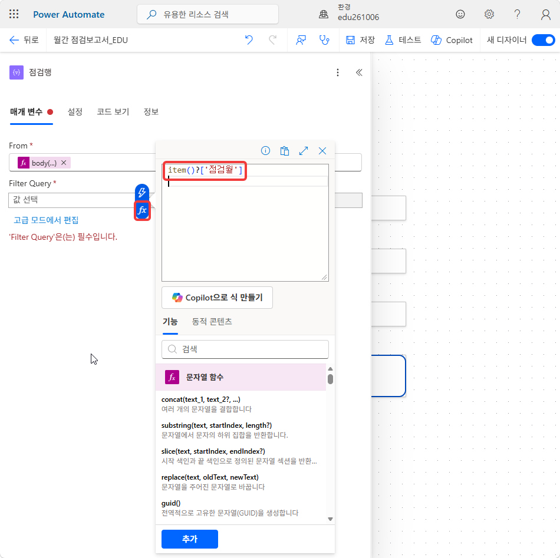
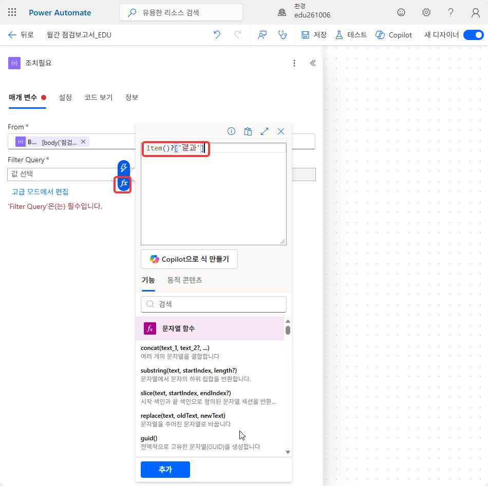
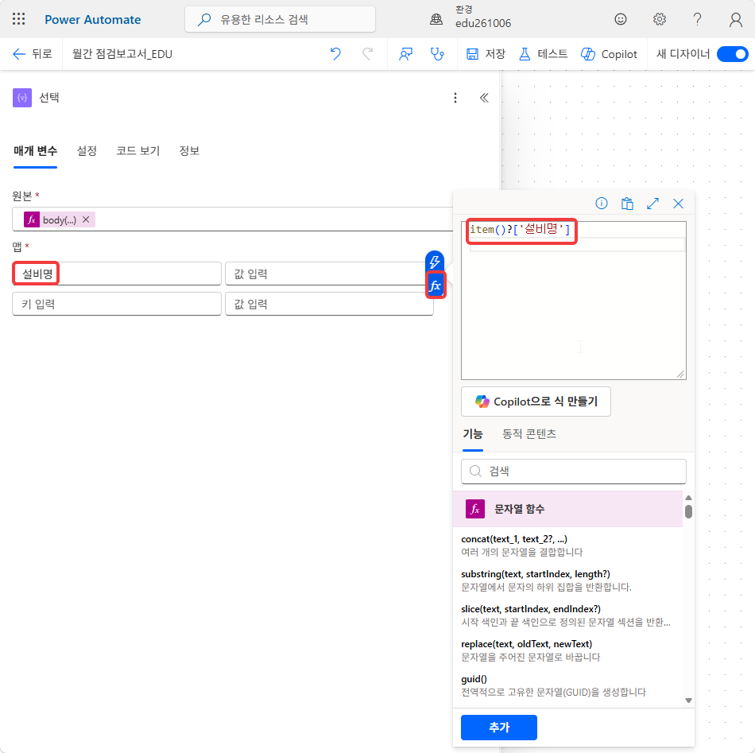
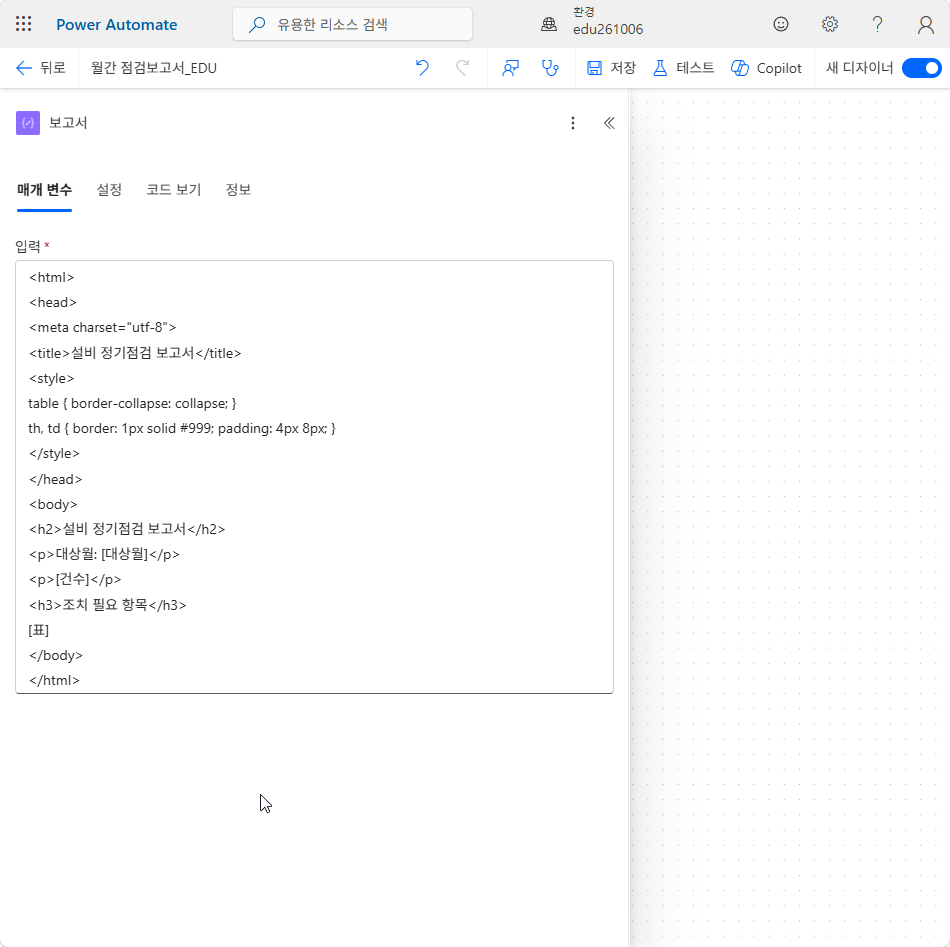
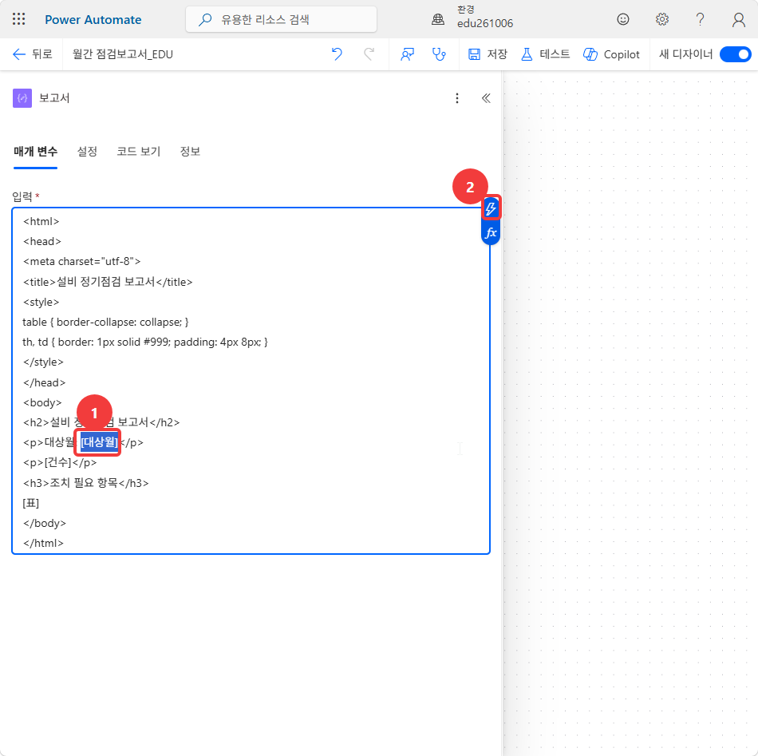

# Lab 2. 정기점검 보고서 — 취합과 생성 📋

<!-- 저작 메모(학생 비노출):
     ★ 자리 — Lab 1에서 받는 것은 식(expression) 입력 경험뿐이다. Lab 1의 목록·흐름은 쓰지 않는다.
       이 랩이 만든 흐름 `월간 점검보고서_HGD` 끝에 Lab 3이 승인·배포를 잇는다.
     ★ 실측 — 실측 전 초안(2026-10-02). 62스텝 · 0컷. 라벨은 MS Learn 한국어판·커넥터 참조 기준이다.
     ★ 의존 — Lab 3이 이 랩의 이름을 그대로 쓴다. 바꾸면 Lab 3 본문과 식도 같이 고친다.
         · 작업 이름 `대상월`·`건수` → Lab 3 승인 세부 정보·메일·Teams 메시지의 동적 콘텐츠
         · 「파일 만들기」 출력 ItemId → Lab 3 ① 공유 링크
         · 확인 절 필수 ①~④ → Lab 3 「준비」 조건
     ★ PA_설계.md §5와 다르게 한 것 — ⑤ 「작성」 `건수` 셋(전체·주의·이상)을 「작성」 `건수` 하나로 줄였다.
       주의·이상 개수를 length()로 세려면 그 행만 담은 배열이 따로 있어야 해서 「배열 필터링」 둘(주의행·이상행)을 더했다.
       작성 셋을 그대로 두면 63스텝을 넘는다. 하나로 합친 출력(「점검 32건 · 주의 3 · 이상 2」)을
       Lab 3이 승인 세부 정보·메일·Teams에 그대로 끼운다. 설계 문서 반영 여부는 제작자 판단.
     ★ 식은 동적 콘텐츠 대신 fx로 넣게 했다(26·27·30·31·40·42·43번). 동적 콘텐츠 이름(value·항목 등)이 실측 전이라 화면 글자에 기대지 않으려는 것이다.
       대신 작업 이름이 식에 들어가므로 23번(원본행)·25번(점검행)·29·33·36번 이름을 바꾸는 스텝을 뺄 수 없다.
     ★ 2026-10-02 결정 — ④에서 Excel 「필터 쿼리」(점검월 eq '…')를 쓰지 않는다. 커넥터 참조(Excel Online(비즈니스))의 알려진 제한에
       「Filter Query / Order By / Select Query 작업 매개 변수는 영숫자 열 이름만 지원」이 있어 한글 열 이름 `점검월` 이 실패할 가능성이 높다.
       대신 Excel 카드를 `원본행` 으로 두고(64행 전부), 「배열 필터링」 `점검행`(item()?['점검월'] 같음 대상월 출력)으로 대상월을 거른다(24~27번, 순증 +2스텝).
       그래서 뒤의 식은 `body('점검행')` 이다(배열 필터링 출력은 배열이라 value 가 없다). PA_설계.md §5 Lab 2 ④ 반영은 제작자 판단.
     ⚠️ 실측할 것
       - Excel 작업 이름: 커넥터 참조 한국어판은 「테이블에 있는 행 나열」이다. 본문은 설계 §6의 「표에 있는 행 나열」을 썼다
       - 「배열 필터링」: 데이터 작업 문서 한국어판은 「배열 필터」로 적는다. 조건 연산자 한글 표기(같음 · 같지 않음)
       - 예약된 클라우드 흐름 만들기 창의 칸 이름(시작 · 반복 간격) · 되풀이 카드의 표준 시간대 위치(고급 매개 변수인지)
       - 시작 시간이 2026-11-01 09:00 서울로 저장되는가(창에서 고른 시각이 UTC로 들어가는지)
       - 작업 복사/붙여넣기(32·35번) 메뉴 이름 · 붙여넣은 작업 이름 끝의 `-copy`
       - 테스트 › 수동 › 테스트 → 흐름 실행 창의 단추 이름 · 실행 화면에서 편집으로 돌아가는 단추 이름(17번)
       - 「선택」 맵의 키/값 칸 이름 · 「HTML 테이블 만들기」 열 기본값(자동)
       - 「파일 만들기」 폴더 선택기가 `/Shared Documents/보고서` 로 보여 주는가
       - SharePoint에서 .html 파일을 누르면 브라우저에 열리는가, 내려받아지는가(62번)
       - 실행 화면에서 「배열 필터링」 출력이 몇 개 항목인지 바로 보이는가(59·60번)
-->

> **이번 랩 완성물**: 지난달 점검 기록을 읽어 HTML 보고서 파일을 만드는 예약 흐름 `월간 점검보고서_HGD`
>
> **예상 시간**: 90분
>
> **완성 신호**: 보고서 폴더에 `정기점검_2026-09_HGD.html` 이 생기고, 열면 **점검 32건 · 주의 3 · 이상 2** 와 조치 필요 5행 표가 보인다

{: .time }
90분 타이머. 9단(데이터 확인 → 예약 흐름 → 대상월 → 행 읽기 → 거르기와 세기 → 표 만들기 → 보고서 본문 → 파일 만들기 → 테스트)으로 나눠 진행합니다.

---

## 준비

- 브라우저는 Microsoft Edge를 씁니다. 당일 배부한 교육 계정 하나로만 로그인합니다.
- 강사가 안내한 SharePoint 사이트 주소를 확인합니다. 본문에서는 `https://<테넌트>.sharepoint.com/sites/PA실습` 으로 적습니다.
- 사이트의 `문서/실습자료/점검기록.xlsx` 는 강사가 올려 둔 공용 파일입니다. 이 랩은 읽기만 합니다.

---

## 단계 ① 데이터 확인

1. Edge에서 `PA실습` 사이트를 열고 왼쪽 메뉴의 **문서**를 누릅니다.

    

2. **실습자료** 폴더에서 `점검기록.xlsx` 를 누릅니다. 브라우저의 Excel로 열립니다.

    

3. 표 안의 아무 셀이나 누르고 리본의 **표 디자인** 탭에서 **표 이름**이 `점검기록` 인지 확인합니다.

    

4. 머리글 열 열 개를 확인합니다. 2026-08 32행 다음에 2026-09 32행이 이어집니다. 셀을 고치지 않고 탭을 닫습니다.

    | 열 | 예 |
    |---|---|
    | 점검월 · 점검일 | `2026-09` · `2026-09-16` |
    | 설비ID · 설비명 · 구역 · 점검항목 | `EQ-202` · 수배전반 · B동 지하 · 접속부 온도 |
    | 측정값 · 결과 | `71.5 ℃` · 이상 |
    | 점검자 · 조치내용 | 조치내용은 결과가 정상이면 빈칸 |

    

## 단계 ② 예약 흐름

5. 새 탭에서 [make.powerautomate.com](https://make.powerautomate.com)에 교육 계정으로 로그인합니다.

    

6. 오른쪽 위 **환경**이 강사가 안내한 환경인지 확인합니다.

    

7. 왼쪽 메뉴 **+ 만들기**에서 **예약된 클라우드 흐름**을 고릅니다.

    

8. **흐름 이름**에 아래를 입력합니다. `HGD` 대신 본인 이니셜을 넣습니다.

    ```
    월간 점검보고서_HGD
    ```

    {: .warning }
    **흐름 이름 끝에 본인 이니셜을 넣습니다.** 교육생 전원이 한 환경을 쓰므로 이름이 같으면 내 흐름 목록에서 본인 흐름을 가려낼 수 없습니다. 보고서 파일 이름(55번)에도 같은 이니셜을 씁니다.

    

9. 시작 날짜를 `2026-11-01`, 시간을 `09:00` 으로 고릅니다.

    

10. 반복 간격을 `1` · **월**로 고르고 **만들기**를 누릅니다.

    

11. 디자이너의 **되풀이** 카드를 누릅니다. 왼쪽 구성 창에서 **표준 시간대**를 `(UTC+09:00) 서울` 로 고릅니다. 칸이 보이지 않으면 **고급 매개 변수**를 펼칩니다.

    **완료 기준**: 간격 `1` · 빈도 **월** · 표준 시간대 서울 · 시작 시간 2026-11-01 09:00.

    
{: start="5" }

## 단계 ③ 대상월

12. **되풀이** 카드 아래 **+**를 누르고 **작업 추가** 검색창에 `작성` 을 입력합니다. **데이터 작업 › 작성**을 고릅니다.

    

13. 구성 창 맨 위의 카드 이름 **작성**을 눌러 아래로 바꿉니다.

    ```
    대상월
    ```

    

14. **입력** 칸을 누르고 오른쪽 **fx**(식 삽입)를 누릅니다. 식 편집기에 아래를 붙여넣고 **추가**를 누릅니다.

    ```
    formatDateTime(addToTime(convertFromUtc(utcNow(),'Korea Standard Time'),-1,'Month'),'yyyy-MM')
    ```

    한국 시간으로 오늘에서 한 달을 뺀 달을 `yyyy-MM` 으로 냅니다. 10월에 돌리면 `2026-09` 입니다.

    

15. 위쪽 명령 모음의 **저장**을 누릅니다.

    

16. **테스트**를 누르고 **수동**을 고른 뒤 **테스트**를 누릅니다. **흐름 실행** 창에서 **흐름 실행**을 누르고 **완료**를 누릅니다.

    

17. 실행이 끝나면 **대상월** 카드를 누르고 **출력**을 확인합니다. 확인한 뒤 위쪽의 **편집**을 눌러 디자이너로 돌아옵니다.

    **완료 기준**: 출력이 `2026-09` 다.

    
{: start="12" }

## 단계 ④ 행 읽기

18. **대상월** 아래 **+**를 누르고 `행 나열` 을 검색합니다. **Excel Online (Business) › 표에 있는 행 나열**을 고릅니다. 연결을 묻는 창이 뜨면 교육 계정으로 로그인합니다.

    

19. **위치** 드롭다운에서 `PA실습` 사이트를 고릅니다.

    

20. **문서 라이브러리**에서 **문서**를 고릅니다.

    

21. **파일** 칸의 폴더 아이콘을 누르고 **실습자료** › `점검기록.xlsx` 를 고릅니다.

    

22. **표**에서 `점검기록` 을 고릅니다.

    

23. 카드 이름 **표에 있는 행 나열**을 아래로 바꿉니다.

    ```
    원본행
    ```

    {: .warning }
    **카드 이름은 글자 그대로 씁니다.** 이 랩의 식은 카드 이름으로 앞 작업의 출력을 찾습니다. `원본행` · `점검행` · `조치필요` · `주의행` · `이상행` 중 하나라도 다르면 26번 이후의 식이 저장 단계에서 오류를 냅니다.

    

24. **원본행** 아래 **+**를 누르고 `배열 필터링` 을 검색해 **데이터 작업 › 배열 필터링**을 고릅니다.

    

25. 카드 이름을 아래로 바꿉니다.

    ```
    점검행
    ```

    

26. **원본**(From) 칸을 누르고 **fx**(식 삽입)로 아래 식을 넣습니다.

    ```
    body('원본행')?['value']
    ```

    표의 64행 전체입니다.

    

27. 조건 줄의 왼쪽 칸에 **fx**로 아래 식을 넣고 연산자를 **같음**으로 둡니다. 오른쪽 칸을 누르고 번개 아이콘(동적 콘텐츠 삽입)에서 **대상월 › 출력**을 고릅니다.

    ```
    item()?['점검월']
    ```

    `item()` 은 원본 배열의 한 행입니다. 점검월이 대상월과 같은 행만 남습니다.

    **완료 기준**: 조건 줄이 `item()?['점검월']` 식 칩 · 같음 · **출력** 칩 순서로 보인다.

    
{: start="18" }

## 단계 ⑤ 거르기와 세기

28. **점검행** 아래 **+**를 누르고 `배열 필터링` 을 검색해 **데이터 작업 › 배열 필터링**을 고릅니다.

    

29. 카드 이름을 아래로 바꿉니다.

    ```
    조치필요
    ```

    

30. **원본**(From) 칸을 누르고 **fx**로 아래 식을 넣습니다.

    ```
    body('점검행')
    ```

    

31. 조건 줄을 아래처럼 채웁니다. 왼쪽 칸은 **fx**로 식을 넣고, 오른쪽 칸은 글자로 입력합니다.

    | 왼쪽 값 | 연산자 | 오른쪽 값 |
    |---|---|---|
    | `item()?['결과']` | 같지 않음 | `정상` |

    `item()` 은 원본 배열의 한 행입니다. 결과가 정상이 아닌 행만 남습니다.

    

32. 캔버스에서 **조치필요** 카드를 마우스 오른쪽 단추로 누르고 **작업 복사**를 고릅니다. **조치필요** 아래 **+**를 마우스 오른쪽 단추로 누르고 **작업 붙여넣기**를 고릅니다.

    

33. 붙여넣은 카드 이름을 아래로 바꿉니다.

    ```
    주의행
    ```

    

34. 조건 줄의 연산자를 **같음**으로, 오른쪽 값을 `주의` 로 바꿉니다. 원본과 왼쪽 값은 복사된 그대로 둡니다.

    

35. **주의행** 카드를 32번과 같은 방법으로 복사해 **주의행** 아래에 붙여넣습니다.

    

36. 붙여넣은 카드 이름을 아래로 바꿉니다.

    ```
    이상행
    ```

    

37. 조건 줄의 오른쪽 값을 `이상` 으로 바꿉니다.

    

38. **이상행** 아래 **+**를 누르고 **데이터 작업 › 작성**을 추가합니다.

    

39. 카드 이름을 아래로 바꿉니다.

    ```
    건수
    ```

    

40. **입력** 칸에 **fx**로 아래 식을 넣습니다.

    ```
    concat('점검 ', string(length(body('점검행'))), '건 · 주의 ', string(length(body('주의행'))), ' · 이상 ', string(length(body('이상행'))))
    ```

    `length()` 는 배열의 개수입니다. 세 배열의 개수를 한 줄 글로 이어 붙입니다.

    
{: start="28" }

## 단계 ⑥ 표 만들기

41. **건수** 아래 **+**를 누르고 **데이터 작업 › 선택**을 추가합니다.

    

42. **원본**(From) 칸에 **fx**로 아래 식을 넣습니다.

    ```
    body('조치필요')
    ```

    

43. **맵** 첫 줄의 키 칸에 `설비명` 을 입력하고, 값 칸에 **fx**로 아래 식을 넣습니다.

    ```
    item()?['설비명']
    ```

    

44. 아래 다섯 줄을 같은 방법으로 채웁니다. 키는 글자로, 값은 **fx**로 넣습니다.

    | 키 | 값(식) |
    |---|---|
    | `구역` | `item()?['구역']` |
    | `점검항목` | `item()?['점검항목']` |
    | `측정값` | `item()?['측정값']` |
    | `결과` | `item()?['결과']` |
    | `조치내용` | `item()?['조치내용']` |

    키는 보고서 표의 머리글이 됩니다.

    

45. **선택** 아래 **+**를 누르고 **데이터 작업 › HTML 테이블 만들기**를 추가합니다.

    

46. **원본**(From) 칸을 누르고 번개 아이콘에서 **선택 › 출력**을 고릅니다. **열**은 기본값(자동)으로 둡니다.

    
{: start="41" }

## 단계 ⑦ 보고서 본문

47. **HTML 테이블 만들기** 아래 **+**를 누르고 **데이터 작업 › 작성**을 추가합니다.

    

48. 카드 이름을 아래로 바꿉니다.

    ```
    보고서
    ```

    

49. **입력** 칸에 아래 HTML 틀을 통째로 붙여넣습니다. 대괄호 세 곳(`[대상월]` · `[건수]` · `[표]`)은 50·51번에서 동적 값으로 바꿉니다.

    ```
    <html>
    <head>
    <meta charset="utf-8">
    <title>설비 정기점검 보고서</title>
    <style>
    table { border-collapse: collapse; }
    th, td { border: 1px solid #999; padding: 4px 8px; }
    </style>
    </head>
    <body>
    <h2>설비 정기점검 보고서</h2>
    <p>대상월: [대상월]</p>
    <p>[건수]</p>
    <h3>조치 필요 항목</h3>
    [표]
    </body>
    </html>
    ```

    `<meta charset="utf-8">` 줄은 파일을 열 때 한글이 깨지지 않게 합니다.

    

50. `[대상월]` 글자를 대괄호까지 끌어 선택하고 지웁니다. 커서가 그 자리에 있는 채로 번개 아이콘을 누르고 **대상월 › 출력**을 고릅니다. `[건수]` 도 같은 방법으로 지우고 **건수 › 출력**을 넣습니다.

    **완료 기준**: `대상월: ` 뒤와 두 번째 `<p>` 안에 출력 칩이 하나씩 있다.

    

51. `[표]` 글자를 지우고 그 자리에 번개 아이콘에서 **HTML 테이블 만들기 › 출력**을 넣습니다.

    **완료 기준**: 대괄호가 하나도 남지 않고, 칩 세 개가 `대상월` · `건수` · `HTML 테이블 만들기` 순서로 들어 있다.

    
{: start="47" }

## 단계 ⑧ 파일 만들기

52. **보고서** 아래 **+**를 누르고 `파일 만들기` 를 검색해 **SharePoint › 파일 만들기**를 고릅니다.

    

53. **사이트 주소** 드롭다운에서 `PA실습` 을 고릅니다. 목록에 없으면 **사용자 지정 값 입력**을 눌러 사이트 주소를 붙여넣습니다.

    

54. **폴더 경로**의 폴더 아이콘을 누르고 **문서 › 보고서**를 고릅니다.

    **완료 기준**: 칸에 `/Shared Documents/보고서` 가 보인다.

    

55. **파일 이름**에 아래를 입력합니다. `HGD` 는 8번에서 쓴 본인 이니셜로 바꿉니다. 두 밑줄 사이에 커서를 두고 번개 아이콘에서 **대상월 › 출력**을 넣습니다.

    ```
    정기점검__HGD.html
    ```

    **완료 기준**: `정기점검_` · **출력** 칩 · `_HGD.html` 순서로 보인다.

    

56. **파일 콘텐츠** 칸을 누르고 번개 아이콘에서 **보고서 › 출력**을 고릅니다.

    

57. **저장**을 누릅니다.

    **완료 기준**: 오류 없이 저장되고, 캔버스에 카드 열두 개가 위에서 아래로 한 줄로 놓인다(아래 「여기까지의 흐름」과 대조).

    
{: start="52" }

## 단계 ⑨ 테스트

58. **테스트 › 수동 › 테스트**를 누르고 **흐름 실행** 창에서 **흐름 실행** · **완료**를 누릅니다.

    

59. 실행이 끝나면 카드마다 초록 체크가 붙었는지 확인합니다. 빨간 표시가 있는 카드를 누르면 오류 내용이 보입니다. 이어서 **점검행** 카드의 **출력**을 엽니다.

    **완료 기준**: 점검행 출력이 점검월 `2026-09` 행 32개다.

    

60. **조치필요** 카드를 누르고 **출력**에 다섯 행이 있는지 확인합니다. 이어서 **건수** 카드의 **출력**을 확인합니다.

    **완료 기준**: 건수 출력이 `점검 32건 · 주의 3 · 이상 2` 다.

    

61. `PA실습` 사이트 탭으로 돌아가 **문서 › 보고서** 폴더를 엽니다.

    

62. `정기점검_2026-09_HGD.html` 을 엽니다.

    {: .warning }
    **브라우저에 바로 열리지 않고 내려받아질 수 있습니다.** 그때는 내려받은 파일을 Edge로 엽니다. 파일 내용은 같습니다.

    **완료 기준**: 대상월 `2026-09`, `점검 32건 · 주의 3 · 이상 2`, 아래 다섯 행 표가 보인다.

    | 설비명 | 점검항목 | 측정값 | 결과 |
    |---|---|---|---|
    | 공조기 2호 | 팬 진동 | 6.4 mm/s | 주의 |
    | 수배전반 | 접속부 온도 | 71.5 ℃ | 이상 |
    | 서버랙 UPS | 부하율 | 82 % | 주의 |
    | 비상발전기 | 배터리 전압 | 22.8 V | 이상 |
    | 항온항습기 | 실내 온도 | 27.9 ℃ | 주의 |

    
{: start="58" }

---

## 확인

**필수**: 여기까지 되면 이 랩은 통과입니다

- ① 본인 이니셜이 붙은 예약 흐름 `월간 점검보고서_HGD` 가 1개월 · 서울 표준 시간대로 저장되어 있다 (8~11번)
- ② 대상월 출력이 `2026-09` 다 (17번)
- ③ 건수 출력이 `점검 32건 · 주의 3 · 이상 2` 다 (60번)
- ④ 보고서 폴더에 `정기점검_2026-09_HGD.html` 이 있고, 열면 조치 필요 5행 표가 보인다 (61·62번)
{: .checklist }

**관찰**: 나오면 좋고, 안 나와도 실패가 아닙니다

- ⑤ 실행 화면의 **점검행** 출력이 2026-09 32행이고 2026-08 행이 섞여 있지 않다 (59번)
{: .checklist }

---

## 여기까지의 흐름

빈 흐름에 아래 열두 개 카드가 생겼습니다. 이름 오른쪽은 핵심 설정값입니다.

```
되풀이                    1 월 · 2026-11-01 09:00 · (UTC+09:00) 서울
├─ 대상월                 작성 · formatDateTime(addToTime(...),'yyyy-MM')
├─ 원본행                 표에 있는 행 나열 · 점검기록.xlsx › 점검기록
├─ 점검행                 배열 필터링 · 원본 원본행 · 점검월 같음 대상월
├─ 조치필요               배열 필터링 · 원본 점검행 · 결과 같지 않음 정상
├─ 주의행                 배열 필터링 · 원본 점검행 · 결과 같음 주의
├─ 이상행                 배열 필터링 · 원본 점검행 · 결과 같음 이상
├─ 건수                   작성 · concat(... length() ...)
├─ 선택                   원본 조치필요 · 설비명·구역·점검항목·측정값·결과·조치내용
├─ HTML 테이블 만들기      원본 선택 출력
├─ 보고서                 작성 · HTML 틀 + 대상월·건수·HTML 테이블 출력
└─ 파일 만들기            PA실습 · /Shared Documents/보고서 · 정기점검_<대상월>_HGD.html
```

---

## 출처

이 랩은 아래를 토대로 만들었습니다. 제품 화면과 동작은 실측이고, 문헌은 항목마다 확인일을 적었습니다. 제품이 바뀌면 문헌 쪽이 먼저 낡습니다.

- **실측**: 실측 전 · 62스텝 · 0컷
- **문헌**: 예약된 클라우드 흐름[^scheduled] · 클라우드 흐름 디자이너[^designer] · Excel Online (Business) 커넥터[^excel] · 데이터 작업[^dataops] · SharePoint 커넥터[^sharepoint] · 식 함수 참조[^functions]

[^scheduled]: **일정에 따라 클라우드 흐름 실행** — Microsoft Learn. <https://learn.microsoft.com/ko-kr/power-automate/run-scheduled-tasks> (2026-10-02 확인). 되풀이 트리거의 간격·빈도·표준 시간대·시작 시간.
[^designer]: **클라우드 흐름 디자이너 살펴보기** — Microsoft Learn. <https://learn.microsoft.com/ko-kr/power-automate/flows-designer> (2026-10-02 확인). 저장 · 테스트 › 수동 · 번개 아이콘(동적 콘텐츠)과 fx(식) · 작업 복사/붙여넣기.
[^excel]: **Excel Online(비즈니스)** — Microsoft Learn 커넥터 참조. <https://learn.microsoft.com/ko-kr/connectors/excelonlinebusiness/> (2026-10-02 확인). 행 나열 작업의 위치·문서 라이브러리·파일·표 매개 변수, 필터 쿼리가 영숫자 열 이름만 지원한다는 제한(그래서 배열 필터링으로 거른다), 기본 256행 반환.
[^dataops]: **데이터 작업 사용** — Microsoft Learn. <https://learn.microsoft.com/ko-kr/power-automate/data-operations> (2026-10-02 확인). 작성 · 선택 · 배열 필터링 · HTML 테이블 만들기의 동작과 카드 이름 바꾸기.
[^sharepoint]: **SharePoint** — Microsoft Learn 커넥터 참조. <https://learn.microsoft.com/ko-kr/connectors/sharepointonline/> (2026-10-02 확인). 파일 만들기의 사이트 주소·폴더 경로·파일 이름·파일 콘텐츠 매개 변수와 출력 ItemId.
[^functions]: **Reference guide to functions in expressions for workflows in Azure Logic Apps and Power Automate** — Microsoft Learn. <https://learn.microsoft.com/azure/logic-apps/expression-functions-reference> (2026-10-02 확인). formatDateTime · addToTime · convertFromUtc · length · concat 의 매개 변수.
