# Lab 3. 정기점검 보고서 — 승인과 배포 ✅

<!-- 저작 메모(학생 비노출):
     ★ 자리 — Lab 2의 흐름 `월간 점검보고서_HGD` 끝(「파일 만들기」 아래)에 이어 붙인다. 새 흐름을 만들지 않는다.
       뒤 랩(Lab 4~6, PAD)으로 넘기는 것은 없다.
     ★ 실측 — 실측 전 초안(2026-10-02). 57스텝 · 0컷. 라벨은 MS Learn 한국어판·커넥터 참조 기준이다.
     ★ 의존 — Lab 2에서 받는 이름: 작업 `대상월`·`건수`의 출력, 「파일 만들기」의 ItemId.
         Lab 2 완성 흐름 가져오기 경로는 두지 않는다(PA_설계.md §1). 「준비」에 Lab 2 확인 필수 ①~④를 조건으로 적었다.
         Lab 2 「여기까지의 흐름」 트리를 고치면 이 랩 트리도 같이 고친다.
     ★ 승인자·받는 사람을 전부 본인으로 둔다. 수강생 전원이 강사 한 명에게 승인을 보내면 강사가 인원수만큼 누른다.
       Approvals는 환경 첫 사용 때 프로비저닝이 돈다 — 강사가 전날 한 번 실행해 둔다(PA_설계.md §2).
     ★ 일부러 마크다운을 쓰는 자리 — 13번 승인 세부 정보(불릿 `- ` 두 줄, 블록 사이 빈 줄). 커넥터 참조가 세부 정보의 Markdown을 지원한다고 적는다.
       cs_lab_adv lab5 의 카드 규칙에서 옮긴 것: HTML 태그 안 먹음 · 블록 사이 빈 줄 필수 · 줄 나열은 불릿.
       링크는 세부 정보에 넣지 않고 「항목 링크」 칸으로 보낸다(15번) — 마크다운 링크의 따옴표·공백 문제를 피한다.
     ★ 반려 의견 식은 설계 원문 그대로다(40번). 「응답 의견」 동적 콘텐츠를 고르면 디자이너가 For each 로 감싸므로 first()로 첫 응답만 꺼낸다.
       의견을 비워 거부하면 「반려 의견:」 뒤가 빈칸이다. cs_lab_adv lab5 처럼 coalesce·trim 폴백을 둘지는 실측 후 판단한다.
     ⚠️ 실측할 것
       - ✔ 「파일 또는 폴더에 대한 공유 링크 만들기」 칸 이름은 라이브러리 이름 · 항목 ID · 링크 유형 · 링크 범위. 선택지는 영문(View only · People in your organization)
       - 공유 링크 출력의 동적 콘텐츠 이름 — 커넥터 참조 한국어판은 webUrl 을 「공유 링크」로 적는다(15·27·33·39번)
       - ✔ 「승인 시작 및 대기」가 두 개 뜬다(2026-10-05 제작자 실측). 둘째는 사용 중단 버전이 아니라 텍스트 승인
        (Start and wait for an approval of text · StartAndWaitForATextSuggestionApproval)이고, 한국어 이름에서 「텍스트」가 빠졌다.
        구별은 첫 칸이 「승인 형식」인지(제작자 방법), 애매하면 코드 보기 operationId. 둘째로 추가한 카드는 이름에 「 1」이 붙는다
      - 10~57번은 2026-10-05 Lab 1·2 실측(데이터 작업 · 컨트롤 경로, edu 검색, 흐름 봇 표기, 테스트 창, 워크플로 발신자)을 미리 반영했다. 촬영 때 다시 맞춘다
      - ✔ 42~49번 실측(2026-10-05, Teams 데스크톱). 활동 알림 → 승인 앱 받음 탭(상태 요청됨). 세부 정보 창의 항목 링크는 「첨부 파일」 아래.
        응답 입력칸 이름은 「설명」, 단추는 거부 · 승인이고 확인 단계가 없다. 항목 링크의 .html 은 SharePoint 미리 보기로 열린다.
        Teams 메시지를 한 줄로 붙이면 요약 뒤에 「보고서:」와 URL 이 이어 붙고, URL 은 링크가 되지 않는다(Outlook 은 자동 링크).
        메시지 칸 툴바에 코드 보기(</>) 토글이 있다(제작자 확인) — 32번을 HTML 붙여넣기로 바꿨다. 32 · 33 · 49 재촬영.
        ✔ 코드 보기에서도 대괄호를 선택해 번개 단추로 칩을 넣을 수 있고, href 안의 공유 링크 칩이 Teams 에서 「보고서 열기」 링크로 나간다(재촬영 실측)
        13번 세부 정보 문구의 「의견 칸」은 화면 이름(설명)과 다르다 — 제작자 판단 대기
      - ✔ 26~41번 실측(2026-10-05). Teams 작업 이름은 「채팅 또는 채널에서 메시지 게시」, 칸은 다음으로 게시 · 게시 위치 · Recipient · 메시지.
        게시 위치를 고르면 Recipient · 메시지 칸이 나타난다. False 갈래 메일 카드 이름은 `메일 보내기(V2) 1`(가정대로). 반려 의견 식은 fx 로 넣으면 `first(...)` 칩이 된다
      - ✔ 10~26번 실측(2026-10-05). 승인 형식 값은 「승인/거부 - 첫 번째로 응답」. 항목 링크 · 항목 링크 설명은 고급 매개 변수가 아니라 기본 칸이다
        (고급 매개 변수 2/4 는 알림 사용 · 재할당 사용). 공유 링크 작업의 출력 이름은 「공유 링크」. 할당 대상 검색에 보안 그룹 edu261006-users 도 뜬다.
        11번 제목은 제작자 촬영대로 대상월 칩 없이 둔다(44번 제목도 맞췄다). 22번은 Lab 1 의 Outlook 연결을 그대로 쓴다
      - ✔ 1~9번 실측. 공유 링크의 링크 유형 · 범위 선택지가 영문(View only · People in your organization). 항목 ID 동적 콘텐츠 이름은 body/ItemId. 표준 승인 연결은 「새로 만들기」로 로그인 없이 만들어진다
       - ✔ 칸 이름은 「승인 형식」, 값은 「승인/거부 - 첫 번째로 응답」(10번 실측). cs_lab_adv lab5 표기와 같다
       - ✔ 결과 값 `Approve` / `Reject` — 커넥터 참조 영문판 Known issues 에 「Valid responses … are "Approve" and "Reject". These responses are case-sensitive.」(2026-10-05 확인). 한국어판의 「승인」「거부」는 번역이다
         승인 흐름 자습서 한국어판도 조건 오른쪽에 「승인」을 입력하라고 적는다 — 실측으로 어느 쪽인지 닫는다(20번)
       - 51번 재실행 때 「파일 만들기」가 같은 이름 파일을 덮어쓰는가, 실패하는가. 커넥터 참조의 파일 만들기에는 덮어쓰기 매개 변수가 없다
-->

> **이번 랩 완성물**: Lab 2 보고서를 본인에게 승인 요청하고, 승인하면 메일과 Teams로 배포하고, 거부하면 의견을 메일로 돌려주는 흐름
>
> **예상 시간**: 85분
>
> **완성 신호**: 승인하면 보고서 링크가 든 메일과 Teams 메시지가 오고, 거부하면 적은 의견이 든 메일이 온다

{: .time }
85분 타이머. 8단(공유 링크 → 승인 요청 → 결과 분기 → 승인 메일 → 승인 Teams → 반려 회신 → 승인 경로 테스트 → 반려 경로 테스트)으로 나눠 진행합니다.

---

## 준비

- Lab 2 「확인」 절의 필수 ①~④가 모두 되어 있어야 합니다. 특히 `대상월`·`건수` 카드 이름과 보고서 파일이 있어야 이 랩의 동적 값이 채워집니다.
- 브라우저는 Microsoft Edge, 계정은 Lab 2와 같은 교육 계정입니다.
- 교육 계정 하나를 전원이 같이 쓰므로 승인 요청·메일·Teams 메시지가 한곳에 모입니다. 본인 것은 문구 앞의 이니셜(`HGD`)로 찾습니다. 붙여넣는 문구의 `HGD` 는 본인 이니셜로 바꿉니다.
- 테스트 단계에서 Teams와 Outlook을 웹으로 엽니다. [teams.microsoft.com](https://teams.microsoft.com) · [outlook.office.com](https://outlook.office.com)

---

## 단계 ① 공유 링크

1. [Power Automate — {{ site.pa.environment }}]({{ site.pa.powerautomate_url }}){:target="_blank"}를 엽니다. 왼쪽 메뉴 **내 흐름**에서 `월간 점검보고서_HGD` 를 엽니다.

    

    흐름 세부 정보 페이지 위쪽의 **편집**을 누릅니다.

    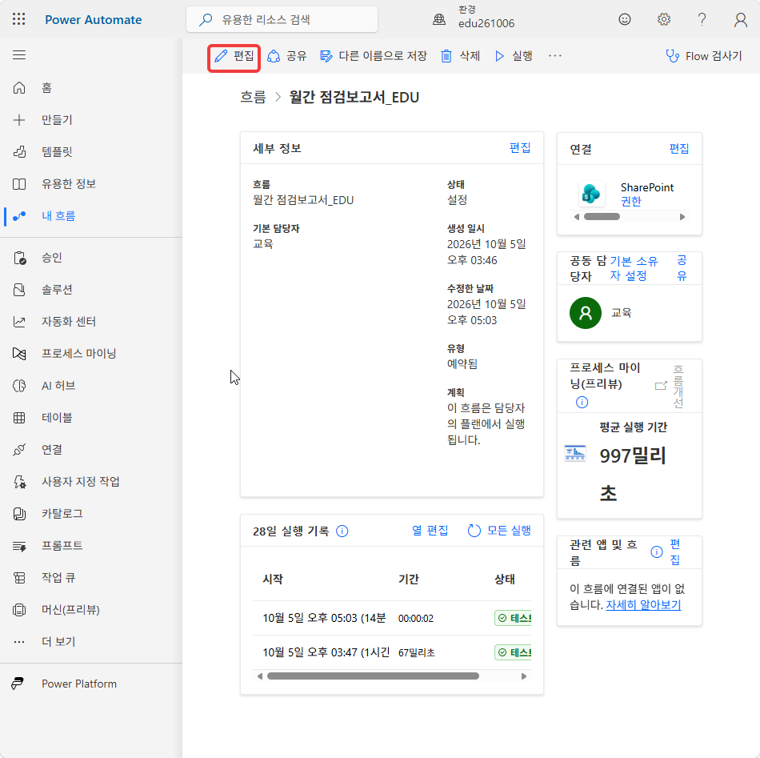

2. 맨 아래 **파일 만들기** 아래 **+** › **작업 추가**에서 `공유 링크` 를 검색해 **SharePoint** 아래 **파일 또는 폴더에 대한 공유 링크 만들기**를 고릅니다. 위쪽 **비즈니스용 OneDrive**의 공유 링크 작업이 아닙니다.

    

3. **사이트 주소** 드롭다운에서 `Power Automate 실습 - https://2ktech.sharepoint.com/sites/pa_practice` 를 고릅니다.

    

4. **라이브러리 이름**에서 **문서**를 고릅니다.

    

5. **항목 ID** 칸을 누르고 번개 단추에서 **파일 만들기** 아래 **body/ItemId**를 고릅니다. Lab 2에서 만든 보고서 파일의 라이브러리 안 번호입니다.

    

6. **링크 유형**에서 **View only**를 고릅니다. 선택지가 영문으로 보입니다.

    

7. **링크 범위**에서 **People in your organization**을 고릅니다. 조직에 로그인한 사람이면 누구나 링크로 보고서를 볼 수 있습니다.

    

## 단계 ② 승인 요청

8. 공유 링크 카드 아래 **+** › **작업 추가**에서 `표준 승인` 을 검색합니다. **표준 승인** 아래에 **승인 시작 및 대기**가 두 개 보입니다. 둘 중 하나를 고릅니다.

    

    **연결 만들기** 창이 뜨면 **새로 만들기**를 누릅니다. 표준 승인 연결은 로그인 창 없이 만들어집니다.

    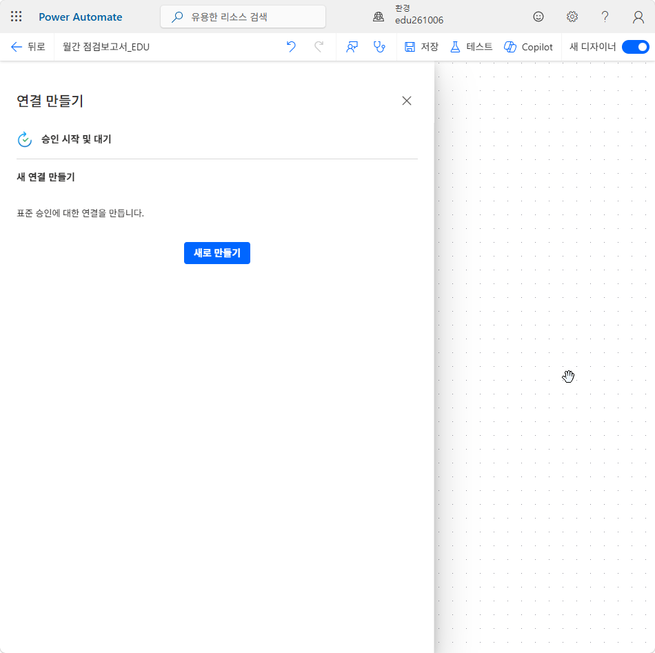

9. 구성 창의 첫 칸이 **승인 형식**인지 확인합니다. 이 작업이 맞습니다. 카드 이름은 `승인 시작 및 대기` 그대로 둡니다.

    

    두 작업은 한국어 화면에서 이름이 같습니다. 영문으로는 「Start and wait for an approval」과 「Start and wait for an approval **of text**」(텍스트 승인)입니다.
    첫 칸이 **승인 형식**이 아니고 제목 · 제안 텍스트 칸이 바로 나오면 텍스트 승인입니다. 애매하면 **코드 보기** 탭의 `operationId` 로 가립니다.

    | operationId | 작업 |
    |---|---|
    | `StartAndWaitForAnApproval` | 이 랩에서 쓰는 승인 시작 및 대기 |
    | `StartAndWaitForATextSuggestionApproval` | 텍스트 승인 — 쓰지 않음 |

    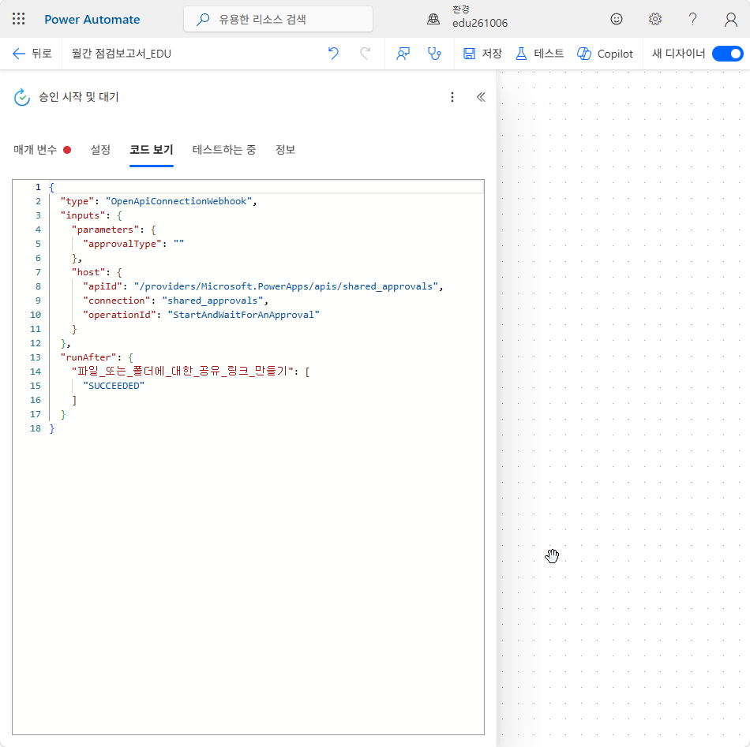

    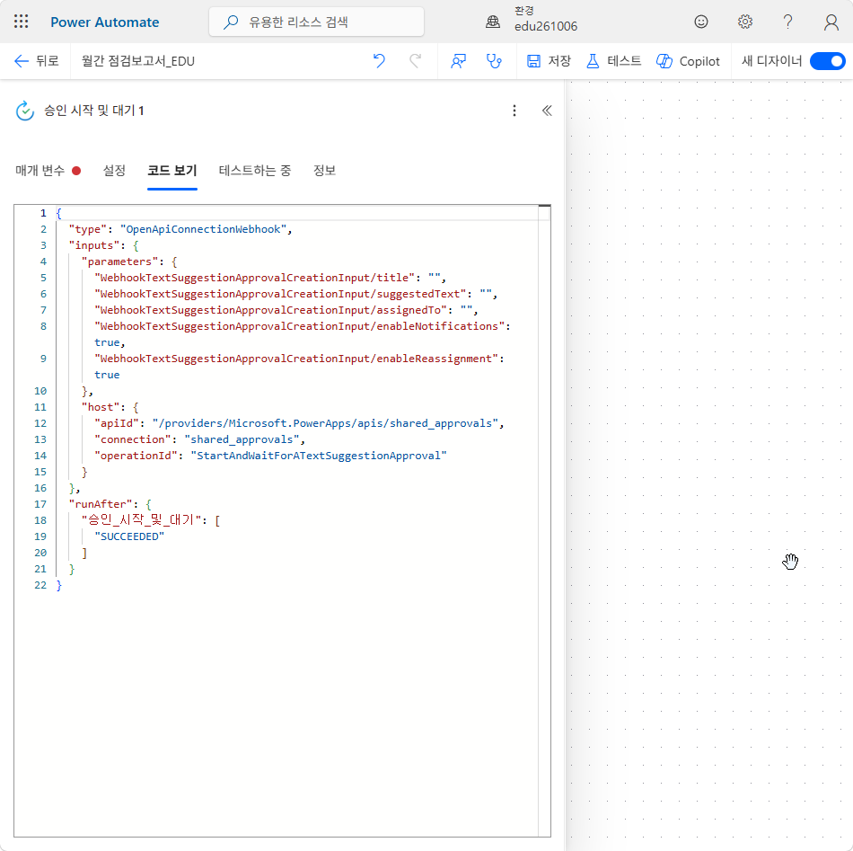

    {: .warning }
    **텍스트 승인을 골랐으면 그 카드를 먼저 삭제하고 다른 하나를 추가합니다.** 카드가 둘인 상태에서 추가하면 새 카드 이름에 ` 1` 이 붙어, 40번의 반려 의견 식이 `승인_시작_및_대기` 라는 이름으로 카드를 찾지 못합니다.

10. **승인 형식**에서 **승인/거부 - 첫 번째로 응답**을 고릅니다.

    

11. **제목**에 아래를 입력합니다. `HGD` 는 본인 이니셜로 바꿉니다.

    ```
    HGD 정기점검 보고서 승인 요청
    ```

    승인 형식을 고르면 제목 · 할당 대상 · 세부 정보 · 항목 링크 · 항목 링크 설명 칸이 나타납니다.

    

12. **할당 대상** 칸에 `edu` 를 입력하고 목록에서 **교육**(`edu@2ktech.co.kr`)을 고릅니다. 아래에 함께 뜨는 **edu261006-users** 는 보안 그룹이라 고르지 않습니다. 실습에서는 승인자도 본인입니다.

    

13. **세부 정보**에 아래를 붙여넣습니다.

    ```
    설비 정기점검 보고서를 검토하고 승인 또는 거부를 선택합니다.

    - 대상월: [대상월]
    - 요약: [건수]

    거부할 때는 의견 칸에 사유를 적습니다. 사유는 회신 메일 본문에 그대로 들어갑니다.
    ```

    {: .warning }
    **문단 사이 빈 줄을 지우지 않습니다.** 세부 정보는 마크다운으로 그려집니다. 빈 줄이 없으면 불릿 두 줄이 앞 문장과 한 덩어리로 붙어 나옵니다.

    ![세부 정보에 붙여넣은 본문 — [대상월] · [건수] 자리와 빈 줄](../assets/lab3/lab3-13.png)

14. `[대상월]` 글자를 대괄호까지 끌어 선택하고, 선택한 채로 번개 단추를 눌러 **대상월** 아래 **출력**을 고릅니다. 선택한 글자가 출력 칩으로 바뀝니다. `[건수]` 도 같은 방법으로 **건수** 아래 **출력**으로 바꿉니다.

    ![[대상월] 을 선택하고 번개 단추를 누르는 화면](../assets/lab3/lab3-14.png)

    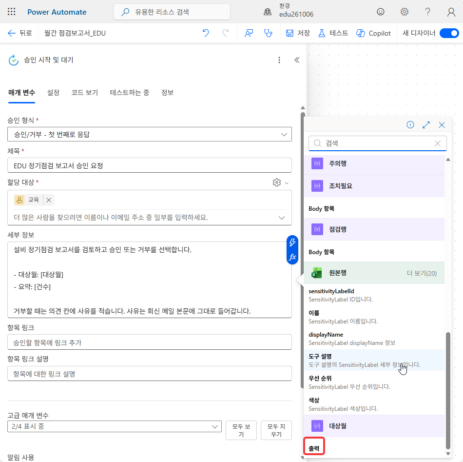

    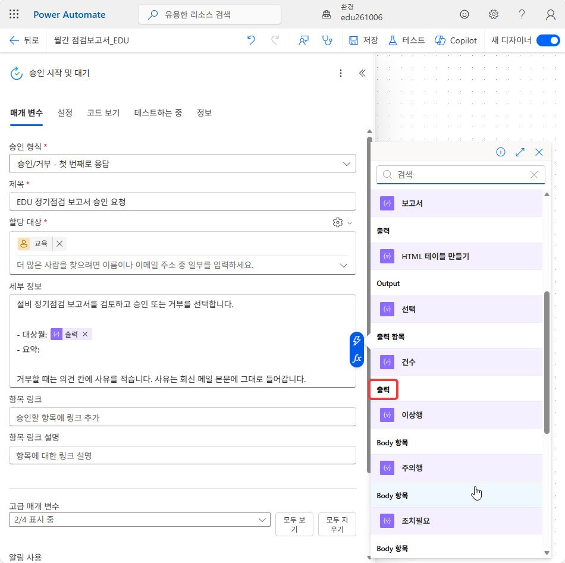

    **완료 기준**: 세부 정보에 대괄호가 남지 않고 칩 두 개가 불릿 두 줄에 하나씩 있다.

    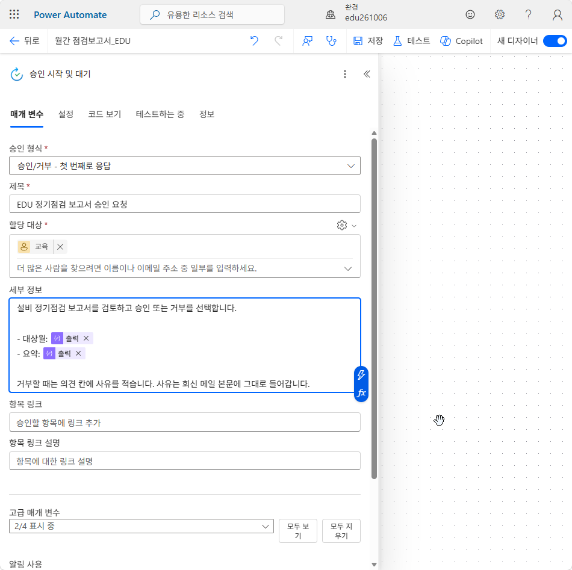

15. **항목 링크** 칸을 누르고 번개 단추에서 **파일 또는 폴더에 대한 공유 링크 만들기** 아래 **공유 링크**를 고릅니다. 항목 링크 칸은 고급 매개 변수가 아니라 처음부터 보입니다.

    

16. **항목 링크 설명** 칸에 아래를 입력합니다.

    ```
    정기점검 보고서 열기
    ```

    

17. 위쪽 명령 모음의 **저장**을 누릅니다.

    
{: start="8" }

## 단계 ③ 결과 분기

18. **승인 시작 및 대기** 아래 **+** › **작업 추가**에서 **기본 제공 도구 › 컨트롤**을 누르고 **조건**을 고릅니다.

    

    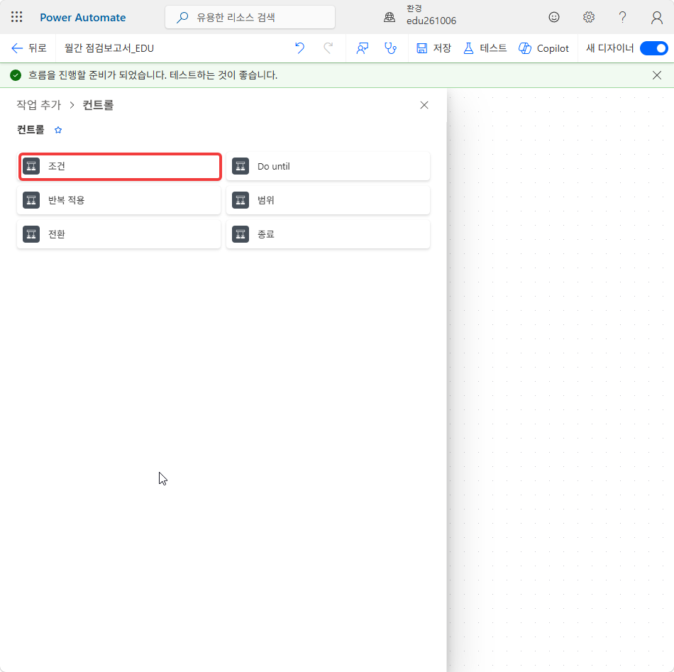

19. 조건 구성 창의 왼쪽 **값 선택** 칸을 누르고 번개 단추에서 **승인 시작 및 대기** 아래 **결과**를 고릅니다. 목록에 없으면 **더 보기**를 누릅니다.

    

20. 연산자를 **다음과 같음**으로 두고 오른쪽 값에 아래를 입력합니다.

    ```
    Approve
    ```

    {: .warning }
    **영문 `Approve` 를 대소문자까지 그대로 씁니다.** 결과 값은 화면 언어와 관계없이 영문으로 옵니다. `승인` 이나 `approve` 로 적으면 승인해도 False 갈래로 갑니다.

    

21. **저장**을 누릅니다.

    **완료 기준**: 조건 카드 아래에 **True**와 **False** 두 갈래가 보인다.

    
{: start="18" }

## 단계 ④ 승인 — 메일

22. **True** 갈래 안의 **+** › **작업 추가**에서 `메일 보내기` 를 검색해 **Office 365 Outlook** 아래 **메일 보내기(V2)**를 고릅니다. Lab 1에서 만든 연결(`outlook email`)이 그대로 쓰입니다.

    

23. **받는 사람** 칸에 `edu` 를 입력하고 목록에서 **교육**을 고릅니다. 운영에서는 보고서를 받을 부서 주소가 들어갈 자리입니다.

    

24. **제목**에 아래를 입력하고 끝에 **대상월 › 출력**을 넣습니다.

    ```
    HGD [배포] 설비 정기점검 보고서 
    ```

    ![제목 EDU [배포] 설비 정기점검 보고서](../assets/lab3/lab3-24.png)

    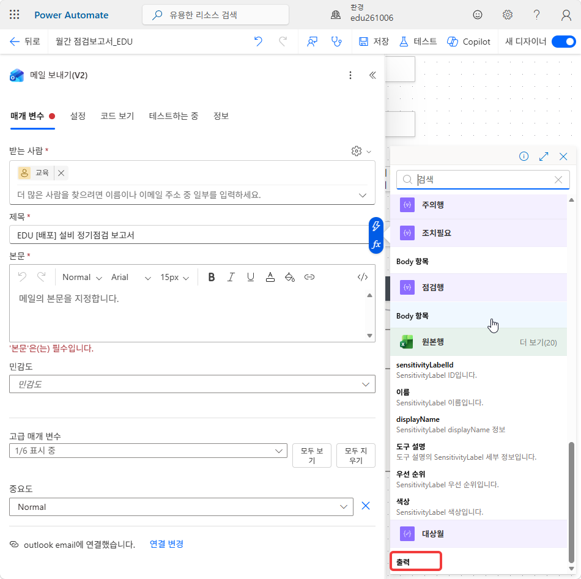

    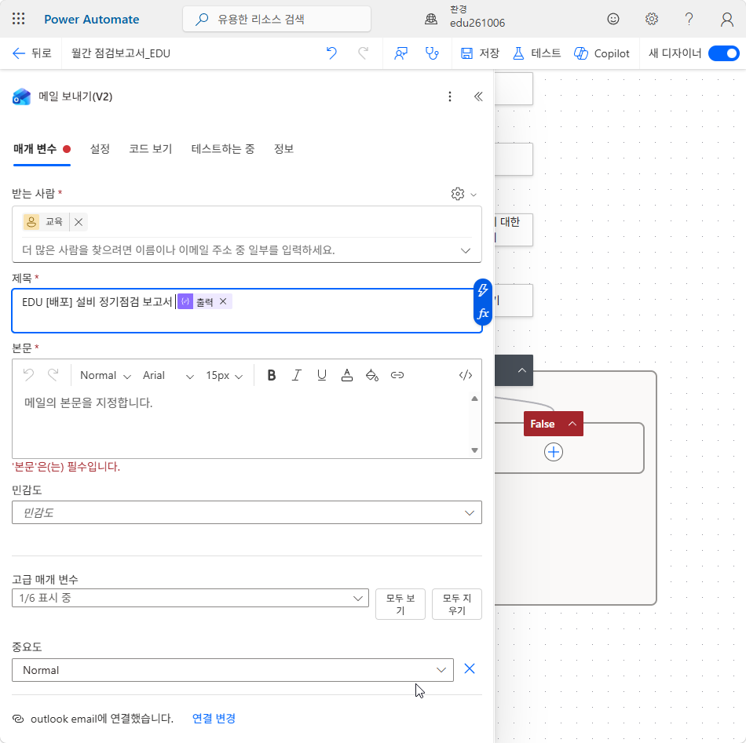

25. **본문**에 아래를 붙여넣습니다.

    ```
    설비 정기점검 보고서가 승인되어 배포합니다.

    대상월: [대상월]
    요약: [건수]
    보고서: [링크]
    ```

    ![본문에 붙여넣은 배포 메일 — [대상월] · [건수] · [링크] 자리](../assets/lab3/lab3-25.png)

26. `[대상월]` 과 `[건수]` 를 14번과 같은 방법으로 **대상월 › 출력**, **건수 › 출력**으로 바꿉니다.

    ![본문의 대상월 · 요약 줄에 들어간 출력 칩, 보고서 줄은 아직 [링크]](../assets/lab3/lab3-26.png)

27. `[링크]` 를 같은 방법으로 선택하고 번개 단추에서 **파일 또는 폴더에 대한 공유 링크 만들기** 아래 **공유 링크**를 고릅니다.

    **완료 기준**: 본문에 대괄호가 남지 않고 칩이 세 개 있다.

    
{: start="22" }

## 단계 ⑤ 승인 — Teams

28. **True** 갈래의 메일 카드 아래 **+** › **작업 추가**에서 `메시지 게시` 를 검색해 **Microsoft Teams** 아래 **채팅 또는 채널에서 메시지 게시**를 고릅니다.

    

29. **다음으로 게시**에서 **흐름 봇**을 고릅니다.

    

30. **게시 위치**에서 **흐름 봇과 채팅**을 고릅니다. 아래에 **Recipient** 와 **메시지** 칸이 나타납니다.

    

31. **Recipient** 칸에 `edu` 를 입력하고 목록에서 **교육**을 고릅니다.

    

32. **메시지** 칸 툴바 오른쪽 끝의 **`</>`**(코드 보기)를 눌러 HTML 보기로 바꿉니다. 칸에 아래를 붙여넣습니다.

    ```
    <p>HGD 설비 정기점검 보고서 [대상월] 승인 완료<br>
    요약: [건수]<br>
    <a href='[링크]'>보고서 열기</a></p>
    ```

    Teams 흐름 봇 메시지는 메일과 달리 URL 을 링크로 바꿔 주지 않습니다. 줄바꿈은 `<br>`, 링크는 `<a href>` 로 직접 적습니다.[^teamsfmt]

    ![코드 보기로 바꾼 메시지 칸에 붙여넣은 HTML — [대상월] · [건수] · [링크] 자리](../assets/lab3/lab3-32.png)

33. 코드 보기 그대로 대괄호 세 곳을 26·27번과 같은 방법으로 **대상월 › 출력**, **건수 › 출력**, **공유 링크**로 바꿉니다. `[링크]` 는 따옴표 안의 대괄호만 선택합니다.

    **완료 기준**: 코드 보기에 대괄호가 남지 않고, `href=` 뒤 작은따옴표 안에 공유 링크 칩이 있다.

    

34. 위쪽 명령 모음의 **저장**을 누릅니다.

    
{: start="28" }

## 단계 ⑥ 반려 — 의견 회신

35. **False** 갈래 안의 **+** › **작업 추가**에서 `메일 보내기` 를 검색해 **Office 365 Outlook** 아래 **메일 보내기(V2)**를 고릅니다. True 갈래에 같은 작업이 있어 카드 이름이 `메일 보내기(V2) 1` 이 됩니다. 이 카드를 부르는 식이 없으므로 그대로 둡니다.

    

36. **받는 사람** 칸에 `edu` 를 입력하고 목록에서 **교육**을 고릅니다. 운영에서는 보고서 작성자 주소가 들어갈 자리입니다.

    

37. **제목**에 아래를 입력하고 끝에 **대상월 › 출력**을 넣습니다.

    ```
    HGD [반려] 설비 정기점검 보고서 
    ```

    ![제목 EDU [반려] 설비 정기점검 보고서 + 출력 칩](../assets/lab3/lab3-37.png)

38. **본문**에 아래를 붙여넣습니다.

    ```
    설비 정기점검 보고서가 반려되었습니다.

    대상월: [대상월]
    반려 의견: [의견]
    보고서: [링크]
    ```

    ![본문에 붙여넣은 반려 메일 — [대상월] · [의견] · [링크] 자리](../assets/lab3/lab3-38.png)

39. 14번과 같은 방법으로 `[대상월]` 을 **대상월** 아래 **출력**으로, `[링크]` 를 **공유 링크**로 바꿉니다.

    ![반려 메일 본문의 출력 · 공유 링크 칩, 반려 의견 줄은 아직 [의견]](../assets/lab3/lab3-39.png)

40. `[의견]` 을 대괄호까지 선택한 채로 ***fx***(식 삽입)를 누릅니다. 아래 식을 붙여넣고 **추가**를 누릅니다.

    ```
    first(outputs('승인_시작_및_대기')?['body/responses'])?['comments']
    ```

    승인자 응답 목록의 첫 응답에서 의견(comments)을 꺼냅니다. 동적 콘텐츠의 응답 의견을 고르면 디자이너가 카드를 **For each**로 감쌉니다. 식으로 넣으면 감싸지 않습니다.

    ![[의견] 을 선택하고 fx 단추를 누르는 화면](../assets/lab3/lab3-40.png)

    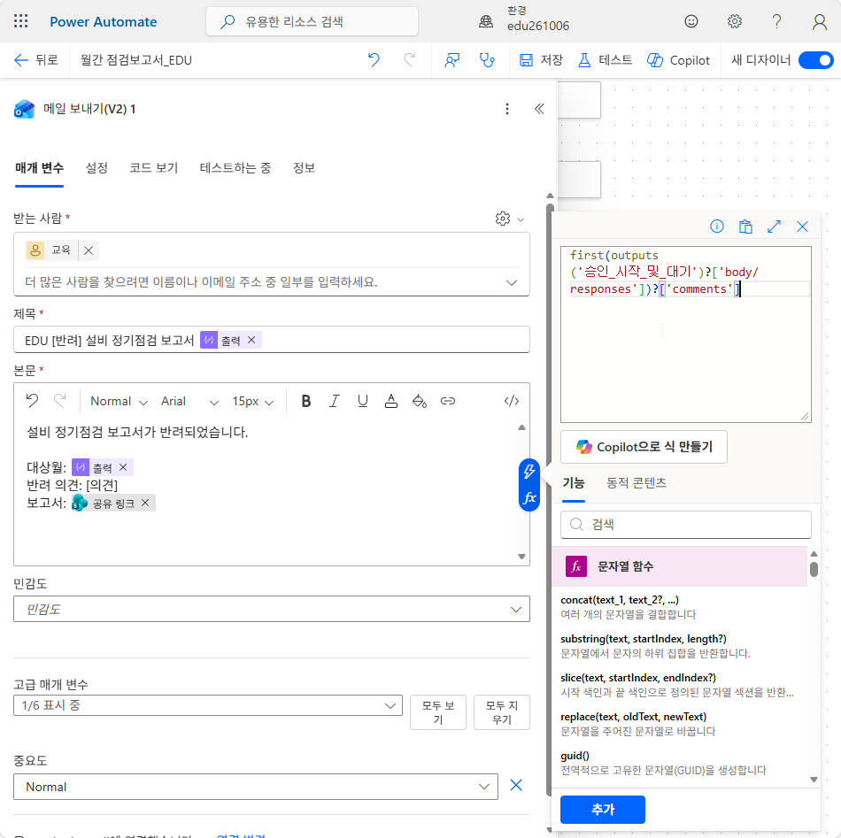

    **완료 기준**: 본문에 대괄호가 남지 않고, `반려 의견: ` 뒤에 `first(...)` 식 칩이 있다.

    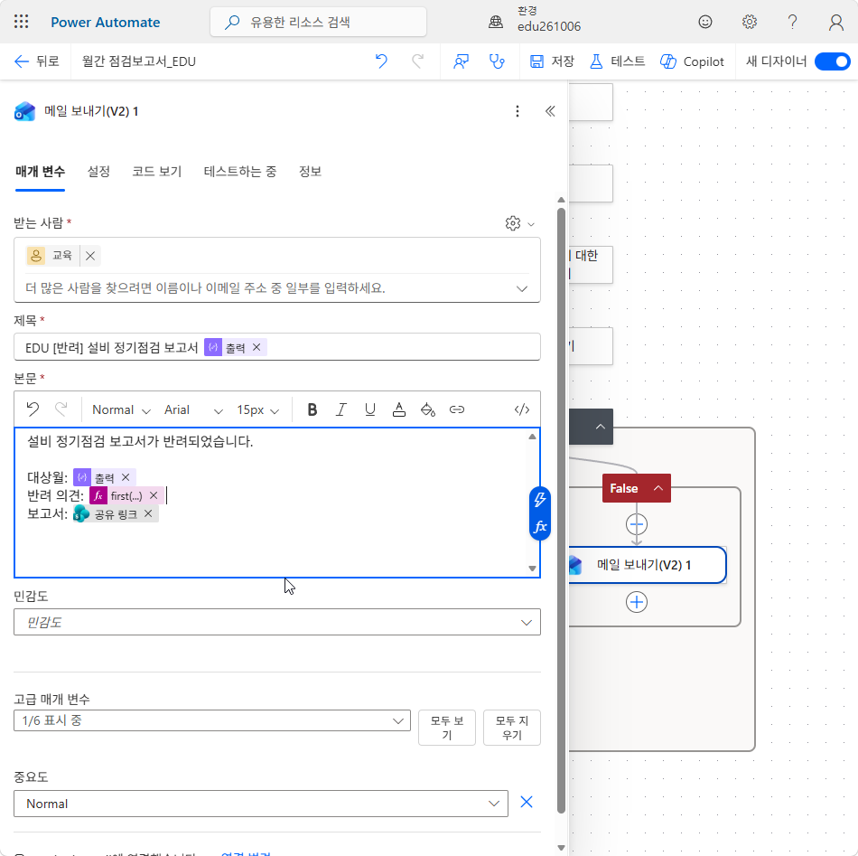

41. **저장**을 누릅니다.

    **완료 기준**: 오류 없이 저장되고, False 갈래에 `메일 보내기(V2) 1` 카드 하나가 있다(아래 「여기까지의 흐름」과 대조).

    
{: start="35" }

## 단계 ⑦ 승인 경로 테스트

42. **테스트**를 누르고 **흐름 테스트** 창에서 **수동**을 고른 뒤 **테스트**를 누릅니다. **흐름 실행** 창이 뜨면 **흐름 실행**을 누릅니다.

    

43. 실행 화면에서 **파일 또는 폴더에 대한 공유 링크 만들기**까지 초록 체크가 붙고, **승인 시작 및 대기** 카드부터 아래가 실행 중(파란 원)인지 확인합니다. 응답할 때까지 흐름이 여기서 기다립니다.

    

    Teams가 켜져 있으면 「교육님이 요청을 보냈습니다.」 알림이 뜹니다.

    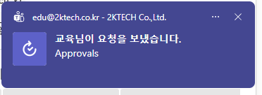

44. Teams를 열고 **활동**에서 `HGD 정기점검 보고서 승인 요청` 알림을 누릅니다. **승인** 앱의 **받음** 탭에 상태가 **요청됨**인 요청이 보입니다. 알림이 없으면 왼쪽 앱 막대의 **⋯**(더 보기)에서 **승인**을 찾습니다.

    Outlook에 같은 제목의 승인 메일도 옵니다. 메일에서 응답해도 됩니다.

    

45. 요청 제목을 눌러 **승인 요청 세부 정보** 창을 엽니다.

    **완료 기준**: 불릿 두 줄에 `대상월: 2026-09` 와 `요약: 점검 32건 · 주의 3 · 이상 2` 가 보인다.

    

46. **첨부 파일** 아래 **정기점검 보고서 열기**를 눌러 Lab 2 보고서가 열리는지 확인합니다. 보고서는 SharePoint 미리 보기로 열립니다. 확인한 뒤 미리 보기를 닫고 Teams로 돌아옵니다.

    

    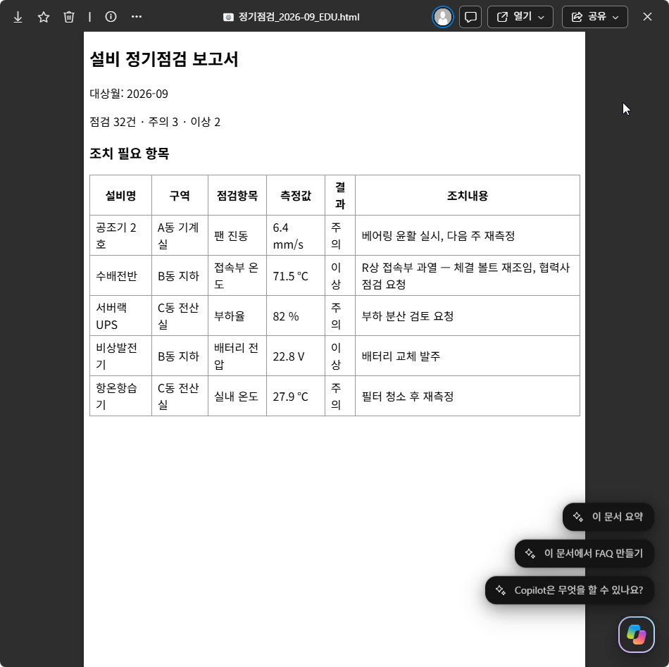

47. 창 아래 **승인**을 누릅니다. 확인 단계 없이 바로 응답이 보내집니다.

    

48. Outlook을 열고 `HGD [배포] 설비 정기점검 보고서 2026-09` 메일을 엽니다.

    **완료 기준**: 본문에 대상월 · 요약 · 보고서 링크 세 줄이 있고, 링크를 누르면 보고서가 열린다.

    

49. Teams 채팅 목록에서 **워크플로**가 보낸 메시지를 엽니다. 흐름 봇 메시지는 보낸 사람이 **워크플로**로 보입니다(Lab 1 36번).

    **완료 기준**: `HGD 설비 정기점검 보고서 2026-09 승인 완료` · `요약: 점검 32건 · 주의 3 · 이상 2` · **보고서 열기** 세 줄이 보이고, 보고서 열기를 누르면 보고서가 열린다.

    

50. Power Automate 탭으로 돌아가 실행 결과를 확인합니다.

    **완료 기준**: 조건의 **True** 갈래 카드 두 개에 초록 체크가 있고, **False** 갈래는 건너뜀으로 표시된다.

    
{: start="42" }

## 단계 ⑧ 반려 경로 테스트

51. 실행 화면 오른쪽 위 **편집**을 눌러 디자이너로 돌아온 뒤 42번과 같은 방법으로 흐름을 한 번 더 실행합니다.

    

52. 실행 화면에서 **파일 만들기** 카드까지 초록 체크가 붙는지 확인합니다. 같은 대상월로 두 번째 실행이라 같은 이름의 보고서 파일이 이미 있습니다.

    {: .warning }
    **파일 만들기가 실패하면 흐름이 거기서 멈추고 승인 요청이 오지 않습니다.** 그때는 SharePoint 보고서 폴더에서 `정기점검_2026-09_HGD.html` 을 삭제하고 51번부터 다시 합니다.

    

53. Teams **승인** 앱의 **받음** 탭에서 새로 온 요청을 엽니다.

    

54. **설명** 칸에 아래를 입력합니다.

    ```
    서버랙 UPS 부하율 82 % 항목의 조치 계획을 보완해 주세요.
    ```

    

55. **거부**를 고르고 **확인**을 누릅니다.

    

56. Outlook에서 `HGD [반려] 설비 정기점검 보고서 2026-09` 메일을 엽니다.

    **완료 기준**: `반려 의견:` 뒤에 54번에서 입력한 문장이 그대로 있다.

    

57. Power Automate 탭으로 돌아가 두 번째 실행 결과를 확인합니다.

    **완료 기준**: **False** 갈래의 메일 카드에 초록 체크가 있고, **True** 갈래는 건너뜀으로 표시된다.

    
{: start="51" }

---

## 확인

**필수**: 여기까지 되면 이 랩은 통과입니다

- ① 승인 요청 세부 정보에 대상월과 요약이 보이고, 항목 링크로 보고서가 열린다 (45·46번)
- ② 승인하면 보고서 링크가 든 배포 메일이 온다 (47·48번)
- ③ 승인하면 같은 내용의 Teams 메시지가 온다 (49번)
- ④ 거부하면 입력한 의견이 든 반려 메일이 온다 (54~56번)
{: .checklist }

**관찰**: 나오면 좋고, 안 나와도 실패가 아닙니다

- ⑤ 두 번째 실행에서 파일 만들기가 같은 이름 파일을 덮어쓰는가, 실패하는가 (52번)
- ⑥ Outlook에 온 승인 메일에서도 승인·거부 단추가 보이는가 (44번)
{: .checklist }

---

## 여기까지의 흐름

Lab 2 흐름의 **파일 만들기** 아래에 공유 링크 · 승인 · 조건과 두 갈래가 더해졌습니다. 이름 오른쪽은 핵심 설정값입니다.

```
Recurrence                1 월 · 2026-11-01 09:00 · (UTC+09:00) 서울
├─ 대상월                 작성 · formatDateTime(addToTime(...),'yyyy-MM')
├─ 원본행                 표에 있는 행 나열 · 점검기록.xlsx › 점검기록
├─ 점검행                 배열 필터링 · From 원본행 · 점검월 다음과 같음 대상월
├─ 조치필요               배열 필터링 · From 점검행 · 결과 다음과 같지 않음 정상
├─ 주의행                 배열 필터링 · From 점검행 · 결과 다음과 같음 주의
├─ 이상행                 배열 필터링 · From 점검행 · 결과 다음과 같음 이상
├─ 건수                   작성 · concat(... length() ...)
├─ 선택                   원본 조치필요 · 설비명·구역·점검항목·측정값·결과·조치내용
├─ HTML 테이블 만들기      원본 선택 출력
├─ 보고서                 작성 · HTML 틀 + 대상월·건수·HTML 테이블 출력
├─ 파일 만들기            pa_practice · /Shared Documents/보고서 · 정기점검_<대상월>_HGD.html
├─ 파일 또는 폴더에 대한 공유 링크 만들기    문서 · 항목 ID = body/ItemId · View only · People in your organization
├─ 승인 시작 및 대기      승인/거부 - 첫 번째로 응답 · 할당 대상 = 본인 · 항목 링크 = 공유 링크
└─ 조건                   결과 다음과 같음 Approve
   ├─ True
   │  ├─ 메일 보내기(V2)                  [배포] · 받는 사람 = 본인 · 대상월·건수·링크
   │  └─ 채팅 또는 채널에서 메시지 게시      흐름 봇 · 흐름 봇과 채팅 · 받는 사람 = 본인
   └─ False
      └─ 메일 보내기(V2) 1                [반려] · 받는 사람 = 본인 · 반려 의견 식
```

---

## 출처

이 랩은 아래를 토대로 만들었습니다. 제품 화면과 동작은 실측이고, 문헌은 항목마다 확인일을 적었습니다. 제품이 바뀌면 문헌 쪽이 먼저 낡습니다.

- **실측**: 실측 전 · 57스텝 · 0컷
- **문헌**: SharePoint 커넥터[^sharepoint] · 공유 링크 범위[^createlink] · 표준 승인 커넥터[^approvals] · 승인 흐름 자습서[^modern] · Office 365 Outlook 커넥터[^outlook] · Microsoft Teams 커넥터[^teams] · 클라우드 흐름 디자이너[^designer] · 식 함수 참조[^functions]

[^sharepoint]: **SharePoint** — Microsoft Learn 커넥터 참조. <https://learn.microsoft.com/ko-kr/connectors/sharepointonline/> (2026-10-02 확인). 파일 또는 폴더에 대한 공유 링크 만들기의 사이트 주소·라이브러리 이름·항목 ID·링크 유형·링크 범위, 파일 만들기 출력 ItemId, 공유 링크 출력 webUrl.
[^createlink]: **Create a sharing link for a DriveItem** — Microsoft Learn(Microsoft Graph). <https://learn.microsoft.com/graph/api/driveitem-createlink?view=graph-rest-1.0> (2026-10-02 확인). 링크 유형 view(읽기 전용)와 범위 organization(조직에 로그인한 사람)의 뜻.
[^approvals]: **표준 승인** — Microsoft Learn 커넥터 참조. <https://learn.microsoft.com/ko-kr/connectors/approvals/> (2026-10-02 확인). 승인 시작 및 대기 · 세부 정보의 Markdown 지원 · 할당 대상 형식 · 응답 값의 대소문자 구분 · responses.comments 출력.
[^modern]: **Power Automate를 사용하여 승인 워크플로 만들기 및 테스트** — Microsoft Learn. <https://learn.microsoft.com/ko-kr/power-automate/modern-approvals> (2026-10-02 확인). 새 디자이너에서 승인 작업의 승인 유형·제목·할당 대상·세부 정보를 채우는 순서와, 결과로 조건을 걸어 갈래마다 메일을 보내는 구성.
[^outlook]: **Office 365 Outlook** — Microsoft Learn 커넥터 참조. <https://learn.microsoft.com/ko-kr/connectors/office365/> (2026-10-02 확인). 메일 보내기(V2)의 받는 사람·제목·본문(HTML) 매개 변수.
[^teams]: **Microsoft Teams** — Microsoft Learn 커넥터 참조. <https://learn.microsoft.com/ko-kr/connectors/teams/> (2026-10-02 확인). 채팅 또는 채널에 메시지 게시의 게시자·게시 위치 매개 변수와 흐름 봇 게시자의 제한.
[^teamsfmt]: **Format agent messages** — Microsoft Learn. <https://learn.microsoft.com/microsoftteams/platform/bots/how-to/format-your-bot-messages> (2026-10-05 확인). Teams 가 봇 메시지에서 받는 HTML — `<br>` 줄바꿈 · `<a href>` 링크.
[^designer]: **클라우드 흐름 디자이너 살펴보기** — Microsoft Learn. <https://learn.microsoft.com/ko-kr/power-automate/flows-designer> (2026-10-02 확인). 번개 아이콘(동적 콘텐츠)과 fx(식) · 저장 · 테스트 › 수동.
[^functions]: **Reference guide to functions in expressions for workflows in Azure Logic Apps and Power Automate** — Microsoft Learn. <https://learn.microsoft.com/azure/logic-apps/expression-functions-reference> (2026-10-02 확인). first · outputs 와 ?[] 연산자.
