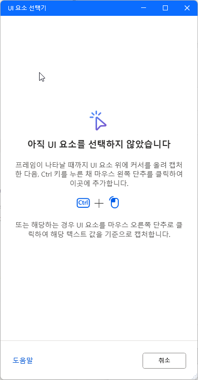
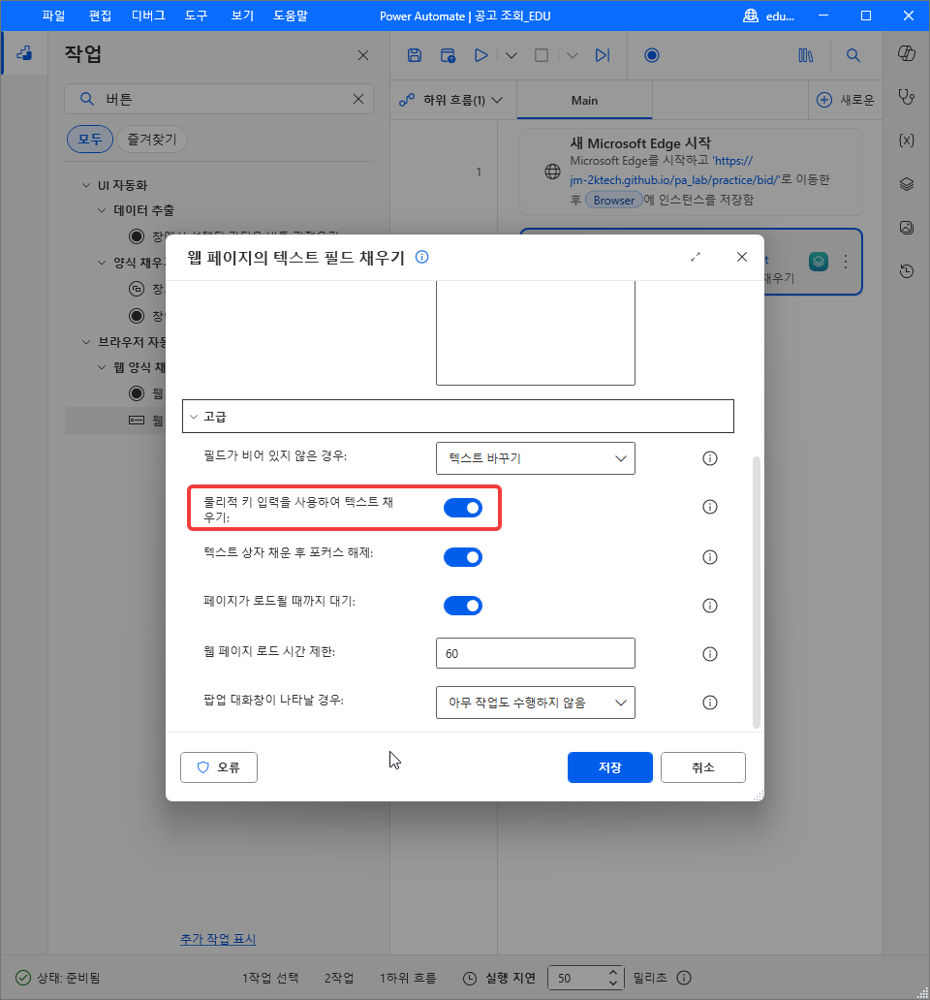
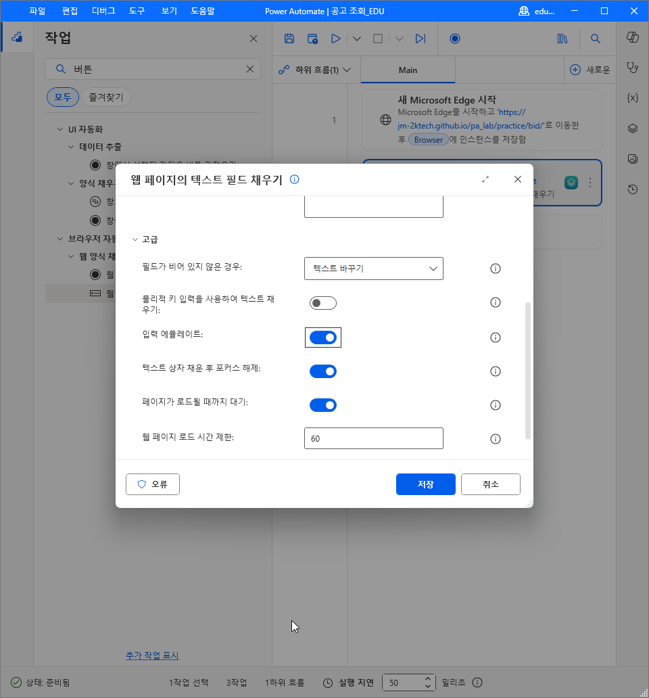
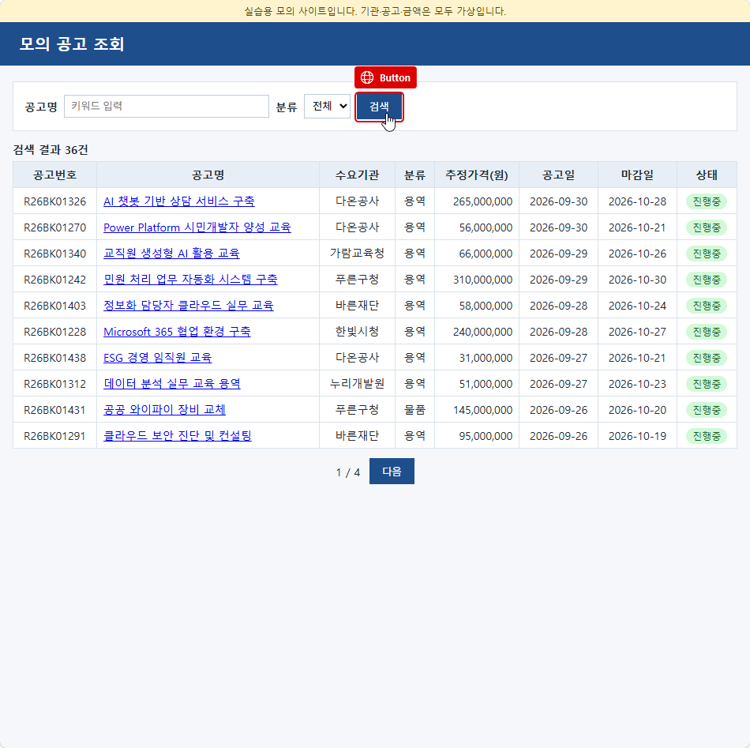
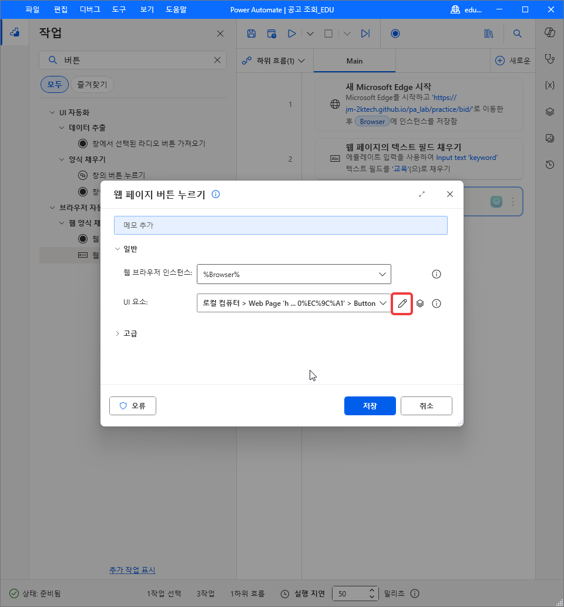
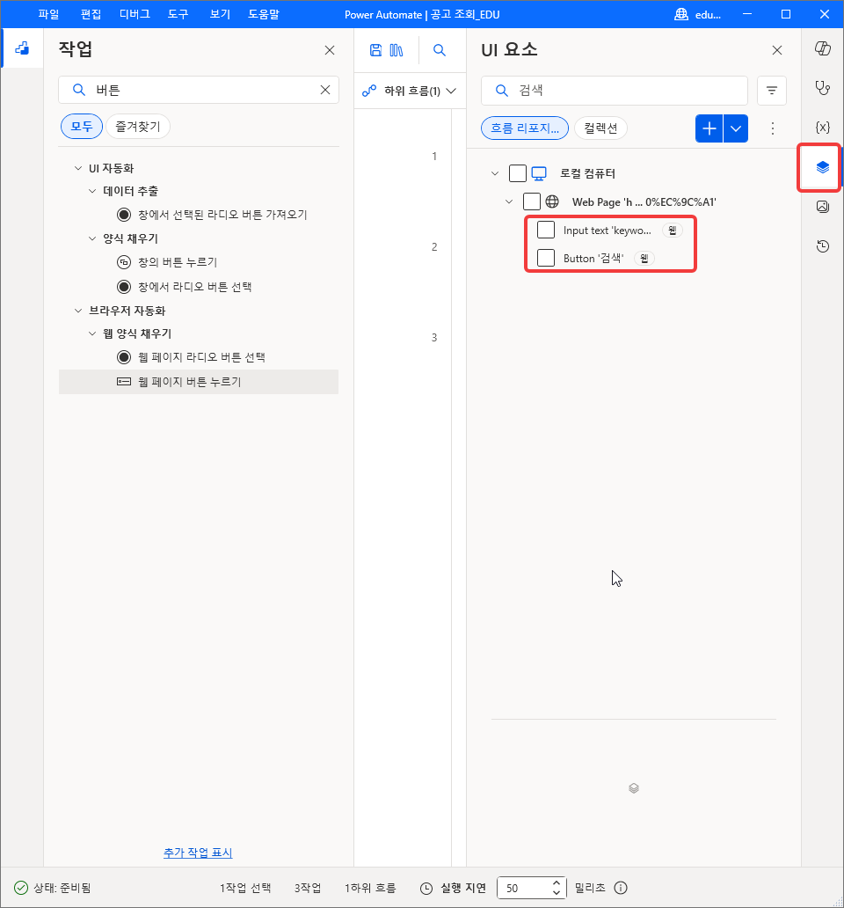
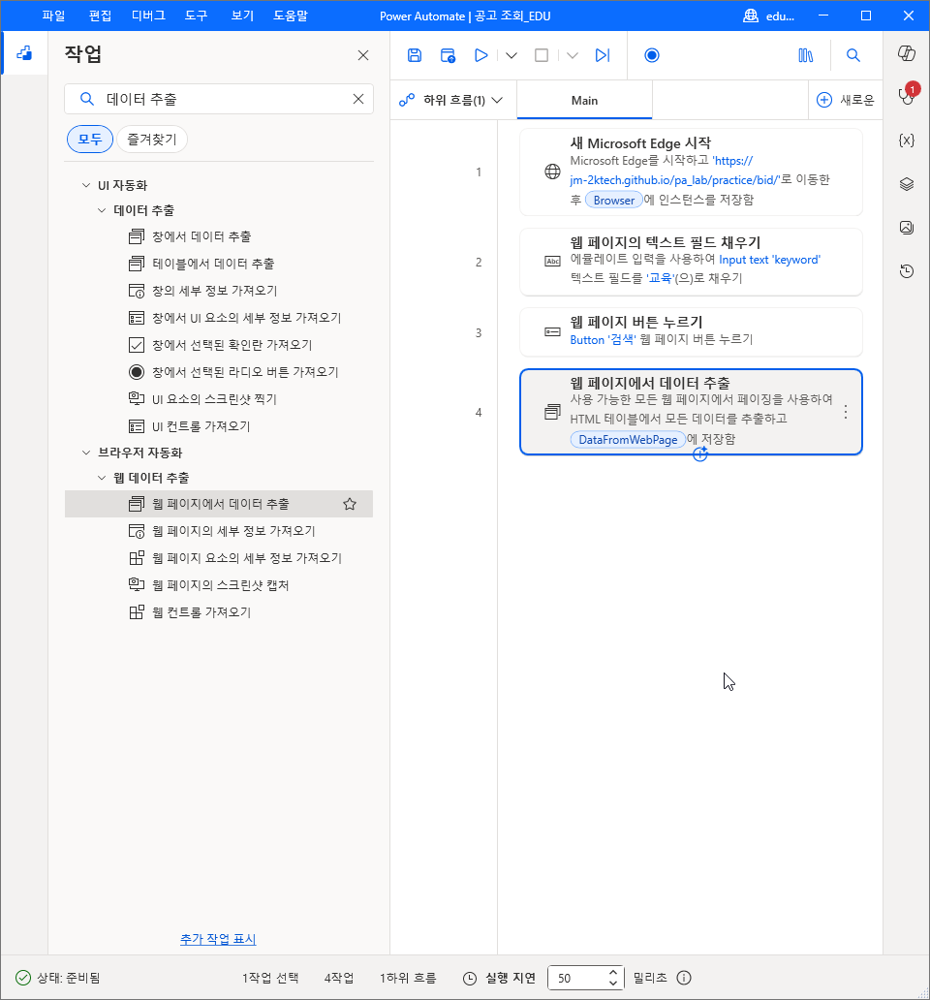

# Lab 5. 웹 자동화 🌐

<!-- 저작 메모(학생 비노출):
     ★ 자리 — Lab 4(PAD 기본)에서 디자이너 조작 · 변수 창 · Excel 실행/닫기를 받는다.
       이 랩의 흐름 `공고 조회_HGD` 를 Lab 6 이 「다른 이름으로 저장」해 `고객 발굴_HGD` 로 키운다.
       Lab 6 은 1~4번 줄(Edge 시작 · 텍스트 필드 채우기 · 단추 누르기 · 데이터 추출)과 8번 줄(웹 브라우저 닫기)을 그대로 쓰고 5~7번 줄(Excel 저장부)을 지운다.
     ★ 실측 — 1~27번 실측(2026-10-05). 28번부터는 MS Learn 한국어판 기준 초안이다.
     ★ 의존 — UI 요소 둘(공고명 입력칸 · 검색 단추)과 데이터 추출 설정(전체 HTML 표 + 다음 단추 호출기)을 Lab 6 이 그대로 쓴다.
       여기서 요소를 잘못 잡으면 Lab 6 에서 키워드 넷이 전부 틀어진다. 29번 완료 기준(16행)을 통과해야 다음 절로 간다.
       `C:\PA실습` 은 Lab 4 에서 푼 것을 쓴다. Lab 4 ⑤ 를 두 번 돌려도 이 랩에는 영향이 없다(정리대상 폴더만 쓴다).
     ✔ 1~10번 실측(2026-10-05). 콘솔 새 흐름은 + 새로운 › 흐름(Lab 4 와 같다). Edge 작업 칸 이름은 「이니셜 URL」(초기 URL 아님),
       창 상태 값 「최대화됨」, 그 밖에 대상 데스크톱 · 브라우저 상호 작용 메서드(브라우저 확장) · 고급 · 변수 생성됨 Browser.
     ⚠️ 실측할 것
       - 작업 이름: MS Learn 한국어판이 문서마다 다르다. 참조 문서는 「웹 페이지 버튼 누르기」, 웹 자동화 문서는 「웹 페이지의 텍스트 필드 채우기」.
         설계 §6 의 「웹 페이지의 단추 누르기」 는 참조 문서와 다르다. 화면 글자로 맞춘다
       - Excel 작업 이름: 한국어 참조가 「Excel 시작」「Excel을 시작」「Excel 실행」을 섞어 쓴다. 본문은 설계 §6 대로 「Excel 실행」
       - 매개 변수 라벨: 「다음 문서 열기」「인스턴스 표시」「쓸 값」「쓰기 모드」「Excel을 닫기 전」 — 한국어 참조에 영문 그대로 남아 있다(Make instance visible · Value to write · Before closing Excel)
       - ✔ 11~14번(2026-10-05). 검색 결과에 UI 자동화 › 창에서 텍스트 필드 채우기가 같이 뜬다. UI 요소 드롭다운은 흐름 리포지토리 · 컬렉션 탭.
         잡을 때 테두리 위 표시는 `Input text` 뿐이다(`'keyword'` 는 안 보인다). 빨간 테두리가 뜬 상태에서 Ctrl + 클릭해야 잡힌다(제작자).
         ✔ 잡은 뒤 UI 요소 칸 연필 → 「"Input text 'keyword'" UI 요소 의 선택기」 창. 요소 목록 Body · Main content · Form 'searchForm' · Input text 'keyword',
           오른쪽 특성 Class · Id · Ordinal · Title, 아래 「미리 보기 선택기」. 기본은 4번만 체크(input[Id="keyword"]). 1~4 체크 시 > body > main > form[Id="searchForm"] > input[Id="keyword"].
           최종은 4번만(제작자 결정). 1~3 체크는 상위 경로를 넣어 선택기를 구체적으로 만드는 시연 — 강의에서 말로 짚을 것
           (사이트마다 같은 모양 요소가 여럿이면 경로를 넣고, 구조가 자주 바뀌면 짧게 둔다)
       - ✔ 15b 고급: 필드가 비어 있지 않은 경우(텍스트 바꾸기) · 물리적 키 입력을 사용하여 텍스트 채우기 · 텍스트 상자 채운 후 포커스 해제 · 페이지가 로드될 때까지 대기 · 웹 페이지 로드 시간 제한 60 · 팝업 대화창이 나타날 경우.
         물리적 키 입력의 실측 기본값은 켜짐이다(참조 문서는 기본 False 로 적는다 — 문서와 다름). 끄는 것을 기본으로, 안 될 때 켜게 적었다(제작자 권장).
         차이 설명은 참조 문서(Populate text field on web page — 켜면 창을 앞으로 가져온다)를 근거로 했다.
         ⚠️ 15b 는 켜진 상태의 화면이다. 끈 상태 컷이 필요하면 다시 찍는다
       - ✔ 13b: UI 요소 추가를 누르면 「UI 요소 선택기」 창이 따로 뜬다(Ctrl + 왼쪽 클릭 안내, 오른쪽 클릭은 텍스트 값 기준 캡처, 취소)
       - ✔ 15c~19번(2026-10-05). 물리적 키 입력을 끄면 「입력 에뮬레이트」가 새로 뜬다(기본 켬). 단추 작업 이름 「웹 페이지 버튼 누르기」(UI 자동화 › 창의 버튼 누르기도 같이 뜬다).
         검색 단추 테두리 표시는 `Button`, 선택기 제목 「"Button '검색'" UI 요소 의 선택기」, Id btnSearch. UI 요소 창은 오른쪽 세로 막대 겹친 사각형 아이콘.
         실행 중 PAD 가 누르는 요소를 노랗게 표시한다
       - 20번 삭제(제작자 2026-10-05) — 「흐름이 연 Edge 창 닫기」는 19번 끝 문장으로 옮겼다. 21번부터 한 칸씩 당겼다
       - ✔ 20~26번(2026-10-05). Edge 창을 앞으로 가져오면 라이브 웹 도우미가 뜬다. 전체 HTML 테이블 추출은 머리글을 열 이름으로 쓴다(미리 보기 8열).
         다음 단추 메뉴 이름은 「요소를 페이지 선택기로 설정」(초안의 「호출기」 아님). 대화 상자 칸: 데이터 추출(기본 첫 번째만) · 처리할 최대 웹 페이지 수(0) ·
         다음 페이지로 실제 클릭 보내기(끔) · 추출 시 데이터 처리(끔) · 시간 제한 60. 참조 문서의 「페이징 사용」「모든 웹 페이지 가져오기」는 화면에 없다.
         ✔ 25번: 페이지 선택기를 넣으면 미리 보기 맨 아래에 「다음 페이지의 상응하는 값...」이 흐리게 붙는다(제작자 교체 컷).
         ✔ 27번: 데이터 추출 「사용 가능한 모든 항목」으로 바꾸면 처리할 최대 웹 페이지 수 칸이 사라진다. 저장 칸 이름은 「데이터 저장 모드」(초안의 「데이터 모드 저장」 아님).
         ⚠️ SPA 쪽 넘김에서 「다음 페이지로 실제 클릭 보내기」를 끈 채로 2쪽까지 읽는지는 28 · 29번 실행 결과로 확인
       - 페이지 매김이 `btnNext` 의 disabled 에서 멈추는가(설계 §7). 멈추지 않으면 2쪽을 두 번 읽어 22행이 된다
       - 설계 §5 는 라이브 웹 도우미 미리 보기를 16행으로 적었다. 미리 보기가 현재 쪽 10행만 보이면 본문 23번 표현이 맞다. 실측 후 확정
       - 「Excel 닫기」 다른 이름으로 저장이 같은 이름 파일을 덮어쓰는가(42번 재실행 시)
       - 추정가격 열이 Excel 에 텍스트(`56,000,000`)로 들어가는가, 숫자로 바뀌는가 -->

> **이번 랩 완성물**: 모의 공고 사이트에서 「교육」 공고를 검색해 두 쪽 결과를 Excel 파일로 저장하는 Desktop 흐름 `공고 조회_HGD`
>
> **예상 시간**: 70분
>
> **완성 신호**: `C:\PA실습\결과\공고_교육.xlsx` 의 머리글 아래에 16행이 들어 있다

{: .time }
70분 타이머. 6단(사이트 보기 → 브라우저 열기 → 입력과 검색 → 표 추출 → Excel 저장 → 마무리)으로 나눠 진행합니다.

---

## 준비

- 브라우저는 **Microsoft Edge**를 씁니다. Edge 주소창에 `edge://extensions/` 를 입력해 **Microsoft Power Automate** 확장이 설치되어 있고 켜져 있는지 확인합니다.[^ext]
- Lab 4에서 푼 `C:\PA실습\` 폴더를 그대로 씁니다. `공고결과_템플릿.xlsx` 와 빈 `결과` 폴더가 있어야 합니다. 없으면 [PA실습.zip](../assets/download/PA실습.zip)을 `C:\` 에 다시 풉니다.
- 흐름 이름의 `HGD` 는 본인 이니셜로 바꿉니다.

---

## 단계 ① 사이트 보기

1. Edge 주소창에 아래 주소를 넣고 엽니다.

    ```
    {{ site.url }}{{ site.baseurl }}/practice/bid/
    ```

    

2. **공고명** 칸에 `교육` 을 입력하고 **검색**을 누릅니다.

    

3. 표 위에 「검색 결과 16건」, 표 아래에 「1 / 2」가 보이는지 확인합니다. 표의 열은 공고번호·공고명·수요기관·분류·추정가격(원)·공고일·마감일·상태 여덟 개입니다.

    

4. 표 아래 **다음**을 누릅니다. 쪽 표시가 「2 / 2」로 바뀌고 6행이 보입니다. 이 쪽에서는 **다음**이 흐리게 바뀌어 눌리지 않습니다.

    

5. **이전**을 눌러 1쪽으로 돌아갑니다. 이 Edge 창은 닫지 않습니다. ③·④에서 화면 요소를 잡을 때 이 창을 씁니다.

    

## 단계 ② 브라우저 열기

6. Power Automate Desktop 콘솔의 **흐름** 화면에서 위쪽 **+ 새로운** › **흐름**을 고릅니다(Lab 4 4번). **흐름 만들기** 창의 **흐름 이름**에 아래를 넣고, **Power Fx 사용**은 끈 채로 **만들기**를 누릅니다.

    ```
    공고 조회_HGD
    ```

    

7. 디자이너 왼쪽 작업 창의 검색 칸에 `Edge` 를 입력하고 **브라우저 자동화** 아래 **새 Microsoft Edge 시작**을 작업 영역으로 끌어다 놓습니다.

    

8. **시작 모드**가 **새 인스턴스 시작**인지 확인하고 **이니셜 URL**에 아래를 넣습니다.[^web]

    ```
    {{ site.url }}{{ site.baseurl }}/practice/bid/
    ```

    

9. **창 상태**를 **최대화됨**으로 바꾸고 **저장**을 누릅니다. 열린 브라우저는 **변수 생성됨**의 `Browser` 에 담깁니다. 다음 작업들이 이 변수로 같은 창을 찾습니다.

    

10. 위쪽 **실행**(▶)을 누릅니다. Edge 창이 새로 열리고 모의 공고 사이트가 뜨면 그 창만 닫습니다. 5번에서 열어 둔 창은 그대로 둡니다.

    **완료 기준**: 1번 줄에 새 Microsoft Edge 시작이 있고, 실행하면 사이트가 최대화된 창으로 열린다.

    
{: start="6" }

## 단계 ③ 입력과 검색

11. 작업 창 검색 칸에 `텍스트 필드` 를 입력하고, **브라우저 자동화 › 웹 양식 채우기** 아래 **웹 페이지의 텍스트 필드 채우기**를 1번 줄 아래로 끌어다 놓습니다. 위쪽 **UI 자동화** 아래의 **창에서 텍스트 필드 채우기**가 아닙니다.

    

12. **웹 브라우저 인스턴스**가 `%Browser%` 인지 확인합니다. 1번 줄이 만든 변수가 기본으로 들어갑니다.

    

13. **UI 요소** 칸의 드롭다운을 엽니다. **흐름 리포지토리** 탭에 「표시할 UI 요소가 없습니다」가 보입니다. **UI 요소 추가**를 누릅니다.

    

    **UI 요소 선택기** 창이 따로 뜹니다. 「아직 UI 요소를 선택하지 않았습니다」와 함께 잡는 방법(Ctrl + 마우스 왼쪽 단추)이 적혀 있습니다. 요소를 잡으면 이 창은 저절로 닫힙니다. 잡지 않고 그만두려면 **취소**를 누릅니다.

    

14. 5번에서 열어 둔 Edge 창으로 가서 **공고명** 입력칸 위에 마우스를 올립니다. 입력칸에 빨간 테두리와 `Input text` 표시가 뜬 상태에서 **Ctrl + 왼쪽 클릭**합니다. 테두리가 빨갛게 보일 때 눌러야 요소가 잡힙니다.[^web]

    {: .warning }
    **「공고명」 글자가 아니라 그 오른쪽 입력칸을 잡습니다.** 글자(label)를 잡으면 실행할 때 입력칸에 아무것도 들어가지 않습니다.

    

    대화 상자로 돌아오면 **UI 요소** 칸에 `로컬 컴퓨터 > Web Page ... >` 로 시작하는 경로가 들어 있습니다. 칸 오른쪽 연필 아이콘을 눌러 선택기를 엽니다.

    

    **UI 요소의 선택기** 창의 **요소** 목록에 페이지 구조가 위에서부터 네 줄로 보입니다. 기본으로 4번 `Input text 'keyword'` 만 체크되어 있고, 아래 **미리 보기 선택기**는 아래와 같습니다. 페이지에서 id 가 `keyword` 인 입력칸 하나를 찾는다는 뜻입니다.

    ```
    input[Id="keyword"]
    ```

    ![선택기 창 — 4번 Input text 'keyword' 만 체크, 미리 보기 선택기 input[Id="keyword"]](../assets/lab5/lab5-14c.png)

    1~3번에도 체크해 봅니다. 설정을 바꾸는 것이 아니라 체크가 하는 일을 보는 것이고, 바로 되돌립니다. 미리 보기 선택기가 body 부터 입력칸까지 내려가는 경로로 길어집니다. 상위 요소를 함께 적을수록 같은 모양의 요소가 여럿인 페이지에서 하나를 더 정확히 집습니다. 대신 페이지 구조가 바뀌면 경로가 어긋나 요소를 찾지 못합니다.

    ![1~4번 모두 체크 — 미리 보기 선택기 > body > main > form[Id="searchForm"] > input[Id="keyword"]](../assets/lab5/lab5-14d.png)

    이 페이지는 id 하나로 입력칸이 정해집니다. 1~3번 체크를 다시 풀어 4번만 남깁니다. 4번을 고른 채 오른쪽 **특성** 목록을 내려 보면 **Id** 에 체크되어 있고 값이 `keyword` 입니다. 미리 보기 선택기가 `input[Id="keyword"]` 로 돌아온 것을 확인하고 **저장**을 누릅니다.

    **완료 기준**: 요소 목록에서 4번만 체크되어 있고, 미리 보기 선택기가 `input[Id="keyword"]` 다.

    ![4번만 체크 · 특성 Id 체크 값 keyword · 미리 보기 선택기 input[Id="keyword"]](../assets/lab5/lab5-14e.png)

15. 원래 대화 상자로 돌아오면 **텍스트**에 아래를 넣습니다.

    ```
    교육
    ```

    

    이어서 **고급**을 펼쳐 **물리적 키 입력을 사용하여 텍스트 채우기**를 끄고 **저장**을 누릅니다. 처음에는 켜져 있습니다. 이 토글은 글자를 넣는 방식을 바꿉니다.[^web]

    - 끄면 PAD 가 브라우저 확장을 통해 입력칸의 값을 바로 넣습니다. Edge 창이 뒤에 있거나 최소화되어 있어도 들어갑니다. 대신 사람이 키를 누를 때 생기는 페이지 쪽 반응(자동 완성 목록, 입력 중 검사 등)은 일어나지 않을 수 있습니다.
    - 켜면 실제 키보드로 치듯 한 글자씩 입력합니다. Edge 창을 맨 앞으로 가져와야 해서 실행 중에는 창이 앞에 뜨고, 그동안 다른 창을 누르면 글자가 그쪽으로 갈 수 있습니다.

    끈 채로 쓰다가, 실행했는데 입력칸에 글자가 들어가지 않거나 페이지가 반응하지 않을 때 켭니다. 모의 사이트는 **검색**을 누를 때 입력칸의 값을 읽으므로 끈 채로 됩니다.

    

    물리적 키 입력을 끄면 바로 아래에 **입력 에뮬레이트**가 새로 나타납니다. 켜져 있는 그대로 둡니다. 켜 두면 값을 한 번에 넣지 않고 한 글자씩 보내 입력을 흉내 냅니다. 느리지만 일부 복잡한 페이지에서는 이 방식이어야 입력이 먹습니다. 저장하면 작업 영역 2번 줄에 `에뮬레이트 입력을 사용하여` 가 붙습니다.

    

16. 작업 창 검색 칸에 `버튼` 을 입력하고, **브라우저 자동화 › 웹 양식 채우기** 아래 **웹 페이지 버튼 누르기**를 2번 줄 아래로 끌어다 놓습니다. **UI 자동화** 아래의 **창의 버튼 누르기**가 아닙니다.

    

17. **UI 요소** 드롭다운을 엽니다. 14번에서 잡은 `Input text 'keyword'` 가 이미 보입니다. 아래 **UI 요소 추가**를 누릅니다.

    

    14번과 같이 5번의 Edge 창에서 **검색** 단추에 빨간 테두리와 `Button` 표시가 뜬 상태로 **Ctrl + 왼쪽 클릭**합니다.

    

    대화 상자로 돌아오면 **UI 요소** 칸 오른쪽 연필 아이콘을 눌러 선택기를 엽니다.

    

    14번과 같이 4번 `Button '검색'` 만 체크되어 있고, **특성**의 **Id** 값이 `btnSearch` 인지 확인합니다. 미리 보기 선택기가 아래와 같으면 **저장**을 누릅니다.

    ```
    button[Id="btnSearch"]
    ```

    ![Button '검색' 선택기 — 4번만 체크 · Id btnSearch · 미리 보기 선택기 button[Id="btnSearch"]](../assets/lab5/lab5-17d.png)

18. 웹 페이지 버튼 누르기 대화 상자의 **저장**을 누릅니다. **UI 요소** 드롭다운을 다시 열면 요소가 두 개입니다.

    

    디자이너 오른쪽 세로 막대의 **UI 요소**(겹친 사각형 아이콘)를 누르면 **UI 요소** 창에서도 같은 두 개가 보입니다.

    **완료 기준**: UI 요소 창의 **흐름 리포지토리**에 `Input text 'keyword'` 와 `Button '검색'` 두 개가 있다.

    

19. **실행**(▶)을 누릅니다. 새 Edge 창에서 공고명 칸에 `교육` 이 들어가고 검색이 실행됩니다. PAD 가 누르는 순간 **검색** 단추가 노랗게 표시됩니다. 확인한 뒤 흐름이 연 Edge 창을 닫습니다. 5번에서 열어 둔 창은 그대로 둡니다.

    **완료 기준**: 흐름이 연 창에 「검색 결과 16건」이 보인다.

    
{: start="11" }

## 단계 ④ 표 추출

20. 작업 창 검색 칸에 `데이터 추출` 을 입력하고, **브라우저 자동화 › 웹 데이터 추출** 아래 **웹 페이지에서 데이터 추출**을 3번 줄 아래로 끌어다 놓습니다. **UI 자동화 › 데이터 추출** 아래의 작업들이 아닙니다.

    

21. 대화 상자를 열어 둔 채 5번의 Edge 창을 앞으로 가져옵니다. **라이브 웹 도우미** 창이 뜹니다. 아직 고른 것이 없어 **추출 미리 보기**에 「선택한 추출이 없습니다」가 보입니다.[^webauto]

    {: .warning }
    **Edge 창이 「검색 결과 16건 · 1 / 2」 상태여야 합니다.** 다른 화면이면 2번처럼 `교육` 을 다시 검색한 뒤 진행합니다.

    

22. 결과 표 안의 칸(예: **공고번호** 머리글)에서 마우스 오른쪽 단추를 누르고 **전체 HTML 테이블 추출**을 고릅니다.

    

23. 라이브 웹 도우미의 **추출 미리 보기**에 여덟 열짜리 표가 보이는지 확인합니다. 머리글(공고번호 ~ 상태)은 열 이름으로 들어가고 데이터 행에 섞이지 않습니다.

    

24. Edge 창으로 돌아가 표 아래 **다음** 단추에서 마우스 오른쪽 단추를 누르고 **요소를 페이지 선택기로 설정**을 고릅니다. 표에는 초록 점선 테두리가 남아 있습니다.

    

25. 라이브 웹 도우미의 **추출 미리 보기**를 맨 아래로 내립니다. 1쪽 행 아래에 「다음 페이지의 상응하는 값...」이 흐리게 보입니다. 다음 쪽도 같은 형식으로 이어 읽는다는 표시입니다. **완료**를 누릅니다.

    

26. **웹 페이지에서 데이터 추출** 대화 상자로 돌아옵니다. 안내 문구의 **추출할 데이터의 시놉시스**가 「여러 웹 페이지의 HTML 테이블 레코드를 8열 테이블 형식으로 추출합니다.」인지 확인합니다. 「여러 웹 페이지」는 24번의 페이지 선택기가 들어갔다는 뜻입니다.

    

27. **데이터 추출** 드롭다운을 **첫 번째만**에서 **사용 가능한 모든 항목**으로 바꿉니다. 첫 번째만이면 1쪽 10행만 읽습니다. 바꾸면 **처리할 최대 웹 페이지 수** 칸이 사라지고, 다음 단추가 눌리지 않을 때까지 쪽을 넘기며 읽습니다.

    **데이터 저장 모드**가 **변수**인지 확인하고 **저장**을 누릅니다. 추출한 표는 **변수 생성됨**의 `DataFromWebPage` 에 담깁니다.

    

    **완료 기준**: 작업 영역 4번 줄이 「사용 가능한 모든 웹 페이지에서 페이징을 사용하여 HTML 테이블에서 모든 데이터를 추출하고 `DataFromWebPage` 에 저장함」이다.

    

28. **실행**(▶)을 누릅니다. 흐름이 연 창에서 검색 뒤 2쪽으로 한 번 넘어갔다가 멈춥니다.

    

29. 디자이너 오른쪽 **변수** 창에서 `DataFromWebPage` 를 두 번 클릭해 내용을 엽니다. 확인한 뒤 흐름이 연 Edge 창을 닫습니다.

    **완료 기준**: 행이 16개이고 첫 행 공고번호가 `R26BK01270` 이다.

    
{: start="20" }

## 단계 ⑤ Excel 저장

30. 작업 창 검색칸에 `Excel` 을 입력하고 **Excel 실행**을 4번 줄 아래로 끌어다 놓습니다.[^excel]

    

31. **Excel 실행**을 **다음 문서 열기**로 바꾸고 **문서 경로**에 아래를 넣습니다.

    ```
    C:\PA실습\공고결과_템플릿.xlsx
    ```

    

32. **인스턴스 표시**가 켜져 있는지 확인하고 저장을 누릅니다. 열린 Excel 은 **변수 생성됨**의 `ExcelInstance` 에 담깁니다.

    

33. **Excel 워크시트에 쓰기**를 5번 줄 아래로 끌어다 놓습니다. **Excel 인스턴스**가 `%ExcelInstance%` 인지 확인합니다.

    

34. **쓸 값**에 아래를 넣습니다.

    ```
    %DataFromWebPage%
    ```

    

35. **쓰기 모드**는 **지정된 셀에 쓰기**, **열**은 `A`, **행**은 `2` 로 두고 저장을 누릅니다. 템플릿 1행에 머리글이 이미 있어 2행부터 씁니다.

    

36. **Excel 닫기**를 6번 줄 아래로 끌어다 놓습니다.

    

37. **Excel을 닫기 전**을 **다른 이름으로 문서 저장**으로 바꿉니다. **문서 형식**은 기본값 그대로 둡니다.

    

38. **문서 경로**에 아래를 넣고 저장을 누릅니다.

    ```
    C:\PA실습\결과\공고_교육.xlsx
    ```

    
{: start="30" }

## 단계 ⑥ 마무리

39. 작업 창 검색칸에 `브라우저 닫기` 를 입력하고 **웹 브라우저 닫기**를 7번 줄 아래로 끌어다 놓습니다. **웹 브라우저 인스턴스**가 `%Browser%` 인지 확인하고 저장을 누릅니다.

    

40. **Ctrl + S** 로 흐름을 저장합니다.

    

41. **실행**(▶)을 누릅니다. Edge가 열려 검색하고 2쪽까지 넘긴 뒤, Excel이 잠깐 열렸다 닫히고 Edge도 닫힙니다.

    {: .warning }
    **실행하는 동안 마우스와 키보드를 건드리지 않습니다.** Excel 창이 앞에 뜬 상태에서 셀을 누르면 쓰기 위치가 바뀔 수 있습니다.

    

42. 파일 탐색기에서 `C:\PA실습\결과\` 를 열고 `공고_교육.xlsx` 를 엽니다.

    

43. 1행 머리글 아래 2행부터 17행까지 값이 있는지 봅니다.

    **완료 기준**: 2~17행에 16행이 있고, 18행은 비어 있다. A2는 `R26BK01270` 이다.

    

44. Excel 파일을 저장하지 않고 닫습니다.

    

45. 디자이너의 줄 1~8을 아래 「여기까지의 흐름」과 대조합니다.

    
{: start="39" }

---

## 확인

**필수**: 여기까지 되면 이 랩은 통과입니다

- ① 흐름 이름이 `공고 조회_HGD`(본인 이니셜)다 (6번)
- ② UI 요소 창에 공고명 입력칸과 검색 단추 두 개가 있다 (14·17·18번)
- ③ `DataFromWebPage` 가 16행이다 (29번)
- ④ `C:\PA실습\결과\공고_교육.xlsx` 의 2~17행에 16행이 있다 (43번)
{: .checklist }

**관찰**: 나오면 좋고, 안 나와도 실패가 아닙니다

- ⑤ 2 / 2 쪽에서 다음 단추가 비활성이 된다 (4번)
- ⑥ 흐름이 2쪽까지 넘긴 뒤 멈춘다 (28번)
{: .checklist }

---

## 여기까지의 흐름

새 흐름 `공고 조회_HGD` 를 만들었습니다. 줄 번호는 디자이너 화면의 줄 번호입니다.

```
1  새 Microsoft Edge 시작         초기 URL = 모의 공고 사이트 · 창 상태 최대화 → %Browser%
2  웹 페이지의 텍스트 필드 채우기  UI 요소 Input text 'keyword' · 텍스트 = 교육
3  웹 페이지 버튼 누르기          UI 요소 Button '검색'
4  웹 페이지에서 데이터 추출      전체 HTML 테이블 · 호출기 = 다음 단추 · 모든 웹 페이지 → %DataFromWebPage%
5  Excel 실행                    C:\PA실습\공고결과_템플릿.xlsx → %ExcelInstance%
6  Excel 워크시트에 쓰기          %DataFromWebPage% → 열 A · 행 2
7  Excel 닫기                    다른 이름으로 문서 저장 · C:\PA실습\결과\공고_교육.xlsx
8  웹 브라우저 닫기               %Browser%
```

---

## 출처

이 랩은 아래를 토대로 만들었습니다. 제품 화면과 동작은 실측이고, 문헌은 항목마다 확인일을 적었습니다. 제품이 바뀌면 문헌 쪽이 먼저 낡습니다.

- **실측**: 2026-10-05 1~27번
- **문헌**: Power Automate 브라우저 확장 설치[^ext] · 브라우저 자동화 작업[^web] · 웹 페이지 자동화[^webauto] · Excel 작업[^excel]

[^ext]: **Install Power Automate browser extensions** — Microsoft Learn. <https://learn.microsoft.com/power-automate/desktop-flows/install-browser-extensions> (2026-10-02 확인). Edge 확장 이름 「Microsoft Power Automate」와 `edge://extensions/` 확인 경로.
[^web]: **브라우저 자동화 작업** — Microsoft Learn. <https://learn.microsoft.com/ko-kr/power-automate/desktop-flows/actions-reference/webautomation> (2026-10-02 확인). 새 Microsoft Edge 시작의 시작 모드·초기 URL·창 상태와 생성 변수 `Browser`, 텍스트 필드 채우기·버튼 누르기·웹 브라우저 닫기의 매개 변수, 데이터 추출의 페이징 매개 변수와 생성 변수 `DataFromWebPage`.
[^webauto]: **웹 페이지 자동화** — Microsoft Learn. <https://learn.microsoft.com/ko-kr/power-automate/desktop-flows/automation-web> (2026-10-02 확인). UI 요소를 Ctrl + 왼쪽 클릭으로 추가하는 방법, 라이브 웹 도우미의 전체 HTML 테이블 추출과 요소를 호출기로 설정.
[^excel]: **Excel 작업** — Microsoft Learn. <https://learn.microsoft.com/ko-kr/power-automate/desktop-flows/actions-reference/excel> (2026-10-02 확인). Excel 실행의 문서 경로와 생성 변수 `ExcelInstance`, Excel 워크시트에 쓰기가 데이터 테이블을 지정한 셀부터 오른쪽·아래로 채우는 동작, Excel 닫기의 다른 이름으로 문서 저장.
