# Lab 6. 고객계약 발굴 🔎

<!-- 저작 메모(학생 비노출):
     ★ 자리 — Lab 5 의 `공고 조회_HGD` 를 「다른 이름으로 저장」해 `고객 발굴_HGD` 로 키운다. 과정의 마지막 랩이다.
       Lab 5 에서 받는 것: Edge 시작 · UI 요소 둘(공고명 입력칸 · 검색 단추) · 데이터 추출 설정(전체 HTML 표 + 다음 단추 호출기) · 웹 브라우저 닫기.
       Lab 4 에서 받는 것: For each · If · 변수 창 조작.
     ★ 실측 — 1~31번 실측(2026-10-06). 32번부터는 초안. 파일 메뉴: 초안 저장(Ctrl+S) · 게시 · 다른 이름으로 저장(Ctrl+Shift+S) · 종료.
       다른 이름으로 저장 창: 흐름 이름 · 유형(흐름/템플릿) · 저장. Shift+클릭으로 여러 줄 선택 확인
     ★ 의존 — Lab 5 확인 절 ②③(UI 요소 둘, DataFromWebPage 16행)이 이 랩의 전제다. 둘 중 하나가 안 되면 ④부터 어긋난다.
       Lab 5 에는 게시 스텝을 두지 않는다(제작자 2026-10-05 — Lab 4 54번에서 배웠다). 1번에서 콘솔 편집 단추가 꺼져 있으면 Lab 5 디자이너를 닫으라는 한 줄만 둔다. 촬영 때 확인
       Lab 5 흐름은 1번에서 다른 이름으로 저장해 남겨 둔다. 4·5번에서 지우는 것은 사본의 5~7번 줄이다.
     ★ 결정 — 행 반복은 열 이름이 아니라 열 번호(`%공고[0]%` … `%공고[7]%`)로 읽는다.
       전체 HTML 테이블 추출이 머리글을 열 이름으로 쓰는지 실측 전이고, 머리글 `추정가격(원)` 에 괄호가 들어 있다. 번호는 추출 방식과 무관하다.
       열 번호: 0 공고번호 · 1 공고명 · 2 수요기관 · 3 분류 · 4 추정가격(원) · 5 공고일 · 6 마감일 · 7 상태.
       키워드 목록은 A1:A5 를 「범위의 첫 번째 행을 열 이름으로 사용」으로 읽어 `%키워드행['키워드']%` 로 꺼낸다(제작자 실측 09b, 2026-10-06).
       공고 행은 열 번호 그대로 둔다 — Lab 5 실측으로 전체 HTML 테이블 추출은 머리글을 열 이름으로 쓰지만, `추정가격(원)` 처럼 괄호가 든 이름을 피한다.
     ★ 결정 — 조건은 If 두 개를 겹친다. If 한 개에 AND 식(%a = 'x' AND b >= c%)도 되지만 Lab 4 에서 쓴 연산자 선택 화면을 그대로 쓴다.
       상태가 진행중인 행만 금액을 변환하므로 마감 행은 쉼표 제거·변환을 건너뛴다.
     ★ 결정 — 결과 E열(추정가격)에는 쉼표를 뺀 숫자 `%TextAsNumber%` 를 쓴다.
     ★ 기대값 — 교육 7(2~8행) · 클라우드 5(9~13행) · 자동화 4(14~17행) · 메타버스 0 = 16행. 중복 R26BK01403 · R26BK01214(교육·클라우드), R26BK01207(교육·자동화) → 공고번호 기준 13건.
     ⚠️ 실측할 것
       - 작업 이름: 「웹 페이지가 포함하는 경우」(참조 문서) vs 설계 §6 「웹 페이지에 포함된 경우」. 「웹 페이지 버튼 누르기」 vs 「웹 페이지의 단추 누르기」. 화면 글자로 맞춘다
       - 「For each」 화면 표기(참조 문서 한국어판은 「각각에 대해」). 「Excel 실행」(참조 문서는 「Excel 시작」·「Excel을 시작」 혼용)
       - 매개 변수 라벨: 「반복할 값」「셀 범위의 값」「단일 셀의 값」「구문 분석할 텍스트」「찾을 텍스트」「바꿀 텍스트」「변환할 텍스트」「증가할 크기」「사용할 형식」「사용자 지정 형식」「메시지 상자 제목」「표시할 메시지」 — 한국어 참조에 영문으로 남아 있거나 미확인
       - 「현재 날짜 및 시간 가져오기」「날짜/시간을 텍스트로 변환」「메시지 표시」「변수 증가」 작업 이름(설계 §6 추정 그대로)
       - ✔ 19~31번(2026-10-06). 작업 이름 「웹 페이지가 다음을 포함하는 경우」(칸 「웹 페이지가 포함하는지 확인」) · 「텍스트 대체」(칸 「바꿀 내용」, `%''%` 받음) ·
         If 연산자 「크거나 같음 (>=)」. 메타버스 0건은 표에 「검색 결과가 없습니다.」, 쪽 표시 0 / 0. 중간 실행 DataFromWebPage 자동화 6행
       - 0건 검색에서 데이터 추출이 빈 표를 내는가, 결과 없음 행 하나를 내는가(설계 §7). 이 랩은 21·22번 분기로 추출 전에 넘어가므로 어느 쪽이든 결과가 같다
       - 결과가 1쪽뿐인 키워드(클라우드·자동화)에서 호출기 설정이 오류 없이 한 쪽만 읽는가
       - C2 를 단일 셀로 읽으면 숫자(50000000)로 오는가. 텍스트로 오면 31번 비교가 텍스트 비교가 된다
         ⚠️ 17b 변수 목록에서 최소금액 아이콘이 {x}(다음행은 #)다. 숫자 형식이 아닐 수 있다 — 31번 비교 결과로 확인
       - Shift+클릭으로 여러 줄을 골라 블록 안으로 끌어다 놓을 수 있는가(19번)
       - 23번 중간 실행 뒤 결과엑셀 창이 남는다. 닫지 않고 다시 실행하면 템플릿이 읽기 전용으로 열리는가
       - 다른 이름으로 저장 경로의 `%오늘%` 이 같은 날 두 번째 실행에서 덮어쓰는가, 확인 창을 띄우는가 -->

> **이번 랩 완성물**: 발굴조건 파일의 키워드 넷을 차례로 검색해, 진행중이고 최소금액 이상인 공고만 결과 파일에 모으는 Desktop 흐름 `고객 발굴_HGD`
>
> **예상 시간**: 95분
>
> **완성 신호**: `C:\PA실습\결과\고객발굴_<실행일>.xlsx` 에 16행이 들어 있고, 메시지 창에 「발굴 결과 16건」이 뜬다

{: .time }
95분 타이머. 9단(흐름 복사 → 조건 읽기 → 결과 파일 → 키워드 반복 → 행 거르기 → 결과 쓰기 → 저장과 알림 → 오류 대비 → 실행 확인)으로 나눠 진행합니다.

---

## 준비

- Lab 5의 `공고 조회_HGD` 흐름이 있어야 합니다. Lab 5 확인 절의 ②(UI 요소 두 개)와 ③(`DataFromWebPage` 16행)이 되어 있는 상태에서 시작합니다.
- `C:\PA실습\발굴조건.xlsx` 와 `C:\PA실습\고객발굴_템플릿.xlsx` 가 있어야 합니다. 없으면 [PA실습.zip](../assets/download/PA실습.zip)을 `C:\` 에 다시 풉니다.
- 모의 공고 사이트 주소는 Lab 5와 같습니다.

    ```
    {{ site.url }}{{ site.baseurl }}/practice/bid/
    ```

- 흐름 이름의 `HGD` 는 본인 이니셜로 바꿉니다.

---

## 단계 ① 흐름 복사

1. Lab 5의 `공고 조회_HGD` 를 디자이너로 엽니다. Lab 5 디자이너가 열려 있으면 그대로 씁니다. 닫았으면 콘솔에서 **편집**으로 엽니다.

    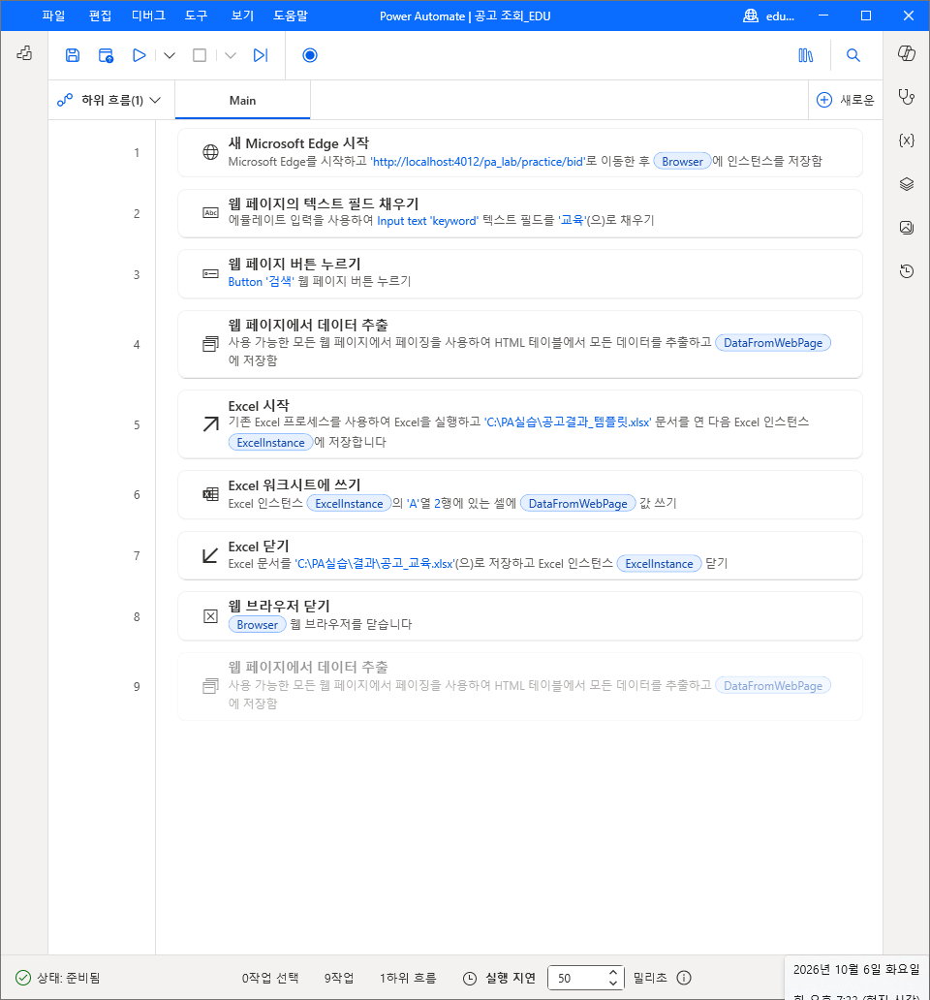

2. 디자이너 메뉴 **파일**에서 **다른 이름으로 저장**을 고릅니다. 단축키는 `Ctrl` + `Shift` + `S` 입니다.

    {: .warning }
    **줄을 지우기 전에 다른 이름으로 저장합니다.** 순서가 바뀌면 Lab 5 흐름의 Excel 저장부가 지워진 채 저장됩니다.

    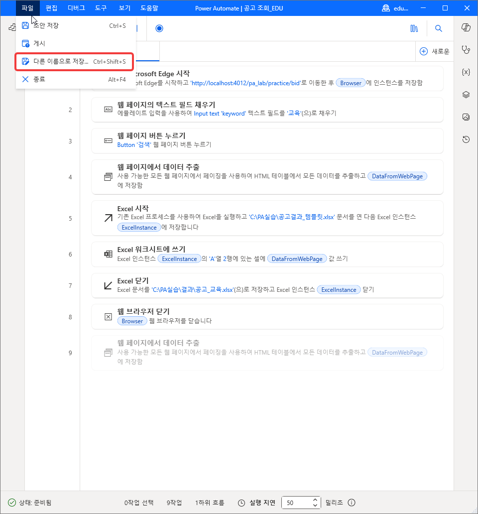

3. **다른 이름으로 저장** 창의 **흐름 이름**에 아래를 넣습니다. **유형**은 **흐름** 그대로 두고 **저장**을 누릅니다. 디자이너 제목 표시줄의 흐름 이름이 바뀝니다.

    ```
    고객 발굴_HGD
    ```

    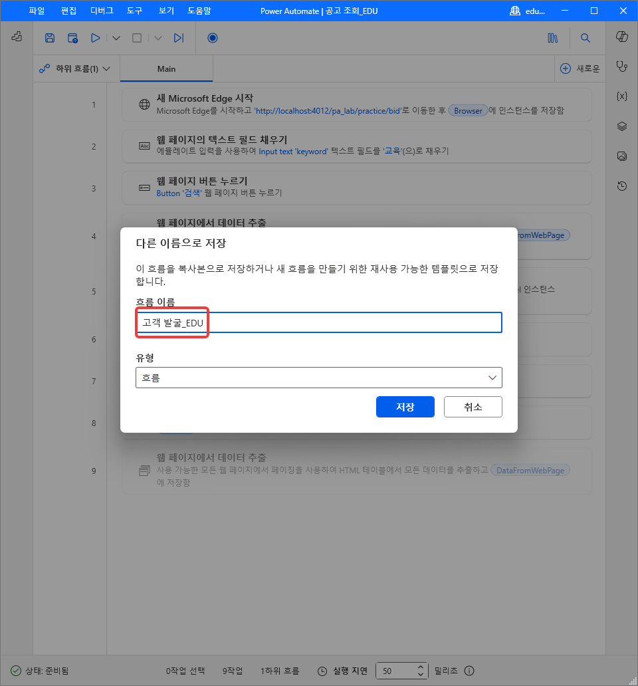

4. 5번 줄 **Excel 시작**을 누르고, `Shift` 를 누른 채 7번 줄 **Excel 닫기**를 누릅니다. 세 줄이 함께 선택됩니다.

    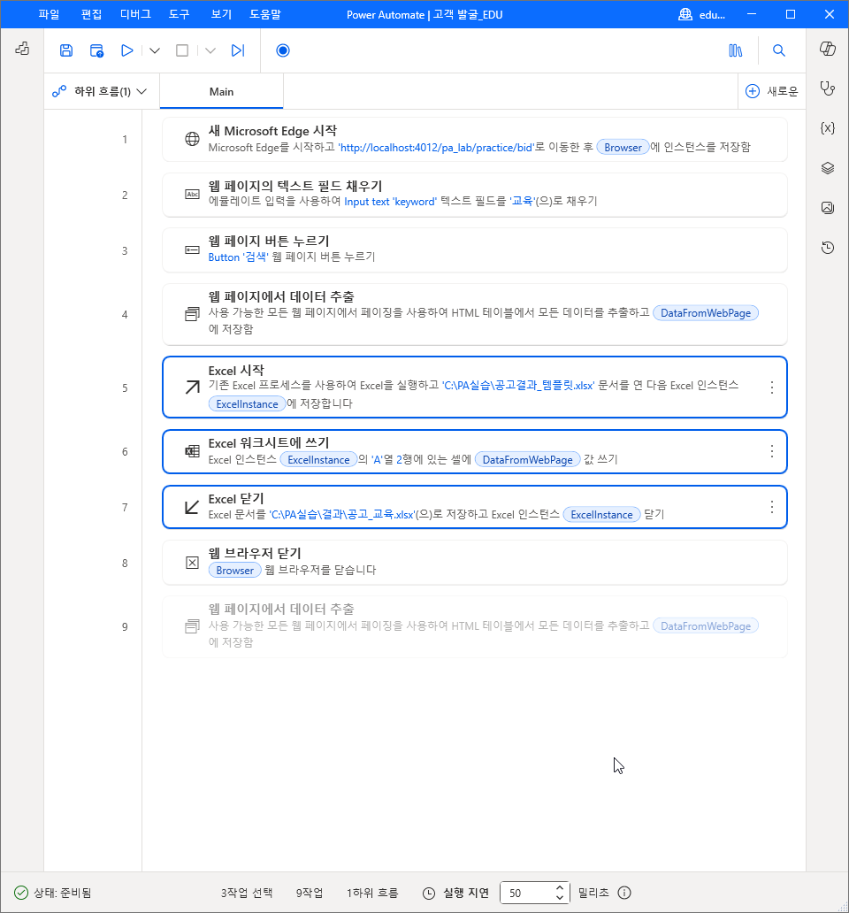

5. `Delete` 키를 누릅니다.

    **완료 기준**: 1 새 Microsoft Edge 시작 · 2 웹 페이지의 텍스트 필드 채우기 · 3 웹 페이지 버튼 누르기 · 4 웹 페이지에서 데이터 추출 · 5 웹 브라우저 닫기, 다섯 줄이 남는다.

    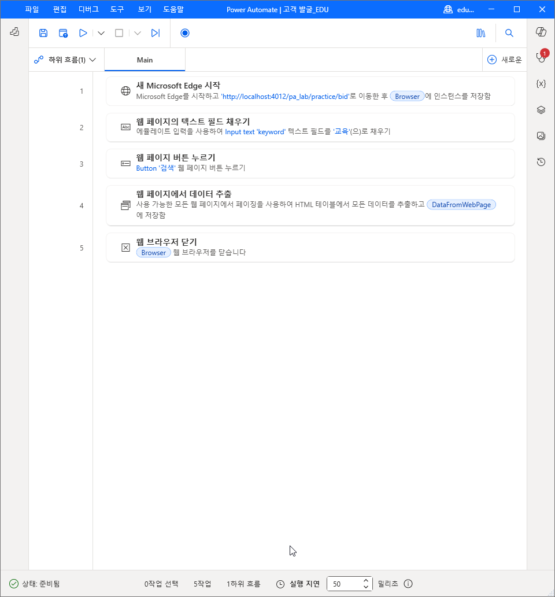

## 단계 ② 조건 읽기

6. 파일 탐색기에서 `C:\PA실습\발굴조건.xlsx` 를 열어 봅니다. A1은 `키워드`, A2~A5는 교육 · 클라우드 · 자동화 · 메타버스, C1은 `최소금액`, C2는 `50,000,000` 입니다. 확인한 뒤 저장하지 않고 닫습니다.

    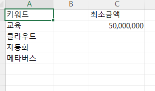

7. 작업 검색 칸에 `Excel 시작` 을 입력하고, **Excel 시작**을 1번 줄 새 Microsoft Edge 시작 **위**로 끌어다 놓습니다.[^excel]

    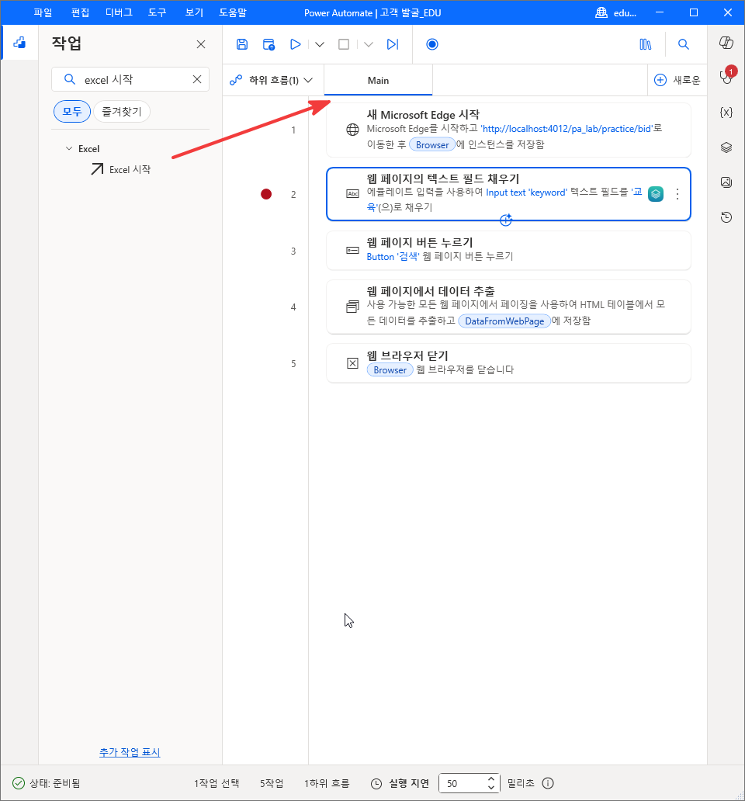

8. **Excel 시작**을 **및 다음 문서 열기**로 바꾸고 **문서 경로**에 아래를 넣은 뒤 **저장**을 누릅니다. 열린 Excel 은 **변수 생성됨**의 `ExcelInstance` 에 담깁니다.

    ```
    C:\PA실습\발굴조건.xlsx
    ```

    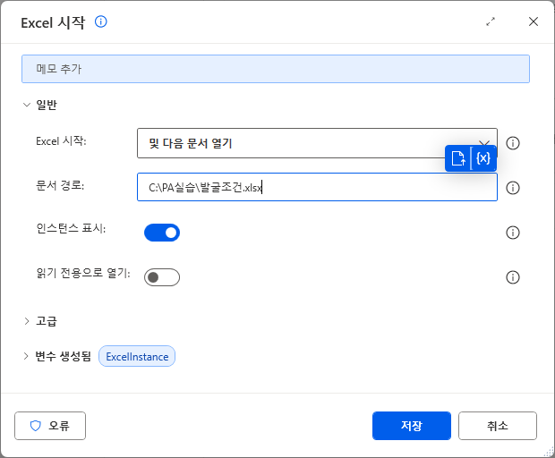

9. 작업 검색 칸에 `Excel 워크시트에서 읽기` 를 입력하고, **Excel 워크시트에서 읽기**를 1번 줄 아래로 끌어다 놓습니다.

    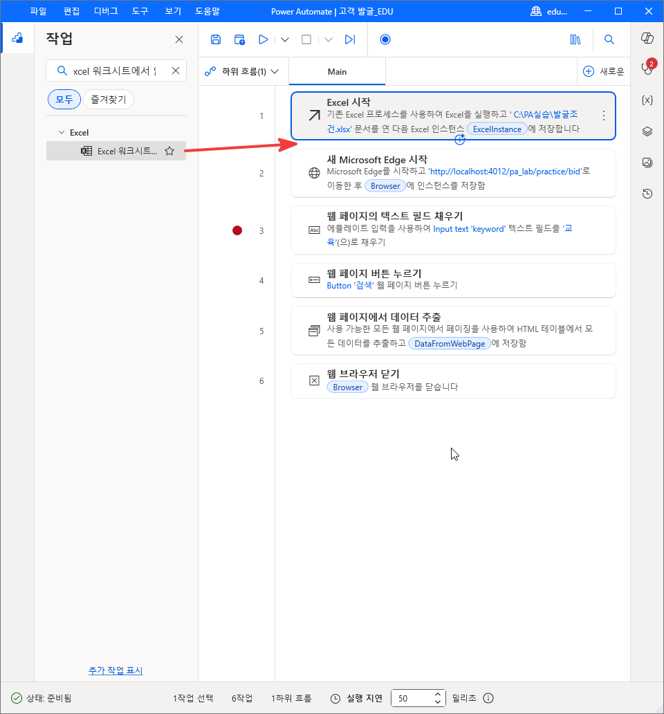

    **검색**을 **셀 범위의 값**으로 바꾸고 **시작 열** · **시작 행** · **끝 열** · **끝 행**에 아래를 차례로 넣습니다. 머리글 `키워드` 가 있는 1행부터 읽습니다.

    ```
    A
    ```

    ```
    1
    ```

    ```
    A
    ```

    ```
    5
    ```

    **고급**을 펼쳐 **범위의 첫 번째 행을 열 이름으로 사용**을 켭니다. 1행 `키워드` 가 열 이름이 되고, 데이터는 교육 · 클라우드 · 자동화 · 메타버스 네 행입니다. 뒤 스텝에서 키워드를 열 이름 `['키워드']` 로 꺼냅니다(Lab 4 45번과 같은 옵션).

    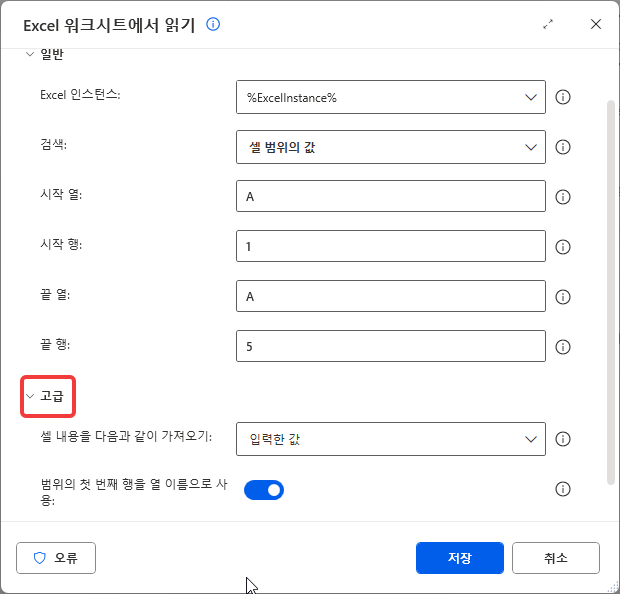

10. 아래 **변수 생성됨**의 `ExcelData` 를 눌러 아래 이름으로 바꾸고 **저장**을 누릅니다.

    ```
    키워드목록
    ```

    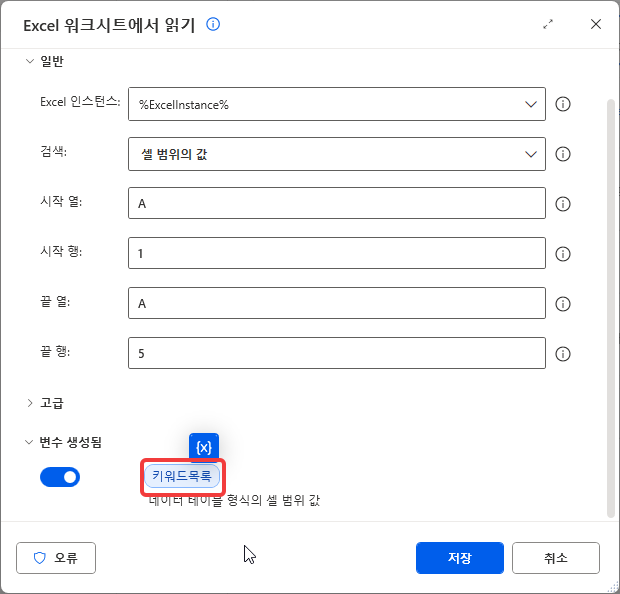

11. **Excel 워크시트에서 읽기**를 2번 줄 아래로 하나 더 끌어다 놓습니다.

    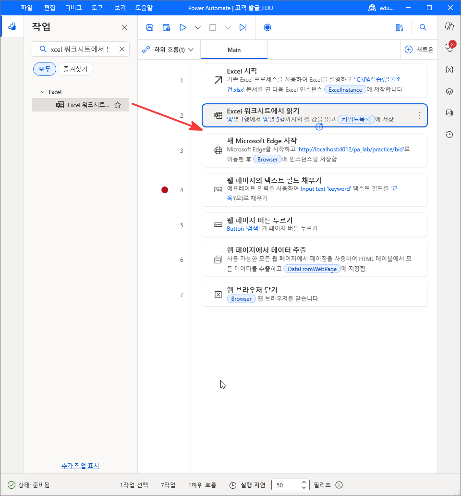

    **검색**을 **단일 셀의 값**으로 바꾸고, **시작 열**과 **시작 행**에 아래를 차례로 넣습니다.

    ```
    C
    ```

    ```
    2
    ```

    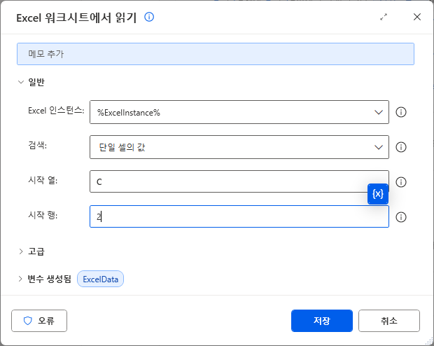

12. **변수 생성됨**의 `ExcelData` 를 아래 이름으로 바꾸고 **저장**을 누릅니다.

    ```
    최소금액
    ```

    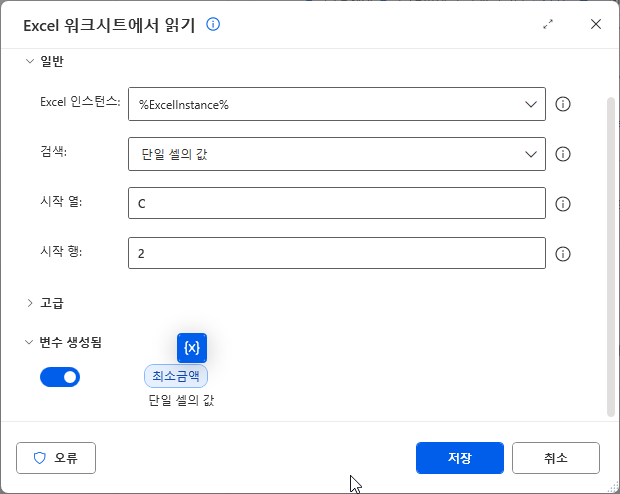

13. 작업 검색 칸에 `Excel 닫기` 를 입력하고, **Excel 닫기**를 3번 줄 아래로 끌어다 놓습니다.

    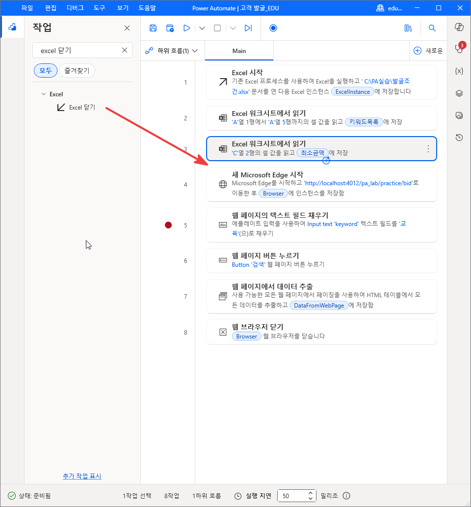

    **Excel 인스턴스**가 `%ExcelInstance%`, **Excel을 닫기 전**이 **문서 저장 안 함**인지 확인하고 **저장**을 누릅니다. 조건을 읽은 파일은 바꾸지 않고 닫습니다.

    **완료 기준**: 1~4번 줄이 Excel 시작 · 읽기(키워드목록) · 읽기(최소금액) · Excel 닫기이고, 5번 줄이 새 Microsoft Edge 시작이다.

    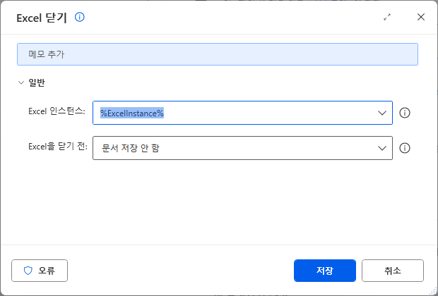
{: start="6" }

## 단계 ③ 결과 파일

14. **Excel 시작**을 4번 줄 아래로 끌어다 놓습니다.

    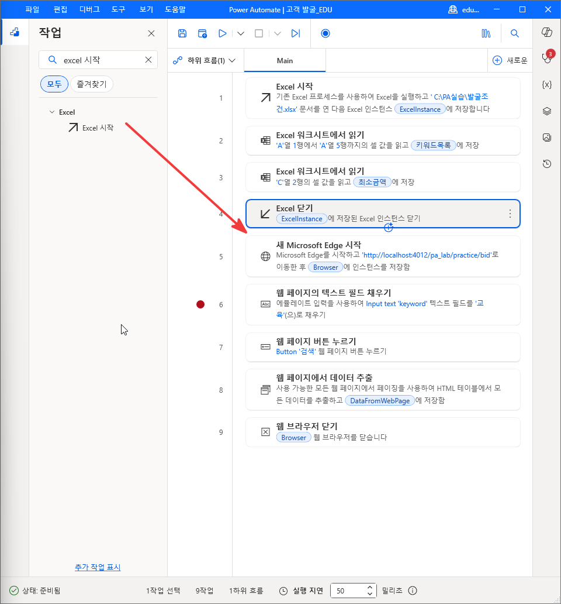

    **및 다음 문서 열기**로 바꾸고 **문서 경로**에 아래를 넣습니다. **인스턴스 표시**는 켠 채로 둡니다.

    ```
    C:\PA실습\고객발굴_템플릿.xlsx
    ```

    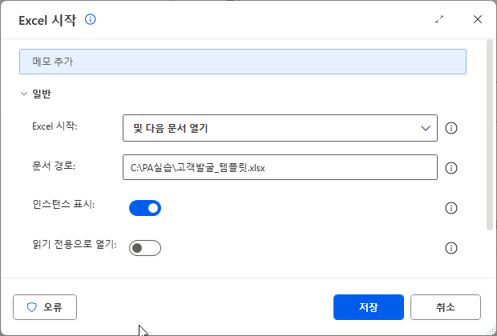

15. **변수 생성됨**의 `ExcelInstance2` 를 아래 이름으로 바꾸고 **저장**을 누릅니다. 1번 줄의 `ExcelInstance` 와 구분하려는 이름입니다.

    ```
    결과엑셀
    ```

    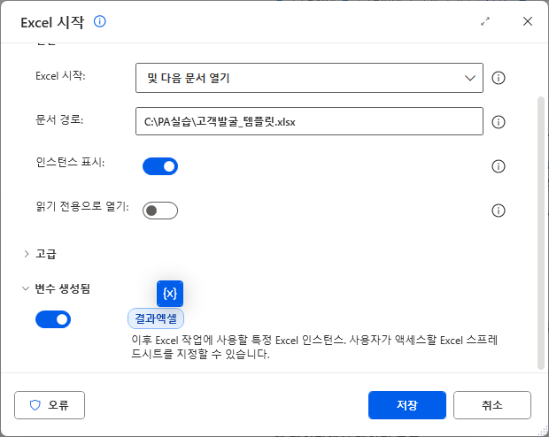

16. 작업 검색 칸에 `변수 설정` 을 입력하고, **변수 설정**을 5번 줄 아래로 끌어다 놓습니다.[^vars]

    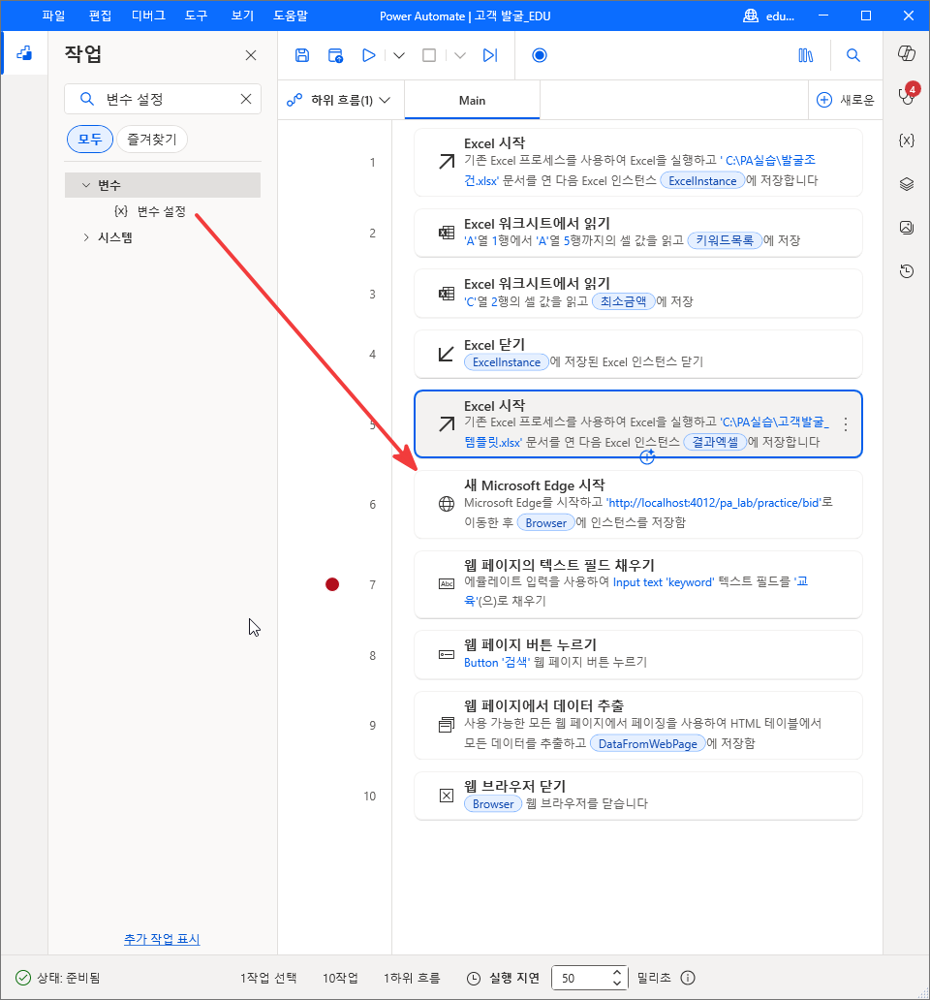

    **변수**의 `NewVar` 를 아래 이름으로 바꿉니다.

    ```
    다음행
    ```

    **값**에 아래를 넣고 **저장**을 누릅니다. 템플릿 1행이 머리글이라 2행부터 씁니다.

    ```
    2
    ```

    **완료 기준**: 6번 줄이 변수 설정 `다음행` 에 할당 값 2이고, 7번 줄이 새 Microsoft Edge 시작이다.

    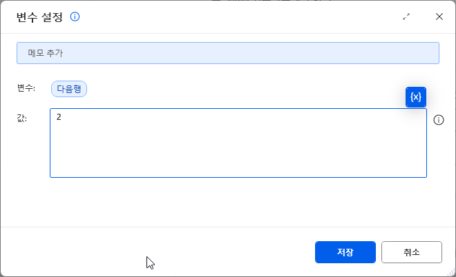
{: start="14" }

## 단계 ④ 키워드 반복

17. 작업 검색 칸에 `각각의` 를 입력하고, **반복** 아래 **각각의 경우**를 7번 줄 새 Microsoft Edge 시작 아래로 끌어다 놓습니다.[^loops]

    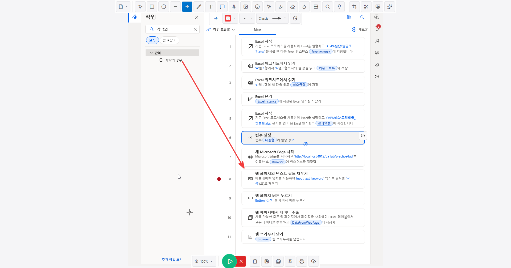

    **반복할 값** 칸을 누르고 **{x}** 에서 **흐름** 아래 `키워드목록` 을 고릅니다.

    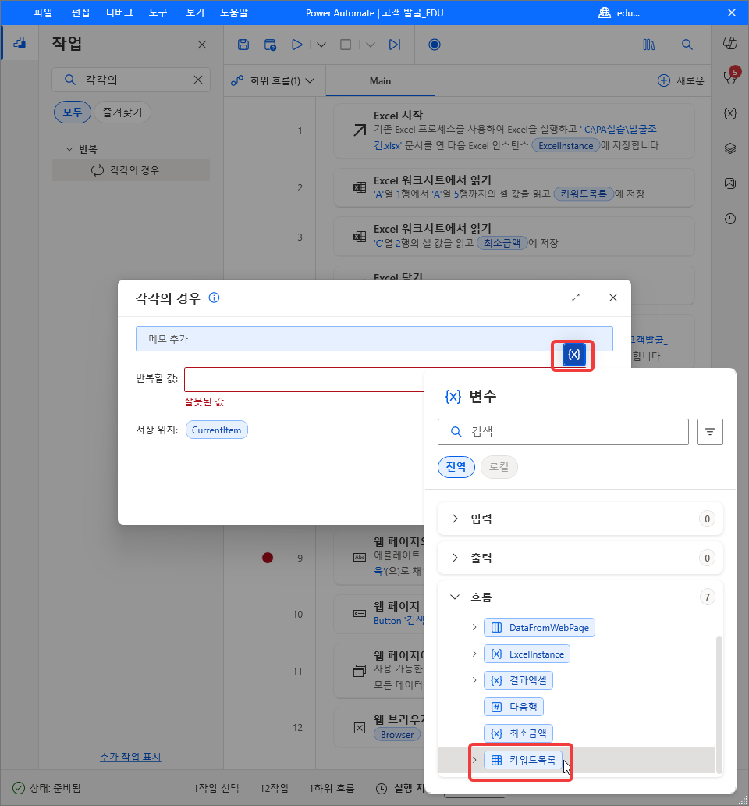

18. **저장 위치**의 `CurrentItem` 을 눌러 아래 이름으로 바꾸고 **저장**을 누릅니다. 8번 줄 각각의 경우와 9번 줄 End가 생깁니다.

    ```
    키워드행
    ```

    {: .warning }
    **반복 변수 이름은 이 랩에서 두 개(`키워드행` · `공고`)이고, 뒤 스텝이 그 이름을 그대로 씁니다.** 기본 이름 `CurrentItem` 으로 두면 20·28~38번 식이 맞지 않습니다.

    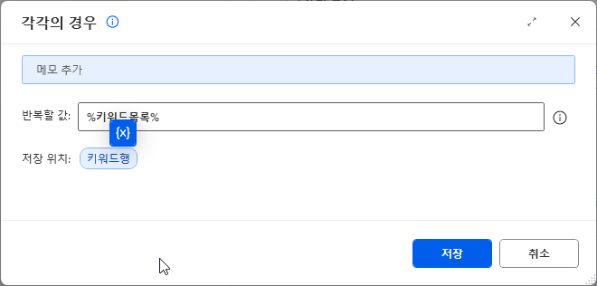

19. 10번 줄 **웹 페이지의 텍스트 필드 채우기**를 누르고 `Shift` 를 누른 채 12번 줄 **웹 페이지에서 데이터 추출**을 누릅니다. 선택한 세 줄을 8번 줄 각각의 경우와 9번 줄 End 사이로 끌어다 놓습니다.

    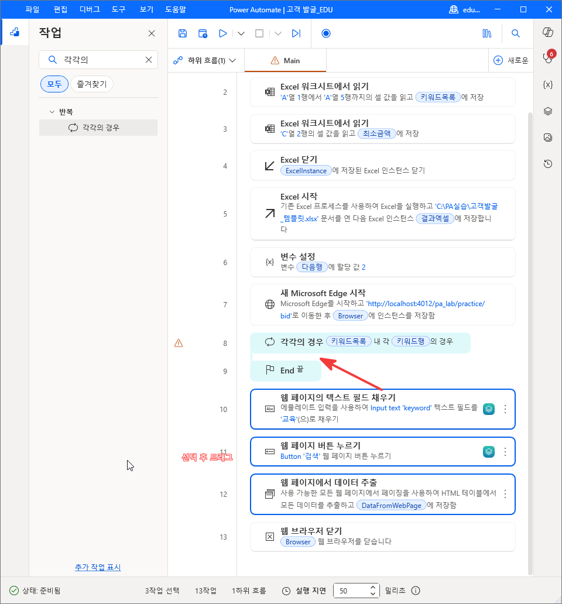

    **완료 기준**: 8 각각의 경우 · 9 텍스트 필드 채우기 · 10 버튼 누르기 · 11 데이터 추출 · 12 End · 13 웹 브라우저 닫기. 9~11번 줄이 한 칸 들여쓰기되어 있다.

    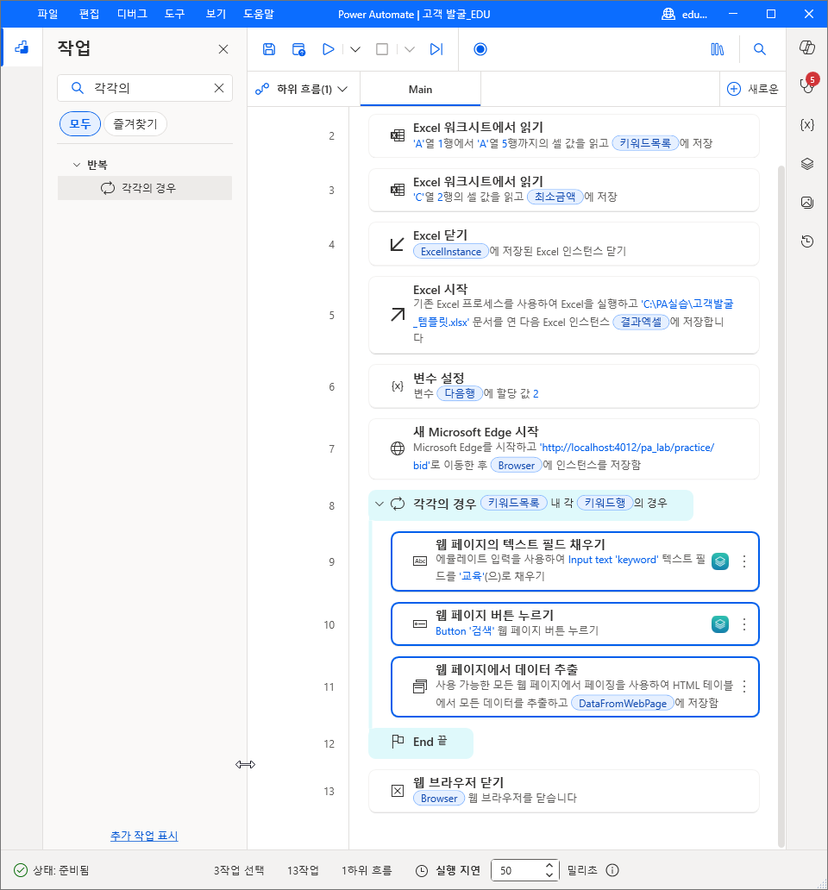

20. 9번 줄을 두 번 클릭해 열고, **텍스트**의 `교육` 을 지운 뒤 아래를 넣고 **저장**을 누릅니다. 반복마다 그 회차의 키워드가 들어갑니다.

    ```
    %키워드행['키워드']%
    ```

    ![웹 페이지의 텍스트 필드 채우기 — 텍스트 %키워드행['키워드']%](../assets/lab6/lab6-20.png)

21. 작업 검색 칸에 `웹 페이지가 포함` 을 입력하고, **브라우저 자동화** 아래 **웹 페이지가 다음을 포함하는 경우**를 10번 줄 웹 페이지 버튼 누르기 아래로 끌어다 놓습니다.[^web]

    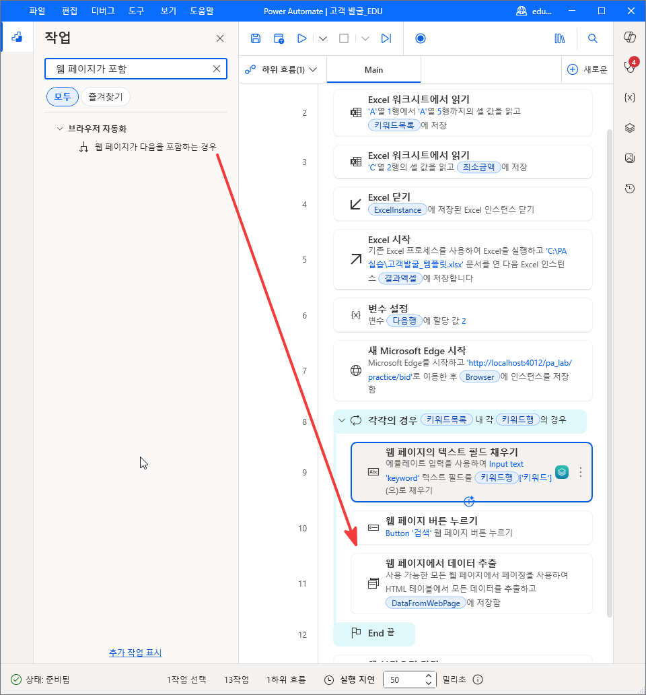

    **웹 페이지가 포함하는지 확인**을 **텍스트 포함**으로 바꾸고, **텍스트**에 아래를 넣은 뒤 **저장**을 누릅니다. 모의 사이트가 결과 0건일 때 표에 띄우는 문장입니다.

    ```
    검색 결과가 없습니다.
    ```

    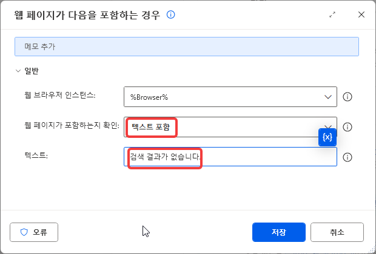

22. 작업 검색 칸에 `다음 반복` 을 입력하고, **다음 반복**을 11번 줄과 그 아래 12번 줄 End 사이로 끌어다 놓습니다. 결과가 없는 키워드는 여기서 데이터 추출을 건너뛰고 다음 키워드로 갑니다.

    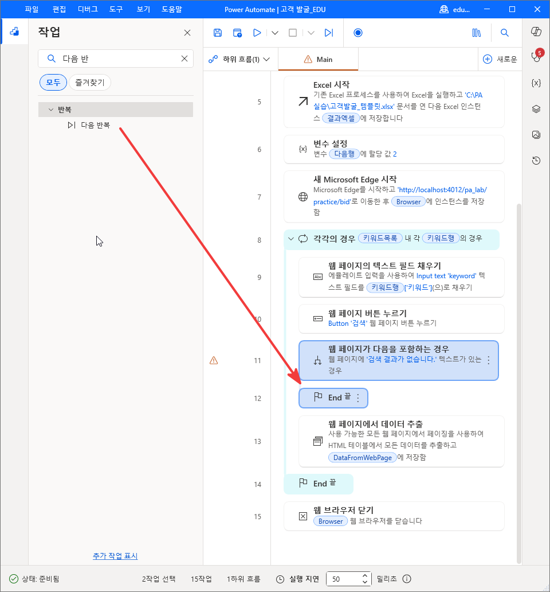

    **완료 기준**: 11 웹 페이지가 다음을 포함하는 경우 · 12 다음 반복 · 13 End · 14 웹 페이지에서 데이터 추출 · 15 End · 16 웹 브라우저 닫기.

    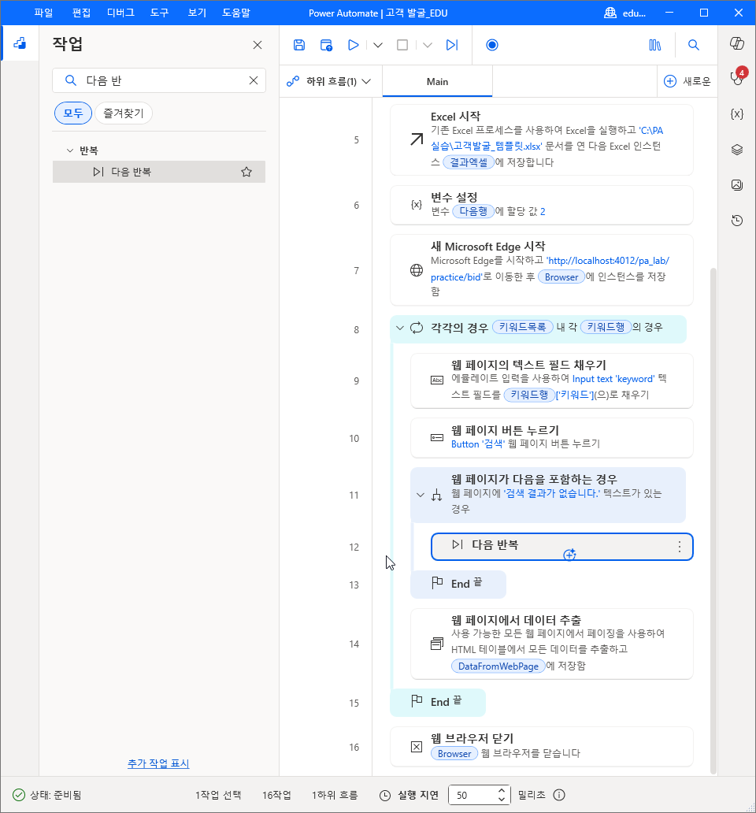

23. **실행**(▶)을 누릅니다. Edge가 교육 · 클라우드 · 자동화 · 메타버스를 차례로 검색합니다. 메타버스는 결과가 0건이라 표에 「검색 결과가 없습니다.」가 뜨고 다음 반복으로 넘어갑니다.

    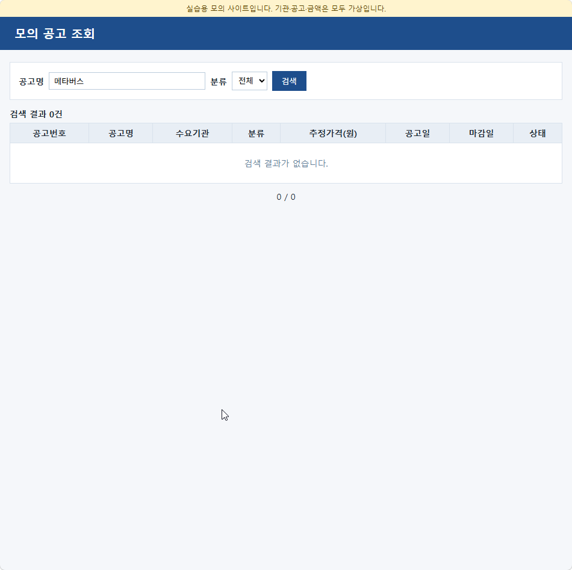

24. 실행이 끝나면 **변수** 창에서 `DataFromWebPage` 를 두 번 클릭하고 **보기**로 엽니다.

    **완료 기준**: 6행이고 공고명에 모두 「자동화」가 들어 있다. 마지막으로 추출한 키워드가 자동화이고, 메타버스는 추출 전에 넘어갔다.

    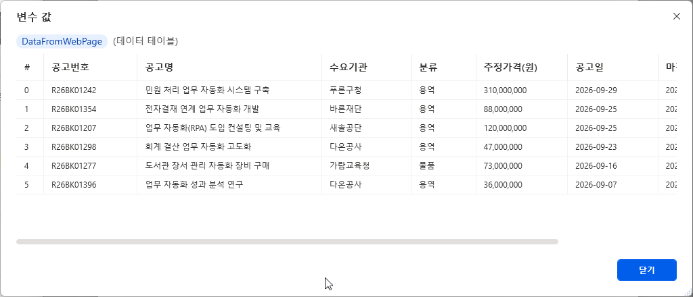

25. 23번 실행이 열어 둔 `고객발굴_템플릿.xlsx` Excel 창을 저장하지 않고 닫습니다. 1행 머리글(키워드 · 공고번호 · 공고명 · 수요기관 · 추정가격 · 마감일) 아래가 비어 있습니다. 아직 쓰는 작업이 없기 때문입니다.

    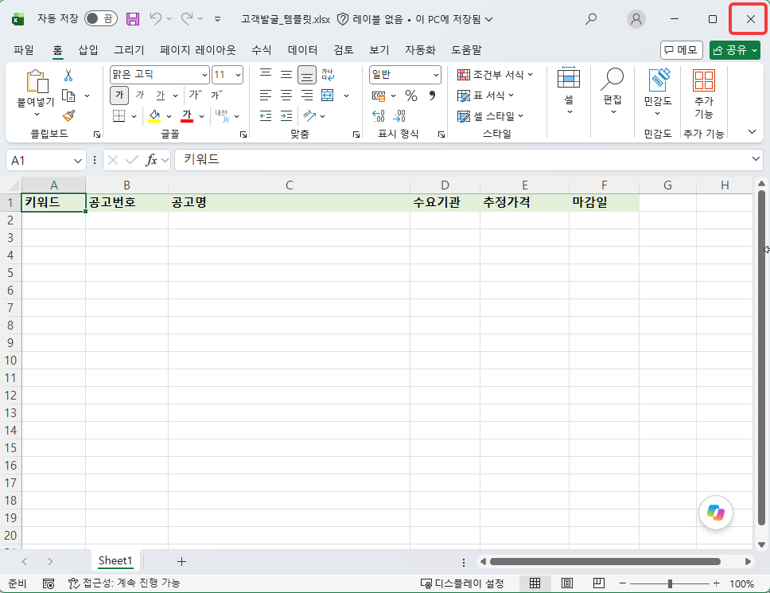
{: start="17" }

## 단계 ⑤ 행 거르기

26. **각각의 경우**를 14번 줄 웹 페이지에서 데이터 추출 아래, 15번 줄 End 위로 끌어다 놓습니다.

    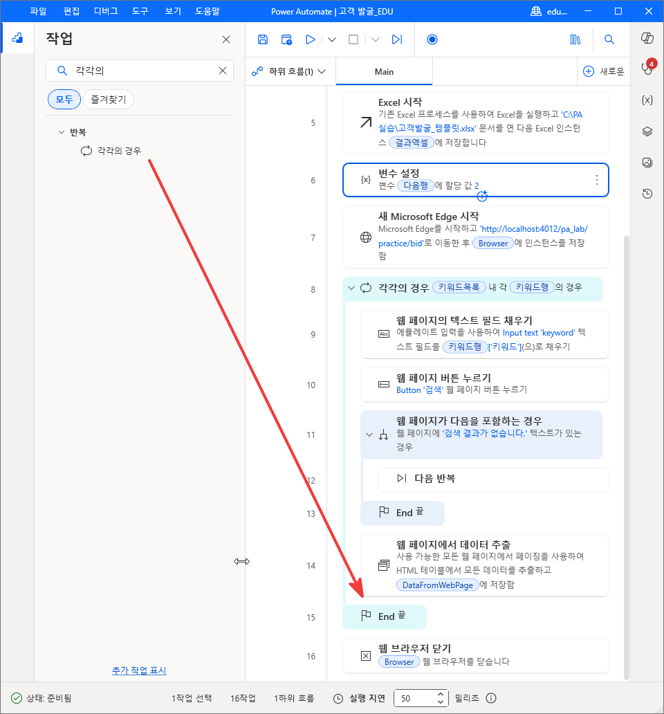

27. **반복할 값**에 아래를 넣고, **저장 위치**의 `CurrentItem` 을 `공고` 로 바꾼 뒤 **저장**을 누릅니다. 15번 줄 각각의 경우와 16번 줄 End가 생깁니다.

    ```
    %DataFromWebPage%
    ```

    ```
    공고
    ```

    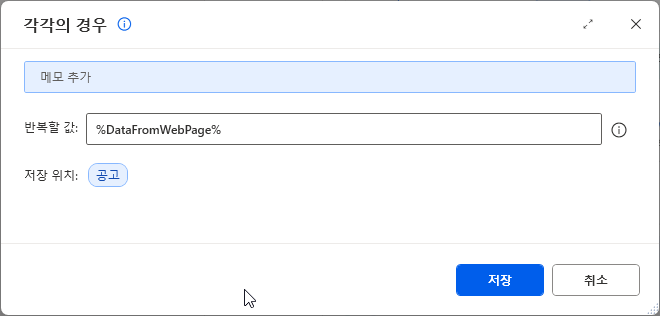

28. 작업 검색 칸에 `if` 를 입력하고, **조건** 아래 **If**를 15번 줄과 16번 줄 End 사이로 끌어다 놓습니다.[^cond]

    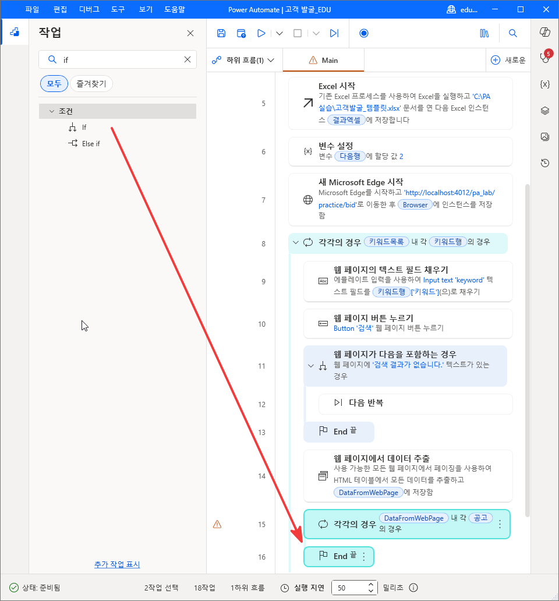

    **첫 번째 피연산자** · **두 번째 피연산자**에 아래를 차례로 넣습니다. **연산자**는 **같음 (=)** 그대로 두고 **저장**을 누릅니다. `[7]` 은 여덟째 열 상태입니다(0부터 셉니다).[^types]

    ```
    %공고[7]%
    ```

    ```
    진행중
    ```

    ![If — 첫 번째 피연산자 %공고[7]% · 같음 (=) · 진행중](../assets/lab6/lab6-28b.png)

29. 작업 검색 칸에 `텍스트 대체` 를 입력하고, **텍스트 대체**를 16번 줄 If와 그 End 사이로 끌어다 놓습니다.[^text]

    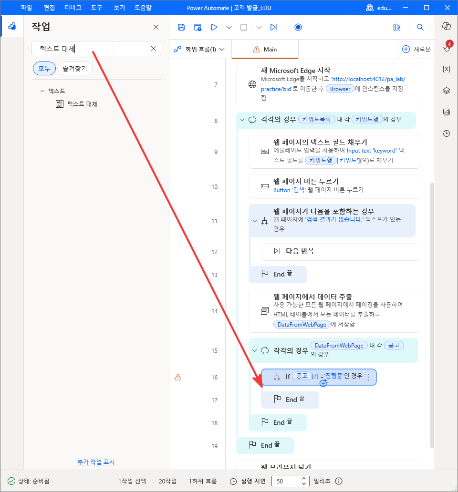

    **구문 분석할 텍스트** · **찾을 텍스트** · **바꿀 내용**에 아래를 차례로 넣고 **저장**을 누릅니다. 나머지 토글은 그대로 둡니다. 결과는 **변수 생성됨**의 `Replaced` 에 담깁니다.

    ```
    %공고[4]%
    ```

    ```
    ,
    ```

    ```
    %''%
    ```

    `%''%` 는 빈 텍스트입니다. 쉼표를 지워 `120,000,000` 이 `120000000` 이 됩니다.

    ![텍스트 대체 — 구문 분석할 텍스트 %공고[4]% · 찾을 텍스트 , · 바꿀 내용 %''%](../assets/lab6/lab6-29b.png)

30. 작업 검색 칸에 `텍스트를` 을 입력하고, **텍스트를 숫자로 변환**을 17번 줄 아래로 끌어다 놓습니다.

    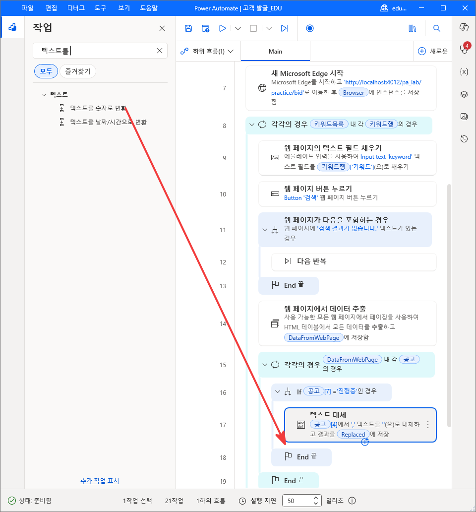

    **변환할 텍스트**에 아래를 넣고 **저장**을 누릅니다. 결과는 **변수 생성됨**의 `TextAsNumber` 에 담깁니다.

    ```
    %Replaced%
    ```

    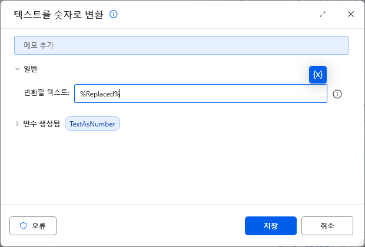

31. **If**를 18번 줄 아래, 19번 줄 End 위로 하나 더 끌어다 놓습니다.

    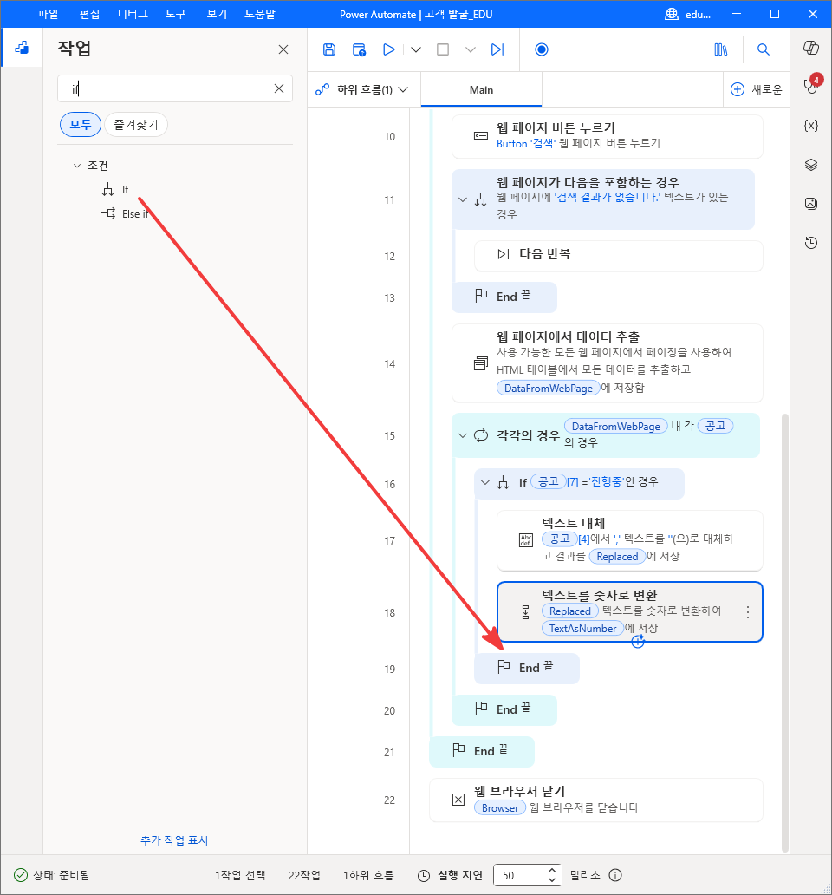

    **첫 번째 피연산자**에 아래를 넣고, **연산자**를 **크거나 같음 (>=)**으로 바꿉니다. **두 번째 피연산자**에 아래를 넣고 **저장**을 누릅니다.

    ```
    %TextAsNumber%
    ```

    ```
    %최소금액%
    ```

    **완료 기준**: 15 각각의 경우 · 16 If 진행중 · 17 텍스트 대체 · 18 텍스트를 숫자로 변환 · 19 If 최소금액 · 20 End · 21 End · 22 End.

    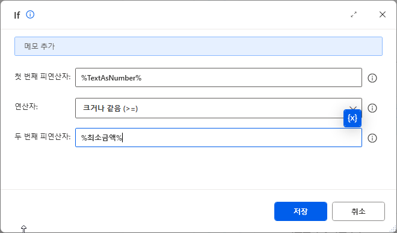
{: start="26" }

## 단계 ⑥ 결과 쓰기

32. **Excel 워크시트에 쓰기**를 19번 줄 If와 20번 줄 End 사이로 끌어다 놓습니다. 아래처럼 채우고 저장을 누릅니다.

    | 항목 | 값 |
    |---|---|
    | Excel 인스턴스 | `%결과엑셀%` |
    | 쓸 값 | `%키워드행['키워드']%` |
    | 쓰기 모드 | 지정된 셀에 쓰기 |
    | 열 | `A` |
    | 행 | `%다음행%` |

    {: .warning }
    **Excel 인스턴스를 `%결과엑셀%` 로 바꿉니다.** 기본값 `%ExcelInstance%` 는 4번 줄에서 이미 닫은 발굴조건 파일입니다.

    ![촬영: Excel 워크시트에 쓰기 — 결과엑셀, 키워드행['키워드'], A, 다음행](../assets/lab6/lab6-32.png)

33. 20번 줄을 누르고 **Ctrl + C** 를 누른 뒤 **Ctrl + V** 를 다섯 번 누릅니다. 20~25번 줄에 같은 쓰기 작업이 여섯 개 생깁니다.

    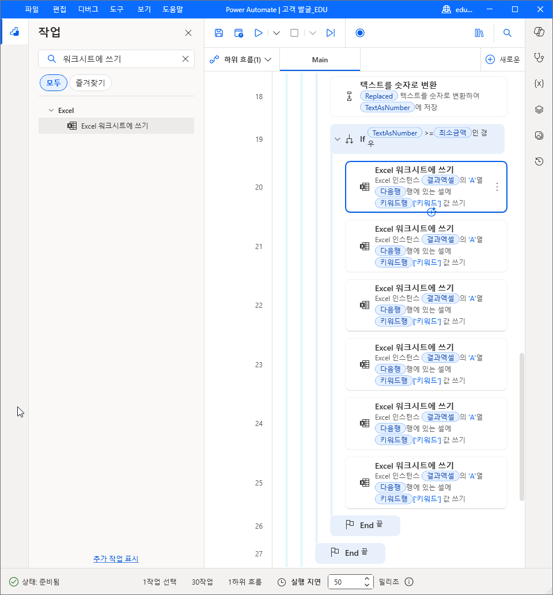

34. 21번 줄을 열어 **쓸 값**을 `%공고[0]%`, **열**을 `B` 로 바꾸고 저장을 누릅니다.

    ```
    %공고[0]%
    ```

    ![촬영: 21번 줄 공고[0], B](../assets/lab6/lab6-34.png)

35. 22번 줄을 열어 **쓸 값**을 `%공고[1]%`, **열**을 `C` 로 바꾸고 저장을 누릅니다.

    ```
    %공고[1]%
    ```

    ![촬영: 22번 줄 공고[1], C](../assets/lab6/lab6-35.png)

36. 23번 줄을 열어 **쓸 값**을 `%공고[2]%`, **열**을 `D` 로 바꾸고 저장을 누릅니다.

    ```
    %공고[2]%
    ```

    ![촬영: 23번 줄 공고[2], D](../assets/lab6/lab6-36.png)

37. 24번 줄을 열어 **쓸 값**을 `%TextAsNumber%`, **열**을 `E` 로 바꾸고 저장을 누릅니다. 추정가격은 쉼표를 뺀 숫자로 씁니다.

    ```
    %TextAsNumber%
    ```

    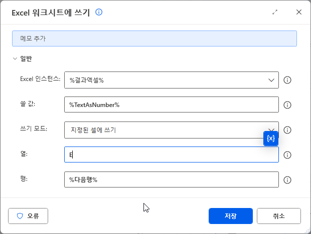

38. 25번 줄을 열어 **쓸 값**을 `%공고[6]%`, **열**을 `F` 로 바꾸고 저장을 누릅니다.

    ```
    %공고[6]%
    ```

    ![촬영: 25번 줄 공고[6], F](../assets/lab6/lab6-38.png)

39. 작업 창 검색칸에 `변수 증가` 를 입력하고 **변수 증가**를 25번 줄 아래로 끌어다 놓습니다.[^vars] **변수 이름**은 `%다음행%`, **증가할 크기**는 `1` 로 두고 저장을 누릅니다.

    **완료 기준**: 20~25번 줄 쓰기 여섯 개의 열이 A·B·C·D·E·F 순서이고, 26번 줄이 변수 증가다. 20~26번 줄은 19번 줄 If 안에 들여쓰기되어 있다.

    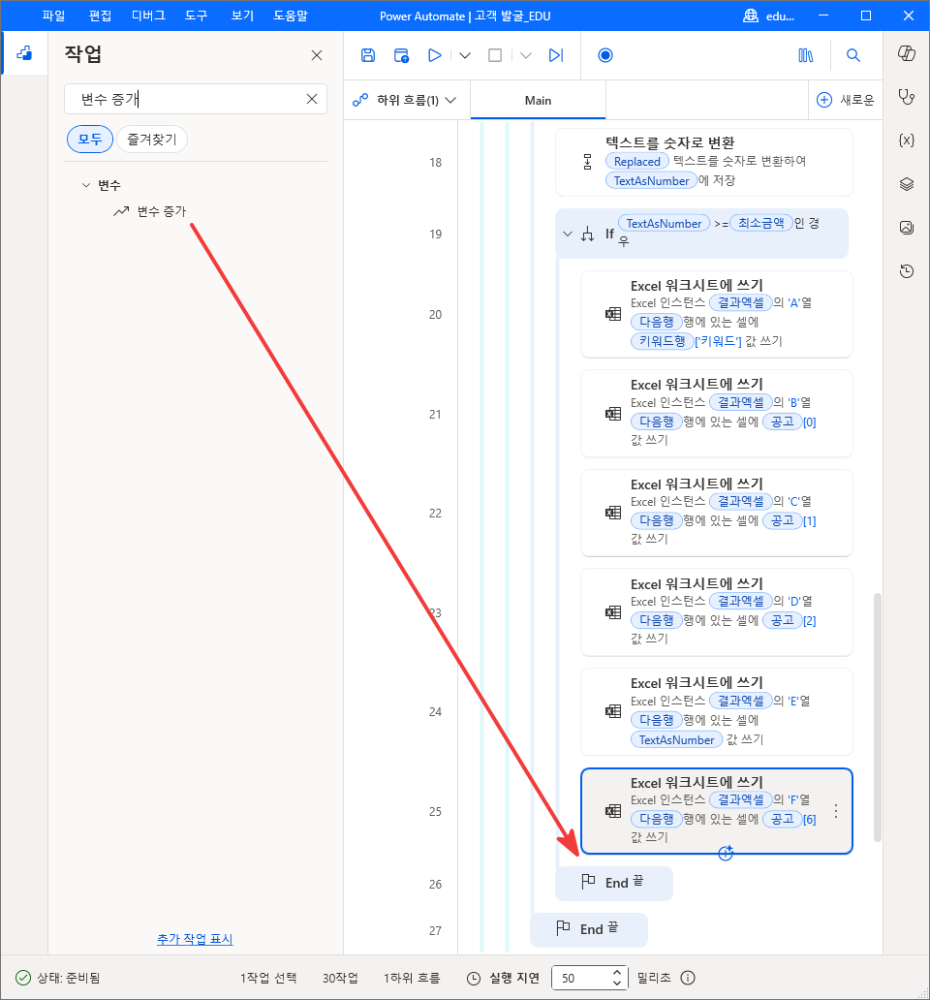
{: start="32" }

## 단계 ⑦ 저장과 알림

40. 작업 창 검색칸에 `현재 날짜` 를 입력하고 **현재 날짜 및 시간 가져오기**를 30번 줄 End(바깥 각각의 경우의 End) 아래로 끌어다 놓습니다. 그대로 저장을 누릅니다. 생성된 변수는 `CurrentDateTime` 입니다.

    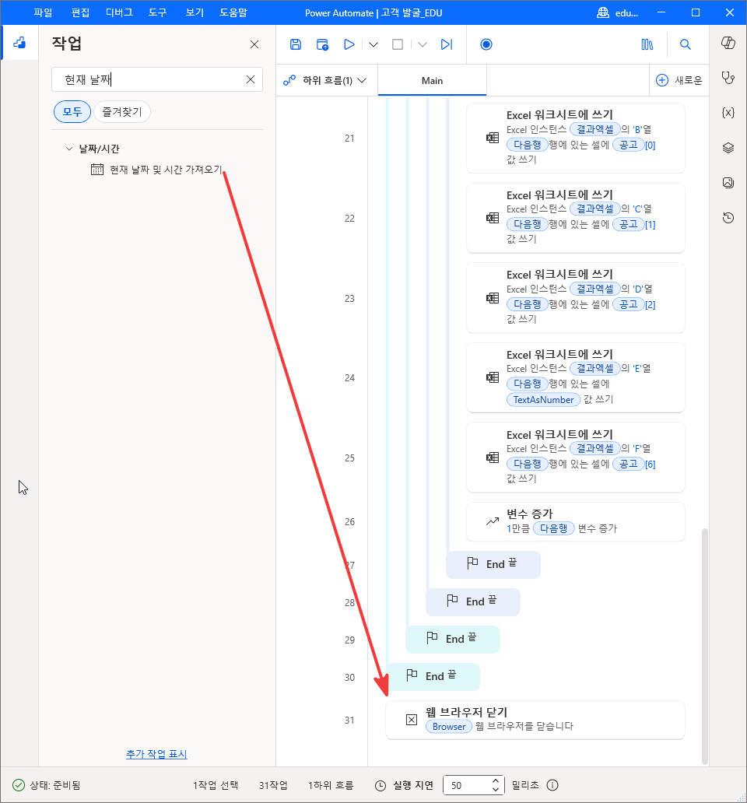

41. **날짜/시간을 텍스트로 변환**을 31번 줄 아래로 끌어다 놓습니다.[^text] **변환할 날짜/시간**은 `%CurrentDateTime%`, **사용할 형식**은 **사용자 지정**, **사용자 지정 형식**은 아래로 둡니다.

    ```
    yyyyMMdd
    ```

    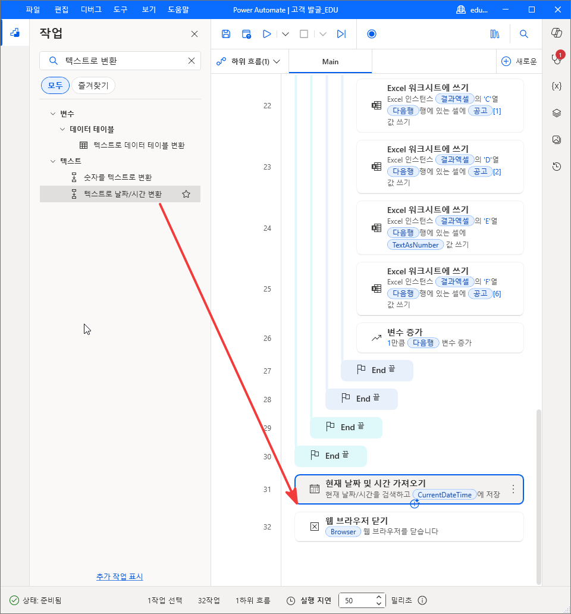

42. 생성된 변수 `FormattedDateTime` 의 이름을 `오늘` 로 바꾸고 저장을 누릅니다.

    ```
    오늘
    ```

    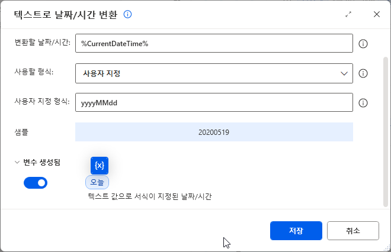

43. **Excel 닫기**를 32번 줄 아래로 끌어다 놓습니다. **Excel 인스턴스**는 `%결과엑셀%`, **Excel을 닫기 전**은 **다른 이름으로 문서 저장**, **문서 경로**는 아래로 두고 저장을 누릅니다.

    ```
    C:\PA실습\결과\고객발굴_%오늘%.xlsx
    ```

    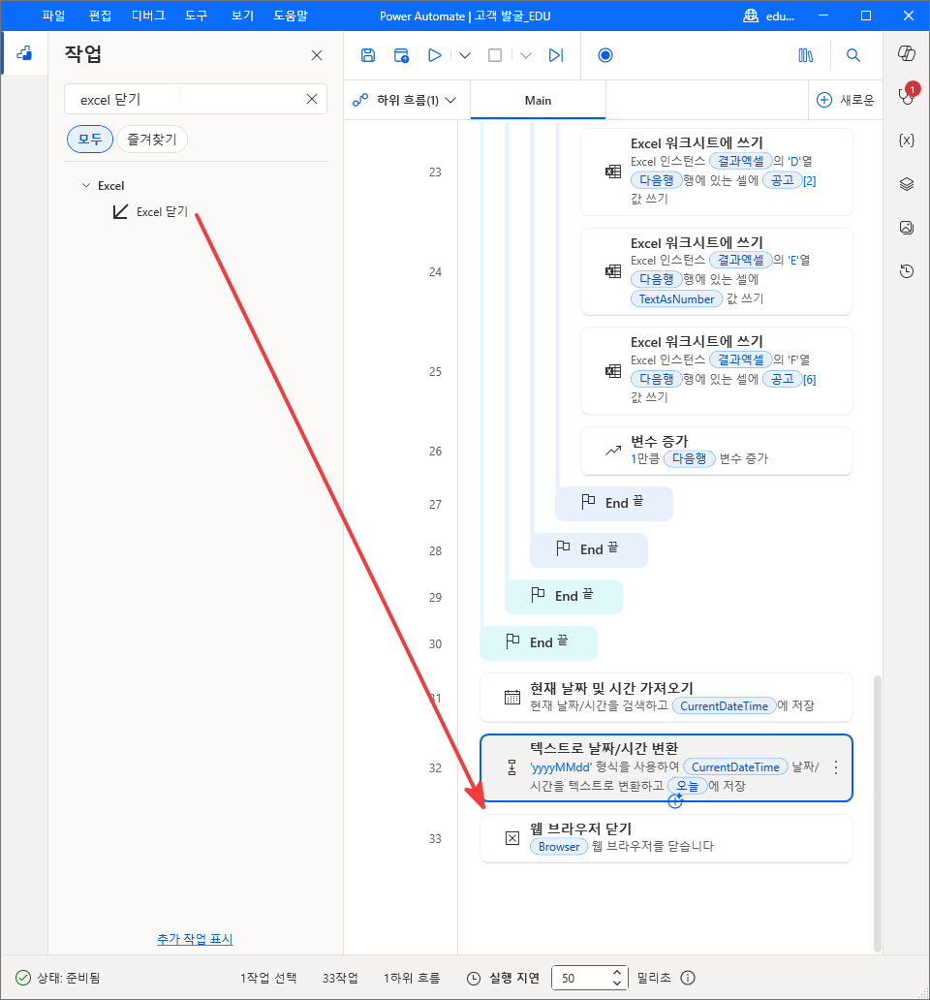

44. 작업 창 검색칸에 `메시지` 를 입력하고 **메시지 표시**를 34번 줄 웹 브라우저 닫기 아래, 흐름 맨 끝으로 끌어다 놓습니다. **메시지 상자 제목**에 `고객 발굴` 을 넣습니다.

    ```
    고객 발굴
    ```

    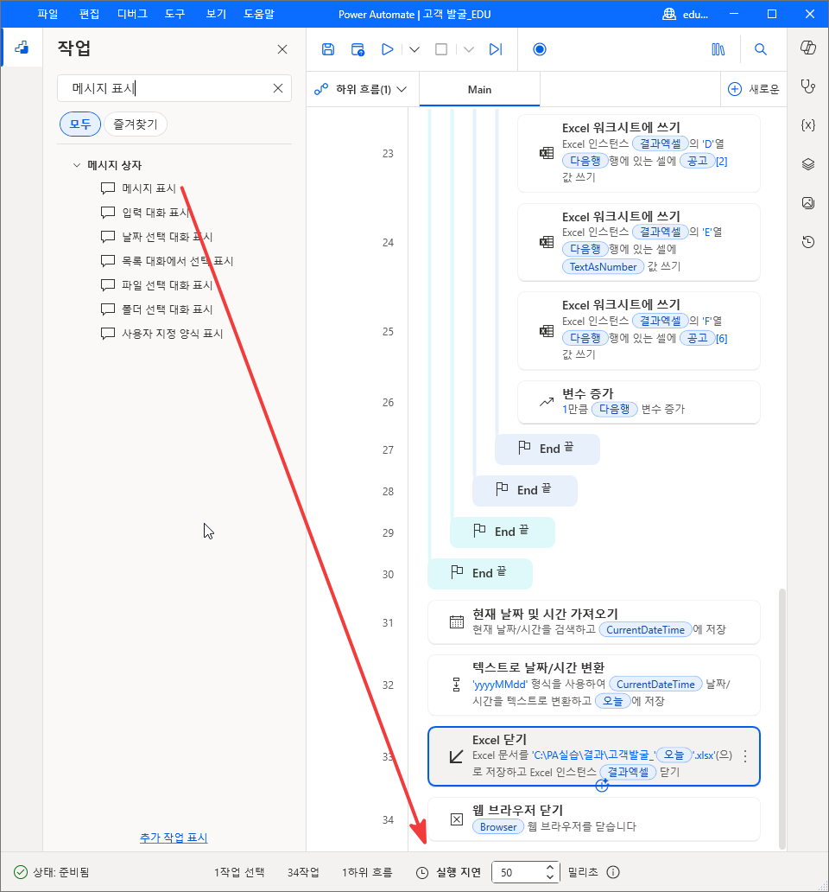

45. **표시할 메시지**에 아래를 넣고 저장을 누릅니다. `다음행` 은 다음에 쓸 행 번호입니다. 2행에서 시작했으므로 2를 빼면 쓴 행 수입니다.

    ```
    발굴 결과 %다음행 - 2%건
    ```

    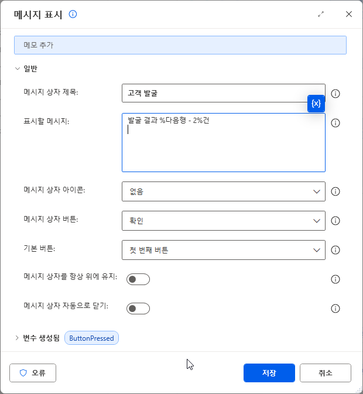
{: start="40" }

## 단계 ⑧ 오류 대비

46. 9번 줄 웹 페이지의 텍스트 필드 채우기를 두 번 클릭해 열고, 창 왼쪽 아래 **오류 발생 시**를 누릅니다.[^err]

    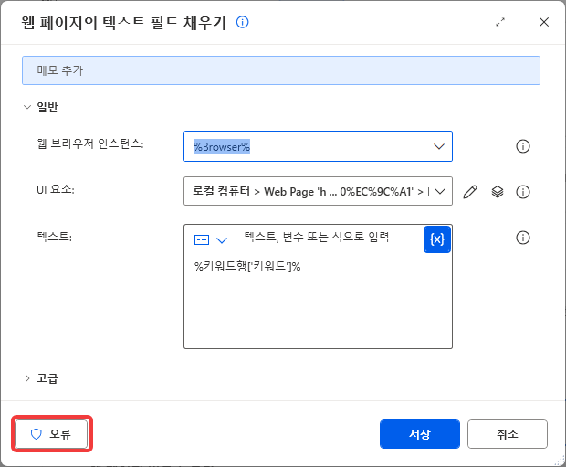

47. **오류 발생 시 작업 재시도**를 체크하고 횟수를 `2` 로 바꿉니다. 간격은 기본값 2초 그대로 둡니다.

    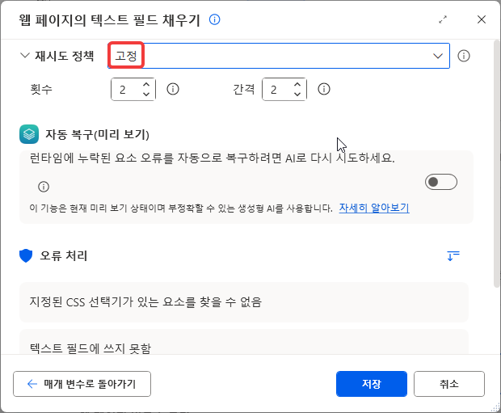

48. 저장을 누릅니다. 페이지가 늦게 떠 입력칸을 못 찾으면 이 작업을 두 번 더 시도합니다.

    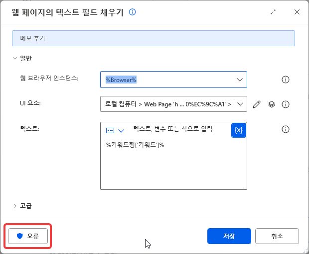
{: start="46" }

## 단계 ⑨ 실행 확인

49. **Ctrl + S** 로 흐름을 저장합니다.

    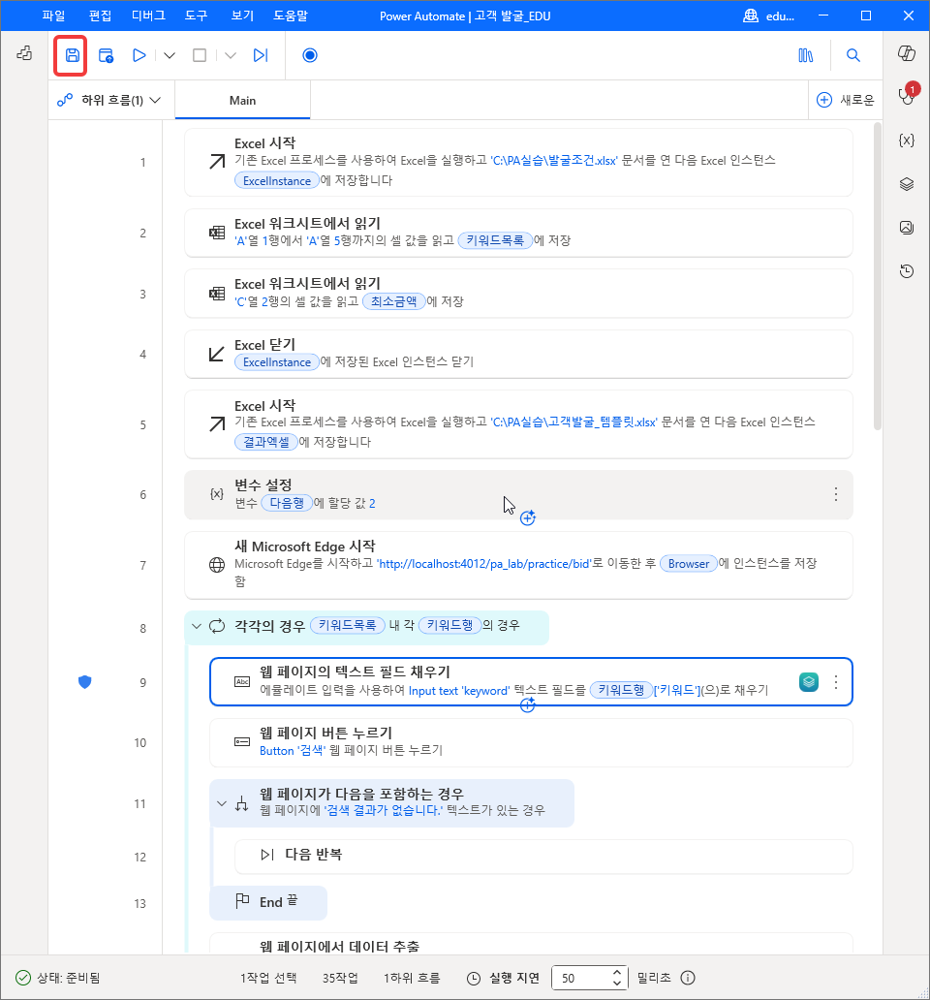

50. 작업 표시줄에 Excel 창이 열려 있지 않은지 확인합니다. 열려 있으면 저장하지 않고 닫습니다.

    {: .warning }
    **`발굴조건.xlsx` 나 `고객발굴_템플릿.xlsx` 가 열린 채로 실행하지 않습니다.** 흐름이 같은 파일을 한 번 더 열면서 읽기 전용으로 열릴 수 있습니다.

    

51. **실행**(▶)을 누릅니다. 실행이 끝날 때까지 마우스와 키보드를 건드리지 않습니다.

    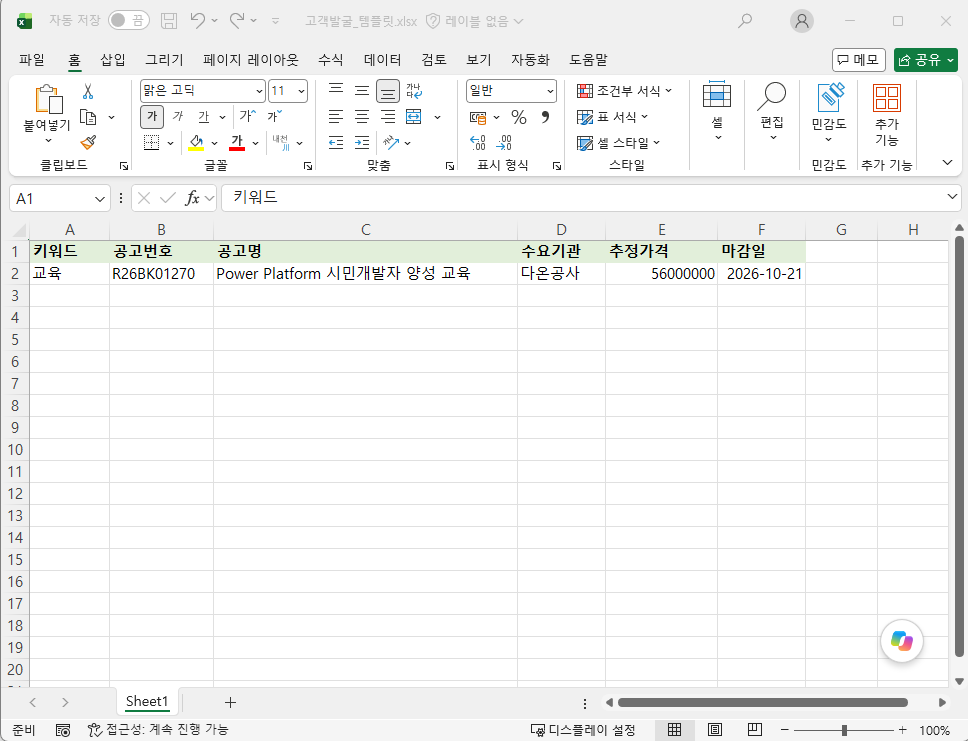

52. 메시지 창이 뜨면 내용을 확인하고 **확인**을 누릅니다.

    **완료 기준**: 메시지 창에 「발굴 결과 16건」이 보인다.

    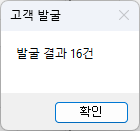

53. **변수** 창에서 `다음행` 값을 봅니다. `18` 입니다.

    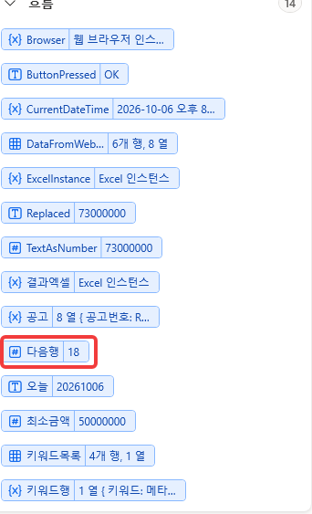

54. 파일 탐색기에서 `C:\PA실습\결과\` 를 열고 `고객발굴_` 뒤에 오늘 날짜(yyyyMMdd)가 붙은 파일을 엽니다. 교육 당일이 2026년 10월 7일이면 `고객발굴_20261007.xlsx` 입니다.

    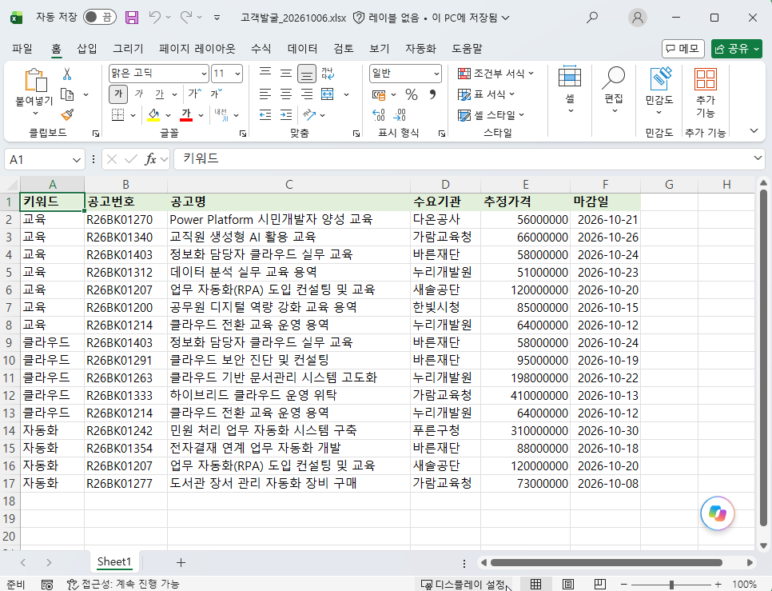

55. 1행 머리글 아래 값이 있는 행을 셉니다.

    **완료 기준**: 2~17행에 16행이 있고, 18행은 비어 있다.

    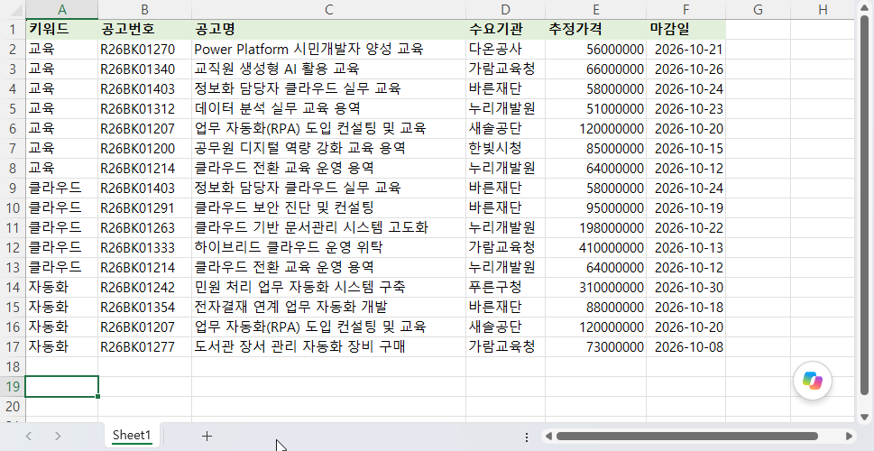

56. A열 키워드를 봅니다. 교육 7행(2~8행), 클라우드 5행(9~13행), 자동화 4행(14~17행)이고 메타버스는 없습니다.

    

57. B열 공고번호에서 두 번 나오는 번호를 찾습니다. `R26BK01403` · `R26BK01214` 는 교육과 클라우드에, `R26BK01207` 은 교육과 자동화에 한 번씩 나옵니다. 키워드별로 썼으므로 16행이고, 공고번호로는 13건입니다.

    

58. E열 추정가격이 쉼표 없는 숫자이고 모두 50000000 이상인지 봅니다.

    

59. F열 마감일이 `2026-10-` 로 시작하는 날짜 텍스트인지 봅니다.

    

60. Excel 파일을 저장하지 않고 닫습니다.

    

61. 디자이너의 줄 1~35를 아래 「여기까지의 흐름」과 대조합니다.

    
{: start="49" }

---

## 확인

**필수**: 여기까지 되면 이 랩은 통과입니다

- ① 흐름 이름이 `고객 발굴_HGD`(본인 이니셜)이고, Lab 5의 `공고 조회_HGD` 는 8줄 그대로 남아 있다 (2·3번)
- ② 반복 변수 이름이 `키워드행` · `공고` 다 (18·27번)
- ③ 메타버스에서 데이터 추출 전에 다음 키워드로 넘어간다 (21~24번)
- ④ 메시지 창에 「발굴 결과 16건」이 뜬다 (52번)
- ⑤ `고객발굴_<실행일>.xlsx` 의 2~17행에 16행이 있다 (55번)
{: .checklist }

**관찰**: 나오면 좋고, 안 나와도 실패가 아닙니다

- ⑥ 키워드별 행 수가 교육 7 · 클라우드 5 · 자동화 4다 (56번)
- ⑦ 두 키워드에 걸친 공고번호가 세 개다 (57번)
- ⑧ E열이 쉼표 없는 숫자다 (58번)
{: .checklist }

---

## 여기까지의 흐름

Lab 5의 `공고 조회_HGD` 에서 5~7번 줄(Excel 저장부)을 지우고, 조건 읽기 · 결과 파일 · 키워드 반복 · 행 거르기 · 결과 쓰기 · 저장과 알림을 더한 `고객 발굴_HGD` 의 전체입니다. 줄 번호는 디자이너 화면의 줄 번호입니다.

```
1  Excel 시작                       및 다음 문서 열기 C:\PA실습\발굴조건.xlsx → %ExcelInstance%
2  Excel 워크시트에서 읽기           셀 범위의 값 A1:A5 · 첫 번째 행을 열 이름으로 → %키워드목록%
3  Excel 워크시트에서 읽기           단일 셀의 값 C2 → %최소금액%
4  Excel 닫기                       %ExcelInstance% · 문서 저장 안 함
5  Excel 실행                       C:\PA실습\고객발굴_템플릿.xlsx → %결과엑셀%
6  변수 설정                        다음행 = 2
7  새 Microsoft Edge 시작           초기 URL = 모의 공고 사이트 · 창 상태 최대화 → %Browser%
8  각각의 경우 키워드행 in %키워드목록%
9     웹 페이지의 텍스트 필드 채우기  %키워드행['키워드']% · 오류 발생 시 재시도 2회
10    웹 페이지 버튼 누르기          Button '검색'
11    웹 페이지가 다음을 포함하는 경우  텍스트 포함 「검색 결과가 없습니다.」
12       다음 반복
13    End
14    웹 페이지에서 데이터 추출      전체 HTML 테이블 · 호출기 = 다음 단추 · 모든 웹 페이지 → %DataFromWebPage%
15    각각의 경우 공고 in %DataFromWebPage%
16       If %공고[7]% = 진행중
17          텍스트 대체              %공고[4]% 의 , → %''% → %Replaced%
18          텍스트를 숫자로 변환      %Replaced% → %TextAsNumber%
19          If %TextAsNumber% >= %최소금액%
20             Excel 워크시트에 쓰기  %결과엑셀% · %키워드행['키워드']% → A%다음행%
21             Excel 워크시트에 쓰기  %결과엑셀% · %공고[0]% → B%다음행%
22             Excel 워크시트에 쓰기  %결과엑셀% · %공고[1]% → C%다음행%
23             Excel 워크시트에 쓰기  %결과엑셀% · %공고[2]% → D%다음행%
24             Excel 워크시트에 쓰기  %결과엑셀% · %TextAsNumber% → E%다음행%
25             Excel 워크시트에 쓰기  %결과엑셀% · %공고[6]% → F%다음행%
26             변수 증가              다음행 + 1
27          End
28       End
29    End
30 End
31 현재 날짜 및 시간 가져오기        → %CurrentDateTime%
32 날짜/시간을 텍스트로 변환         사용자 지정 yyyyMMdd → %오늘%
33 Excel 닫기                       %결과엑셀% · 다른 이름으로 문서 저장 · C:\PA실습\결과\고객발굴_%오늘%.xlsx
34 웹 브라우저 닫기                  %Browser%
35 메시지 표시                      고객 발굴 · 발굴 결과 %다음행 - 2%건
```

---

## 출처

이 랩은 아래를 토대로 만들었습니다. 제품 화면과 동작은 실측이고, 문헌은 항목마다 확인일을 적었습니다. 제품이 바뀌면 문헌 쪽이 먼저 낡습니다.

- **실측**: 실측 전
- **문헌**: Excel 작업[^excel] · 브라우저 자동화 작업[^web] · 루프 작업[^loops] · 조건부 작업[^cond] · 변수 데이터 형식[^types] · 텍스트 작업[^text] · 변수 작업[^vars] · 데스크톱 흐름에서 오류 처리[^err] · 변수와 % 표기법[^expr]

[^excel]: **Excel 작업** — Microsoft Learn. <https://learn.microsoft.com/ko-kr/power-automate/desktop-flows/actions-reference/excel> (2026-10-02 확인). Excel 워크시트에서 읽기의 셀 범위·단일 셀 읽기와 생성 변수 `ExcelData`, Excel 워크시트에 쓰기의 열·행 지정, Excel 닫기의 문서 저장 안 함·다른 이름으로 문서 저장.
[^web]: **브라우저 자동화 작업** — Microsoft Learn. <https://learn.microsoft.com/ko-kr/power-automate/desktop-flows/actions-reference/webautomation> (2026-10-02 확인). 웹 페이지가 포함하는 경우의 웹 페이지 확인(텍스트 포함)과 텍스트 매개 변수.
[^loops]: **루프 작업** — Microsoft Learn. <https://learn.microsoft.com/ko-kr/power-automate/desktop-flows/actions-reference/loops> (2026-10-02 확인). For each가 목록·데이터 테이블·데이터 행을 반복한다는 것, 다음 반복이 블록의 남은 작업을 건너뛰고 다음 반복을 실행한다는 것.
[^cond]: **조건부 작업** — Microsoft Learn. <https://learn.microsoft.com/ko-kr/power-automate/desktop-flows/actions-reference/conditionals> (2026-10-02 확인). If의 연산자 목록 같음(=)·보다 크거나 같음(>=)과 피연산자 두 개.
[^types]: **Variable data types** — Microsoft Learn. <https://learn.microsoft.com/power-automate/desktop-flows/variable-data-types> (2026-10-02 확인). For Each로 데이터 테이블을 돌 때 현재 항목이 데이터 행이고 `%VariableName[ItemNumber]%` 로 항목을 읽는다는 것, 번호가 0부터 시작한다는 것.
[^text]: **Text actions** — Microsoft Learn. <https://learn.microsoft.com/power-automate/desktop-flows/actions-reference/text> (2026-10-02 확인). 텍스트 바꾸기의 생성 변수 `Replaced`, 텍스트를 숫자로 변환이 숫자가 아닌 글자에서 예외를 낸다는 것과 생성 변수 `TextAsNumber`, 날짜/시간을 텍스트로 변환의 사용자 지정 형식과 생성 변수 `FormattedDateTime`.
[^vars]: **Variables actions** — Microsoft Learn. <https://learn.microsoft.com/power-automate/desktop-flows/actions-reference/variables> (2026-10-02 확인). 변수 설정으로 변수를 만들고 변수 증가로 숫자 변수를 지정한 크기만큼 늘리는 것.
[^err]: **데스크톱 흐름에서 오류 처리** — Microsoft Learn. <https://learn.microsoft.com/ko-kr/power-automate/desktop-flows/errors> (2026-10-02 확인). 작업 창의 오류 발생 시, 오류 발생 시 작업 재시도와 기본값(2초 간격 1회).
[^expr]: **Use variables and the % notation** — Microsoft Learn. <https://learn.microsoft.com/power-automate/desktop-flows/variable-manipulation> (2026-10-02 확인). `%다음행 - 2%` 처럼 % 안에서 산술식을 쓰는 것, 따옴표로 텍스트 값을 적는 것(`%''%`).
